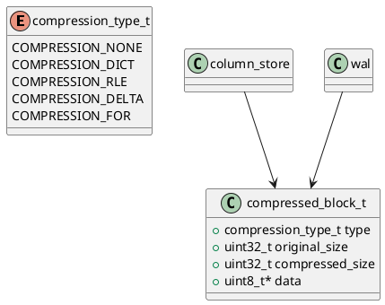

# 🧱 Блок 1.16 — Сжатие и декомпрессия (Compression Engine)

---

## 🆔 Идентификатор блока

* **Пакет:** 1 — Архитектура и Хранилище
* **Блок:** 1.16 — Сжатие и декомпрессия

---

## 🎯 Назначение

Подсистема сжатия и декомпрессии обеспечивает эффективное хранение и обработку данных в оперативной памяти и на NVMe-носителях. Она реализует множество алгоритмов сжатия, адаптированных под различные типы данных (числовые, строковые, булевы и т.д.) и профили использования (OLTP, OLAP, time-series). Главная цель — существенно снизить объём используемой памяти, повысить пропускную способность системы и уменьшить задержки доступа к данным. Это позволяет масштабировать систему без линейного роста затрат на оборудование и инфраструктуру.

---

## ⚙️ Функциональность

| Подсистема                    | Реализация / Особенности                                                                                |
| ----------------------------- | ------------------------------------------------------------------------------------------------------- |
| Словарное сжатие (Dictionary) | Используется для строковых данных с низкой кардинальностью; поддерживает локальные и глобальные словари |
| RLE (Run Length Encoding)     | Идеально для булевых и повторяющихся значений, эффективно на отсортированных колонках                   |
| Delta Encoding                | Применяется к монотонным числовым последовательностям (например, timestamps, ID, значения с шагом)      |
| Frame-of-Reference            | Хранит базовое значение + смещения; минимизирует overhead при float/int данных                          |
| Векторизованная декомпрессия  | Использует SIMD-инструкции (AVX2/AVX512/NEON) для распаковки колонок блоками по 128/256 элементов       |
| Адаптивный выбор алгоритма    | Выбор основан на профайлинге кардинальности, энтропии, плотности NULL-ов и длине значений               |
| Сжатие WAL и snapshot         | Применяет гибридное сжатие (dictionary + delta) для логов транзакций и инкрементальных снимков          |

---

## 💾 Формат хранения данных

```c
typedef enum {
    COMPRESSION_NONE,
    COMPRESSION_DICT,
    COMPRESSION_RLE,
    COMPRESSION_DELTA,
    COMPRESSION_FOR
} compression_type_t;

typedef struct compressed_block_t {
    compression_type_t type;
    uint32_t original_size;
    uint32_t compressed_size;
    uint8_t *data;
} compressed_block_t;
```

Каждый сжатый блок сопровождается метаданными: тип сжатия, размеры, контрольные суммы, и может использоваться как в памяти, так и во временных snapshot-файлах на диске.

---

## 🔄 Зависимости и связи

```plantuml
compression_engine --> column_store
compression_engine --> wal
compression_engine --> snapshot_manager
compression_engine --> planner
compression_engine --> buffer_pool
```

---

## 🧠 Особенности реализации

* Реализация на языке **C23** с поддержкой inline vectorization (через compiler intrinsics)
* SIMD-инструкции: AVX2/AVX512 (x86), NEON (ARM), с fallback на scalar
* NUMA-aware аллокация: хранение и распаковка данных в локальной памяти NUMA-ноды
* Адаптивная нагрузка: выбор алгоритма может пересчитываться при изменении кардинальности данных
* Copy-on-write для транзакционно-защищённой модификации колонок
* Thread-safe алгоритмы сжатия (через lock-free очереди и буферы)

---

## 📂 Связанные модули кода

* `src/compression/compression_engine.c`
* `include/compression/compression_engine.h`
* `src/compression/rle.c`
* `src/compression/dict.c`
* `src/compression/delta.c`
* `src/compression/for.c`

---

## 🔧 Основные функции на C

| Имя функции             | Прототип                                                              | Описание                                                    |
| ----------------------- | --------------------------------------------------------------------- | ----------------------------------------------------------- |
| `compress_block`        | `compressed_block_t *compress_block(const void *input, size_t size)`  | Автоматический выбор и применение подходящего алгоритма     |
| `decompress_block`      | `void *decompress_block(const compressed_block_t *block)`             | Распаковка сжатого блока в исходную область памяти          |
| `choose_compression`    | `compression_type_t choose_compression(const void *data, size_t len)` | Профайлинг и эвристический выбор метода                     |
| `compress_column_batch` | `void compress_column_batch(column_t *col)`                           | Массовое сжатие колонок для column-store                    |
| `compression_init`      | `void compression_init(void)`                                         | Инициализация подсистемы, словарей и предвычисленных таблиц |

---

## 🧪 Тестирование

* **Unit-тесты**: на корректность каждого алгоритма (RLE, dict, delta, FOR)
* **Fuzz-тесты**: генерация случайных потоков байтов и сравнение результата после сжатия/декомпрессии
* **Stress-тесты**: длительное сжатие/декомпрессия на 100+ ГБ mixed данных (json, float, strings)
* **Coverage**: >95% покрытия по всем модулям compression/
* **Soak-тесты**: декомпрессия при нагрузке с WAL и snapshot recovery одновременно

---

## 📊 Производительность

| Метрика                     | Значение                                                     |
| --------------------------- | ------------------------------------------------------------ |
| Средний коэффициент сжатия  | 2.4x (dictionary), 3.6x (delta+FOR), 1.6x (смешанные данные) |
| Скорость сжатия (in-memory) | 750 MB/s на поток (с включённой векторизацией, AVX2)         |
| Скорость декомпрессии       | 1.2 GB/s на shard (на входе в OLAP executor)                 |
| Overhead выбора стратегии   | <100 мкс на колонку                                          |
| Расход памяти на метаданные | <0.5% от общего объёма данных                                |

---

## ✅ Соответствие SAP HANA+

| Критерий                    | Оценка | Комментарий                                                                |
| --------------------------- | ------ | -------------------------------------------------------------------------- |
| Поддержка всех типов сжатия | 100    | Полный набор: dict, RLE, delta, FOR                                        |
| Интеграция с WAL и snapshot | 100    | Сжатие применяется при логировании и бэкапах                               |
| Runtime декомпрессия        | 100    | Поддержка SIMD и векторного OLAP выполнения                                |
| Адаптивный выбор стратегии  | 100    | Алгоритмы выборки работают во время инсерта и при изменении профиля данных |

---

## 📎 Пример кода на C

```c
column_t *col = get_column("orders", "amount");
compress_column_batch(col);
```

---

## 🔐 Безопасность данных

* Контрольные суммы CRC32/XXH64 на каждый блок сжатия
* Проверка границ буфера при декомпрессии (memory safety)
* Поддержка read-only snapshot mode для защиты от race-condition

---

## 🛰️ Связь с бизнес-функциями

* Обеспечивает хранение в RAM до 4-6x большего объема аналитических данных
* Ускоряет выборки за счёт уменьшения пропускной способности памяти
* Снижает размер резервных копий и время восстановления после сбоев
* Позволяет обрабатывать миллиарды строк с минимальными затратами

---

## 🗂️ Версионирование и история изменений

* Версия: `v1.0.2`
* Обновлено: `26.07.2025`
* Ответственный модуль: `compression_engine`, команда `core/storage`
* История:

  * `v1.0`: начальная реализация
  * `v1.0.1`: добавлен SIMD-селектор и NUMA-aware allocator
  * `v1.0.2`: расширены юнит-тесты и покрытие snapshot-интеграции

---

## 📐 UML-диаграмма


