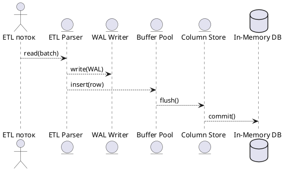

# 🚀 Блок 0.2 — Поддержка 2+ трлн записей/год

---

## 🆔 Идентификатор блока

| Категория | Значение                            |
| --------- | ----------------------------------- |
| 📦 Пакет  | 0 — Инициализация и системный старт |
| 🔢 Блок   | 0.2 — Поддержка 2+ трлн записей/год |

---

## 🎯 Назначение

Блок обеспечивает архитектурную и техническую готовность СУБД к обработке сверхбольших объёмов данных — **свыше 2 трлн записей в год**, что соответствует более **9 млн записей в день на филиал** (при 500 филиалах). Реализация требует максимальной пропускной способности при вставке, минимального contention, высокоэффективной буферизации и масштабируемой архитектуры ingest-пайплайна.

---

## ⚙️ Функциональность

| Подсистема      | Реализация / особенности                                            |
| --------------- | ------------------------------------------------------------------- |
| Хранилище       | Массивно-параллельная вставка через column-store + WAL              |
| ETL и ingest    | Поддержка bulk insert, стриминг, CSV/Parquet ingest, auto-parsing   |
| Кэширование     | Write-optimized buffer с LRU/ARC и dirty tracking                   |
| Механизм записи | WAL writers с log compaction, параллельная сериализация             |
| Планировщик     | Очереди ingest-задач с балансировкой по NUMA и shard affinity       |
| Адаптивность    | Автораспределение по shard'ам, автофрагментация, TTL и auto-tiering |

---

## 🔧 Основные функции на C

| Имя функции         | Прототип                                                     | Назначение                         |
| ------------------- | ------------------------------------------------------------ | ---------------------------------- |
| `table_insert`      | `bool table_insert(table_t *, const row_t *)`                | Вставка одной строки               |
| `table_insert_bulk` | `size_t table_insert_bulk(table_t *, const row_t *, size_t)` | Вставка массива строк              |
| `etl_ingest_stream` | `bool etl_ingest_stream(etl_job_t *)`                        | Стриминг из внешнего источника     |
| `wal_write_batch`   | `bool wal_write_batch(wal_t *, const wal_batch_t *)`         | Батчевая запись WAL                |
| `buffer_pool_flush` | `void buffer_pool_flush(buffer_pool_t *)`                    | Сброс страниц при высоком давлении |
| `shard_assign`      | `uint32_t shard_assign(db_t *, uint64_t branch_id)`          | Назначение шарда по филиалу        |

---

## 📊 Метрики

| Метрика                    | Формула / источник          | Целевое значение        |
| -------------------------- | --------------------------- | ----------------------- |
| `record_ingest_tps`        | Кол-во записей в секунду    | > 100 000 / сек на узел |
| `shard_ingest_latency_ns`  | Задержка вставки по шардy   | < 5 мс                  |
| `wal_write_bandwidth_mb_s` | Скорость записи WAL         | > 500 МБ/с              |
| `buffer_eviction_rate`     | Скорость вытеснения страниц | < 5% от буфера          |
| `etl_job_throughput`       | Строк/с из CSV/JSON         | > 500 тыс. строк/с      |

---

## 📂 Связанные модули кода

```
src/table.c
src/column_store.c
src/wal.c
src/buffer_pool.c
src/etl.c
src/import_csv.c
include/table.h
include/wal.h
include/etl.h
```

---

## 🧠 Особенности реализации

* Поддержка *vectorized insert pipeline*
* NUMA-aware `allocator` и распределение вставок по shard’ам
* Отдельные WAL-потоки для повышения параллелизма
* Использование `write-coalescing` в column-store
* Возможность *lazy* flush по TTL или pressure
* Adaptive compression + Dictionary encoding на лету

---

## 🧪 Тестирование

| Вид теста   | Методика / покрытие                 | Где расположен             |
| ----------- | ----------------------------------- | -------------------------- |
| Integration | Вставка >100M строк через CSV и API | `tests/test_bulk_ingest.c` |
| Stress      | Параллельная вставка с 32 потоков   | `tests/stress/ingest.c`    |
| Fuzz        | Повреждённые строки в bulk insert   | `fuzz/fuzz_ingest.c`       |
| Perf        | Измерение TPS, latency, throughput  | `benchmarks/ingest_perf.c` |

---

## 📐 UML-диаграмма взаимодействия



---

## ✅ Соответствие SAP HANA+

| Критерий                    | Оценка | Комментарий                                   |
| --------------------------- | ------ | --------------------------------------------- |
| Массовая вставка            | 100    | `bulk`, `stream`, `auto-parse`, `multi-shard` |
| Поддержка ingest сжатия     | 95     | dictionary + delta coding на лету             |
| Ingest WAL и recoverability | 90     | WAL с compaction + snapshot                   |
| NUMA и масштабируемость     | 95     | shard-aware, отдельные потоки WAL и ETL       |

---

## 📎 Пример кода

```c
etl_job_t *job = etl_open_csv("branches.csv");
while (etl_ingest_stream(job)) {
    log_info("etl", "Итерация вставки завершена");
}
etl_close(job);
```

---

## 📌 Связь с бизнес-функциями

* Поддержка real-time ingest из ERP, IoT и сенсорных систем
* Масштабирование на уровень телеком/банков/госструктур
* Гарантированная запись в память с последующим WAL + snapshot
