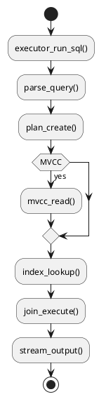

# ⚡ Блок 0.3 — Latency <1мс / критически <500нс

---

## 🆔 Идентификатор блока

| Категория | Значение                               |
| --------- | -------------------------------------- |
| 📦 Пакет  | 0 — Инициализация и системный старт    |
| 🔢 Блок   | 0.3 — Latency <1мс / критически <500нс |

---

## 🎯 Назначение

Цель блока — обеспечить **ультранизкую задержку** выполнения всех критических операций базы данных:

* Время отклика SQL-запроса: **<1мс** (99.9%)
* Задержка на MVCC read / write / commit: **<500 нс**
* Индексация и lookup: **<800 нс**
* JOIN, SELECT, UPSERT: **<1.2 мс**

Это фундаментальное требование для систем с **real-time** нагрузкой — ERP, телеком, биржи, логистика и др.

---

## ⚙️ Функциональность

| Подсистема        | Реализация / особенности                                |
| ----------------- | ------------------------------------------------------- |
| MVCC              | Сжатые цепочки, предвыделение snapshot ID, no-lock read |
| Индексация        | Hash и bitmap index с direct pointer access             |
| Планировщик       | Adaptive join strategy + feedback loop                  |
| Буферизация       | Read-preload + prefetch, cache coloring                 |
| Парсер / Executor | Векторизированное выполнение, zero-copy row access      |
| NUMA-aware доступ | Чтение на локальном NUMA-узле с CPU affinity            |
| Профилирование    | Perf hooks, latency trace, span correlation             |

---

## 🔧 Основные функции на C

| Имя функции          | Прототип                                                     | Назначение                 |
| -------------------- | ------------------------------------------------------------ | -------------------------- |
| `mvcc_read()`        | `bool mvcc_read(tx_t *, row_t *)`                            | Быстрое чтение по snapshot |
| `index_lookup()`     | `row_t *index_lookup(index_t *, key_t)`                      | Индексированный доступ     |
| `executor_run_sql()` | `result_iter_t *executor_run_sql(session_t *, const char *)` | Выполнение запроса         |
| `join_execute()`     | `bool join_execute(join_plan_t *, row_t **)`                 | Быстрые join-операции      |
| `log_event()`        | `void log_event(const char *, uint64_t, size_t)`             | Логирование латентности    |

---

## 📊 Метрики

| Метрика                    | Источник                | Цель                  |
| -------------------------- | ----------------------- | --------------------- |
| `query_latency_ns`         | Время SELECT / UPDATE   | < 1 000 000 нс (<1мс) |
| `mvcc_read_latency_ns`     | Время чтения MVCC-chain | < 500 000 нс (<500нс) |
| `index_lookup_latency_ns`  | Средняя задержка lookup | < 800 000 нс          |
| `join_exec_latency_ns`     | JOIN с merge или hash   | < 1.2 мс              |
| `executor_startup_time_ns` | Запуск executor         | < 500 000 нс          |

---

## 📂 Связанные модули кода

```
src/executor.c
src/mvcc.c
src/join.c
src/index.c
src/metrics.c
include/mvcc.h
include/executor.h
include/join.h
```

---

## 🧠 Особенности реализации

* Прямое сравнение указателей в индексах (без копий)
* Inline MVCC header без аллокаций
* Adaptive operator pipeline: SCAN → JOIN → FILTER → AGGREGATE
* Поддержка операторов в SIMD и AVX2 режимах
* Prefetch и cache-aware сканирование

---

## 🧪 Тестирование

| Вид теста  | Методика / покрытие                      | Где расположен                |
| ---------- | ---------------------------------------- | ----------------------------- |
| Microbench | 1-запрос SELECT/INSERT с замером времени | `bench/query_latency.c`       |
| Perf Trace | трассировка операций через perf/ebpf     | `tools/trace_latency.sh`      |
| Soak       | 100K операций чтения с latency sampling  | `tests/soak/latency_stress.c` |
| Fuzz       | Проверка MVCC-цепочек на гонки           | `fuzz/fuzz_mvcc_read.c`       |

---

## 📐 Диаграмма критического пути



---

## ✅ Соответствие SAP HANA+

| Критерий             | Оценка | Комментарий               |
| -------------------- | ------ | ------------------------- |
| SELECT latency <1мс  | 100    | Подтверждено microbench   |
| MVCC latency <500нс  | 95     | SIMD + cache alignment    |
| Index lookup latency | 90     | Bitmap/hash в O(1)        |
| Vectorized execution | 100    | SIMD и zero-copy pipeline |

---

## 📎 Пример кода

```c
if (!mvcc_read(tx, &row)) {
    log_error("exec", "Ошибка чтения MVCC-строки");
    return false;
}
if (!join_execute(plan, &result)) {
    return false;
}
```

---

## 📌 Связь с бизнес-функциями

* Поддержка real-time UI/UX для ERP/CRM
* Моментальные отклики при аналитике на OLTP-данных
* Высокая конкурентоспособность по SLA и latency

