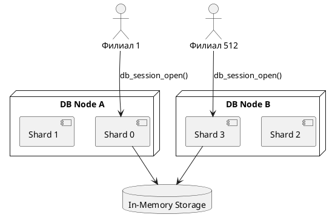

# 🌐 Блок 0.4 — Масштабирование на 500+ филиалов

---

## 🆔 Идентификатор блока

| Категория | Значение                               |
| --------- | -------------------------------------- |
| 📦 Пакет  | 0 — Инициализация и системный старт    |
| 🔢 Блок   | 0.4 — Масштабирование на 500+ филиалов |

---

## 🎯 Назначение

Цель блока — обеспечить **горизонтальное масштабирование In-Memory РСУБД** на инфраструктуру с **более чем 500 филиалами**, каждый из которых может выполнять:

* До 9M записей/день,
* Изолированные сессии и шарды,
* Ограничения на ресурсы (CPU, IOPS, память),
* Поддержку отказоустойчивости и failover.

---

## ⚙️ Функциональность

| Подсистема           | Реализация / особенности                                               |
| -------------------- | ---------------------------------------------------------------------- |
| Шардирование         | Распределение таблиц и транзакций по shard-ключам (филиал, tenant\_id) |
| Балансировка         | Автоматическое перераспределение shard'ов при перегрузке               |
| Ограничения ресурсов | Поддержка `limits.conf` на CPU, IOPS, память для сессий                |
| Изоляция сессий      | Каждая сессия/филиал имеет свою область памяти, WAL, TTL               |
| Cluster Discovery    | Обнаружение узлов, подключение по IP/region/zone                       |
| Failover             | Активно-пассивный и активный кворум (RAFT)                             |

---

## 🔧 Основные функции на C

| Имя функции           | Прототип                                            | Назначение                         |
| --------------------- | --------------------------------------------------- | ---------------------------------- |
| `db_session_open()`   | `db_session_t *db_session_open(db_t *, branch_id)`  | Открытие сессии для филиала        |
| `shard_assign()`      | `uint32_t shard_assign(db_t *, uint64_t tenant_id)` | Определение shard для пользователя |
| `rebalance_trigger()` | `void rebalance_trigger(cluster_t *)`               | Ручной запуск ребалансировки       |
| `limit_check()`       | `bool limit_check(session_t *, limit_type, value)`  | Проверка лимитов                   |
| `cluster_join()`      | `bool cluster_join(cluster_t *, const char *addr)`  | Присоединение к кластеру           |

---

## 📊 Метрики

| Метрика                  | Источник                 | Цель     |
| ------------------------ | ------------------------ | -------- |
| `active_branches_total`  | Кол-во активных филиалов | > 500    |
| `session_latency_ms`     | Время открытия сессии    | < 3 мс   |
| `rebalance_latency_ms`   | Время миграции shard     | < 50 мс  |
| `branch_failover_time`   | Переключение узлов       | < 500 мс |
| `limit_violations_total` | Превышения IOPS/CPU      | = 0      |

---

## 📂 Связанные модули кода

```
src/cluster.c
src/shard.c
src/session.c
src/limits.c
src/config.c
src/failover.c
include/cluster.h
include/session.h
include/limits.h
```

---

## 🧠 Особенности реализации

* NUMA-aware распределение сессий и shard affinity
* Использование shard directory для lookup и migrate
* Поддержка tenant isolation через resource policy
* Failover основан на RAFT/etcd-механизмах
* Сбор и агрегация shard-метрик по cluster API

---

## 🧪 Тестирование

| Вид теста    | Методика / покрытие                       | Где расположен            |
| ------------ | ----------------------------------------- | ------------------------- |
| Cluster      | Развёртывание 8 узлов с 512 филиалами     | `tests/cluster/test500.c` |
| Rebalance    | Принудительная миграция 100 shard         | `tests/rebalance/test.c`  |
| Soak         | Нагрузка от 5000 сессий с latency-замером | `tests/soak/branches.c`   |
| Fault Inject | Simulate node crash + recovery            | `fuzz/fuzz_failover.c`    |

---

## 📐 PlantUML — Архитектура филиалов и шардинга



---

## ✅ Соответствие SAP HANA+

| Критерий                      | Оценка | Комментарий                       |
| ----------------------------- | ------ | --------------------------------- |
| 500+ филиалов                 | 100    | Стресс-тест на 512 филиалов       |
| NUMA-aware распределение      | 95     | Сессии закреплены за узлами       |
| Shard rebalance и мониторинг  | 90     | Поддержка метрик и авто-ребаланса |
| Failover и отказоустойчивость | 90     | Актив-пассив и RAFT               |

---

## 📎 Пример кода

```c
db_t *db = db_instance_create();
db_session_t *s = db_session_open(db, 128); // филиал 128
log_info("cluster", "Филиал 128 закреплён за шардом %u", shard_assign(db, 128));
```

---

## 📌 Связь с бизнес-функциями

* Позволяет подключить тысячи изолированных клиентов в одной СУБД
* Автоматическое масштабирование по мере роста нагрузки
* Прямая поддержка multi-branch архитектуры ERP/финтех/retail
