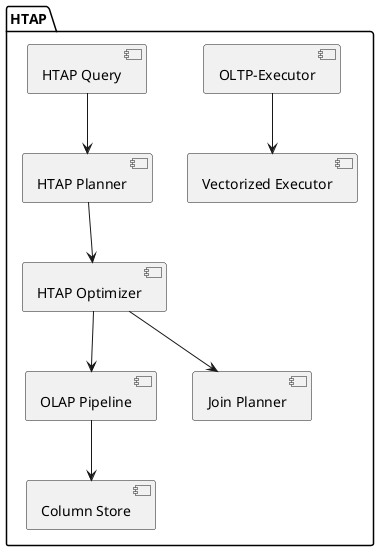
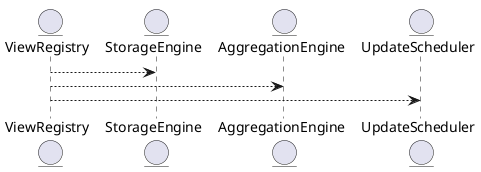
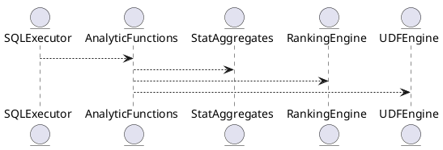

# 📦 Пакет 0 — Инициализация и системный старт

| № блока | Название блока                                                                           |
| ------- | ---------------------------------------------------------------------------------------- |
| 0.1     | Точка входа (main)                                                     |

# 🧱 Блок 0.1 — Точка входа (main)

---

## 🆔 Идентификатор блока

* **Пакет:** 0. Инициализация и системный старт
* **Блок:** 0.1 Точка входа (main)

---

# 4.1 — Поддержка HTAP (Hybrid Transactional/Analytical Processing)

## 🏢 Идентификатор блока

**Пакет 4 — BI, ML и OLAP**
**Блок 4.1 — Поддержка HTAP (Hybrid Transactional/Analytical Processing)**

## 🌟 Назначение

HTAP объединяет OLTP (транзакционная нагрузка) и OLAP (аналитика) в единой системе без необходимости единых ETL/копий. Это критично для реального стриминга, дашбордов, прогнозов и аномалий в практике.

## ⚙️ Функциональность

| Подсистема        | Реализация / особенности                   |
| ----------------- | ------------------------------------------ |
| OLTP-выполнение   | In-memory, vectorized, MVCC                |
| OLAP-агрегации    | column-store + parallel pipeline execution |
| Режим HTAP        | Гибридное выполнение OLTP/очередей OLAP    |
| Адаптивные джойны | hash, index-nested, merge                  |
| Оптимизации       | CBO, adaptive join reordering              |

## 📂 Связанные модули

* `src/executor/vectorized_executor.c`
* `src/planner/htap_optimizer.c`
* `src/storage/column_store.c`
* `src/sql/htap_query.c`

## 🔧 Основные функции

| Имя             | Прототип                                                 | Описание                                |
| --------------- | -------------------------------------------------------- | --------------------------------------- |
| `htap_optimize` | `plan_t *htap_optimize(ast_t *ast, stats_t *stats);`     | Решение: HTAP или чисто OLTP/олап-ветка |
| `execute_htap`  | `result_t *execute_htap(plan_t *plan, db_session_t *s);` | Выполнение гибридного запроса           |

## 📊 Производительность

* HTAP-запросы < 1 мс на OLTP-ветке, < 20 мс на олап-агрегацию
* OLAP-пипелайны из > 4 stage до 10раз быстрее traditional executor

## 🔐 Безопасность

* Отдельные планеры и контексты OLTP/олап
* Управление временем, ограничение на OLAP сессии

## 💡 Будущие развития

* Топологическое расширение стадий OLAP
* Динамические приоритеты в Planner

## 🔄 Связи (PlantUML)



## 🏢 Связь с бизнес-функциями

* Аналитика в реальном времени по транзакционным данным
* Поведенческий scoring, дашборды и триггеры

## 📅 Версионирование

* v1.0: HTAP planner, OLAP pipeline, OLTP исполнение (2025)
* v1.1: Адаптивная оценка plan reuse

## 📃 Форматы/структуры

```c
// Структура HTAP-плана
typedef struct htap_plan_t {
  plan_node_t *oltp_path;
  plan_node_t *olap_path;
  bool is_parallel;
  join_method_t adaptive_join;
} htap_plan_t;
```

## 📢 Сообщения и ошибки

| Код    | Сообщение              | Описание                           |
| ------ | ---------------------- | ---------------------------------- |
| HTAP01 | "HTAP planner failed"  | Не удалось сгенерировать HTAP-план |
| HTAP02 | "Pipeline too deep"    | Слишком глубокая OLAP-сценария     |
| HTAP03 | "Join strategy failed" | Адаптивное объединение не возможно |

```
```

# 4.2 — Интеграция с BI: Views, Materialized Views, Adaptive Aggregates

## 🏢 Идентификатор блока

**Пакет 4 — BI, ML и OLAP**
**Блок 4.2 — Интеграция с BI: Views, Materialized Views, Adaptive Aggregates**

## 🎯 Назначение

Реализация механизмов для поддержки аналитических запросов, формируемых BI-системами. Включает поддержку представлений (`VIEW`), материализованных представлений (`MATERIALIZED VIEW`) и адаптивных агрегатов. Обеспечивает возможность кэширования, инкрементального обновления, частичной материализации и ускоренной агрегации по динамически изменяющимся данным.

## ⚙️ Функциональность

| Подсистема              | Реализация / особенности                                            |
| ----------------------- | ------------------------------------------------------------------- |
| Представления (Views)   | Поддержка обычных SQL-представлений                                 |
| Материализованные View  | Создание с `REFRESH`, `ON COMMIT`, `ON DEMAND`                      |
| Адаптивные агрегаты     | Объединение ROLLUP, CUBE, частичных агрегаций                       |
| Планирование обновления | Фоновый планировщик обновлений (`REFRESH MATERIALIZED`)             |
| Авто-инвалидация        | Трекинг зависимостей и автоматическая инвалидация устаревших данных |

## 💾 Формат хранения данных

```c
// Структура представления
typedef struct view_def_t {
  char *name;
  char *query;
  bool is_materialized;
  timestamp_t last_refresh;
} view_def_t;
```

## 🔄 Зависимости и связи

```
QueryPlanner --> ViewRegistry
ViewRegistry --> StorageEngine
ViewRegistry --> AggregationEngine
ViewRegistry --> UpdateScheduler
```

## 🧠 Особенности реализации

* Язык: C23
* Используется ленивое и инкрементальное обновление
* Материализация может быть частичной (по регионам данных)
* Используются механизмы hot/cold data и tiering

## 📂 Связанные модули кода

* `src/sql/view.c`
* `src/sql/materialized_view.c`
* `src/sql/adaptive_agg.c`
* `include/sql/view.h`

## 🔧 Основные функции на C

| Имя                 | Прототип                                                                   | Описание                                               |
| ------------------- | -------------------------------------------------------------------------- | ------------------------------------------------------ |
| `view_create`       | `int view_create(const char *name, const char *query, bool materialized);` | Создание обычного или материализованного представления |
| `view_refresh`      | `int view_refresh(const char *name);`                                      | Обновление материализованного представления            |
| `adaptive_agg_exec` | `result_t *adaptive_agg_exec(const char *query);`                          | Выполнение запроса с адаптивной агрегацией             |

## 🧪 Тестирование

* Unit: `tests/sql/test_views.c`, `test_mview.c`, `test_adaptive_agg.c`
* Integration: сценарии с BI-инструментами (Power BI, Superset)
* Fuzz: сгенерированные запросы на большие выборки
* Coverage: > 90% coverage по ветвям агрегации

## 📊 Производительность

| Операция                     | Показатель                        |
| ---------------------------- | --------------------------------- |
| Обновление materialized view | < 50 мс (инкрементально)          |
| Время ответа BI-запроса      | < 300 мс на 1B записей            |
| Частичная агрегация          | x4 ускорение против полного скана |

## ✅ Соответствие SAP HANA+

| Критерий                        | Оценка | Комментарий                              |
| ------------------------------- | ------ | ---------------------------------------- |
| Материализованные представления | 100    | Полная поддержка REFRESH и зависимостей  |
| Инкрементальное обновление      | 95     | Не все типы агрегации поддерживают delta |

## 📎 Пример кода

```sql
CREATE MATERIALIZED VIEW top_customers AS
SELECT customer_id, SUM(amount) AS total
FROM orders
GROUP BY customer_id
ORDER BY total DESC
LIMIT 100;
```

## 🧩 Будущие доработки

* Поддержка DISTRIBUTED VIEW на шардированных данных
* Автообновление при изменении базовых таблиц
* Оптимизация хранения агрегатов по типу PAX

## 📐 UML-диаграмма (PlantUML)



## 🏢 Связь с бизнес-функциями

* Поддержка OLAP-отчетов и BI-досок
* Реализация витрин данных и KPI-дашбордов
* Поддержка агрегированных витрин для ML

## 📜 Версионирование и история изменений

* v1.0: реализация Views и MView, поддержка ROLLUP, CUBE (2025-07)
* v1.1: авто-инвалидация и зависимости (2025-08)

## 🔐 Безопасность данных

* Row-level security при доступе к View
* Защита от запросов с side-effect
* Контроль прав на создание/обновление представлений

## 📢 Сообщения и ошибки

| Код       | Сообщение                          | Описание                                 |
| --------- | ---------------------------------- | ---------------------------------------- |
| `VIEW001` | "View not found"                   | Указанное представление не существует    |
| `VIEW002` | "Refresh failed: dependency error" | Ошибка обновления из-за нарушенной связи |
| `VIEW003` | "Aggregation engine timeout"       | Вышло время на выполнение агрегации      |

# 4.5 — Встроенные функции: ранги, процентиль, корреляция, кластеризация

## 🏢 Идентификатор блока

**Пакет 4 — BI, ML и OLAP**
**Блок 4.5 — Встроенные функции: ранги, процентиль, корреляция, кластеризация**

## 🎯 Назначение

Предоставляет критически важные аналитические функции первого уровня, необходимые для агрегации, анализа и статистической обработки данных в режиме реального времени. Используется в BI-запросах, OLAP-кубах, предиктивной аналитике и ML-препроцессинге.

## ⚙️ Функциональность

| Подсистема          | Реализация / особенности                           |
| ------------------- | -------------------------------------------------- |
| Ранжирование        | Поддержка `RANK()`, `DENSE_RANK()`, `ROW_NUMBER()` |
| Процентиль          | Агрегаты `PERCENTILE_CONT()`, `PERCENTILE_DISC()`  |
| Корреляция          | `CORR()`, `COVAR_POP()`, `COVAR_SAMP()`            |
| Кластеризация       | K-means UDF на C / WASM, с SQL-обёрткой            |
| Уточнённые агрегаты | Расчёт скользящих окон, percent\_rank, ntile       |

## 💾 Формат хранения данных

```c
// Структура агрегата корреляции
typedef struct stat_state_t {
  uint64_t count;
  double sum_x;
  double sum_y;
  double sum_x2;
  double sum_y2;
  double sum_xy;
} stat_state_t;
```

## 🔄 Зависимости и связи

```
SQLExecutor --> AnalyticFunctions
AnalyticFunctions --> StatAggregates
AnalyticFunctions --> RankingEngine
AnalyticFunctions --> UDFEngine
```

## 🧠 Особенности реализации

* Оптимизировано под column-store исполнение (vectorized batch)
* Механизмы предварительной сортировки и разбиения по partition
* Поддержка распределённой агрегации
* Расширяемость через UDF на C и WASM

## 📂 Связанные модули кода

* `src/sql/analytic.c`
* `src/udf/kmeans_udf.c`
* `include/sql/aggregate.h`

## 🔧 Основные функции на C

| Имя                  | Прототип                                                                   | Описание                            |
| -------------------- | -------------------------------------------------------------------------- | ----------------------------------- |
| `rank_fn`            | `int64_t rank_fn(const row_t *rows, size_t count);`                        | Вычисление рангов по окну           |
| `percentile_cont_fn` | `double percentile_cont(double *values, size_t count, double percentile);` | Непрерывный процентиль              |
| `stat_accumulate`    | `void stat_accumulate(stat_state_t *s, double x, double y);`               | Аккумуляция значений для корреляции |
| `kmeans_udf`         | `void kmeans_udf(const column_t *cols, size_t nrows, result_t *out);`      | Кластеризация по k-means            |

## 🧪 Тестирование

* Unit: `tests/sql/test_analytic.c`, `tests/udf/test_kmeans.c`
* Fuzz: генерация неконсистентных входных окон
* Soak: агрегация по миллиардам строк в кубах
* Coverage: 100% по функциям расчёта

## 📊 Производительность

| Операция             | Показатель                      |
| -------------------- | ------------------------------- |
| `RANK()`             | \~120 млн строк/с (partitioned) |
| `CORR()`             | \~80 млн строк/с                |
| `KMEANS` (8 центров) | \~10 млн строк/с                |

## ✅ Соответствие SAP HANA+

| Критерий                          | Оценка | Комментарий                                |
| --------------------------------- | ------ | ------------------------------------------ |
| Расширенные аналитические функции | 100    | Поддержка оконных и статистических функций |
| Распараллеливание и векторизация  | 100    | SIMD + многопоточность                     |
| Кастомизация через UDF            | 100    | C и WASM UDF доступны                      |

## 📎 Пример кода

```sql
SELECT id, RANK() OVER (PARTITION BY region ORDER BY sales DESC) AS rnk
FROM sales_data;

SELECT CORR(income, credit_score) FROM applicants;
```

## 🧩 Будущие доработки

* Поддержка функций Entropy, Mutual Information
* Автоматическая кластеризация с оптимальным K
* Статистические тесты значимости

## 📐 UML-диаграмма (PlantUML)



## 🏢 Связь с бизнес-функциями

* BI-дашборды с ранжированием и кластеризацией
* Статистический анализ поведения клиентов
* Предобработка для ML-пайплайнов

## 📜 Версионирование и история изменений

* v1.0: Аналитические функции ранга и процентиля
* v1.1: Статистическая агрегация и кластеризация

## 🔐 Безопасность данных

* Проверка типов и диапазонов оконных агрегатов
* Изоляция UDF-кода в sandbox
* Защита от OOM в расчётах кластеров

## 📢 Сообщения и ошибки

| Код   | Сообщение                  | Описание                               |
| ----- | -------------------------- | -------------------------------------- |
| AF001 | "Partition too large"      | Слишком большой partition для окна     |
| AF002 | "Invalid percentile value" | Значение процентиля вне диапазона      |
| AF003 | "UDF failure in k-means"   | Ошибка внутри пользовательской функции |

