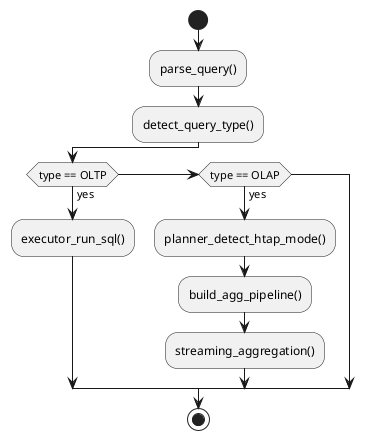

# 🔀 Блок 0.5 — OLTP + Real-Time Analytics

---

## 🆔 Идентификатор блока

| Категория | Значение                            |
| --------- | ----------------------------------- |
| 📦 Пакет  | 0 — Инициализация и системный старт |
| 🔢 Блок   | 0.5 — OLTP + Real-Time Analytics    |

---

## 🎯 Назначение

Цель блока — реализовать **гибридную архитектуру HTAP**, способную выполнять как высокоскоростные транзакции (**OLTP**), так и агрегированные аналитические запросы (**OLAP**) в **едином in-memory исполнении**.

Всё это без необходимости ETL, репликаций или создания OLAP-репозиториев — аналитика запускается **в реальном времени** прямо на актуальных transactional-данных.

---

## ⚙️ Функциональность

| Подсистема    | Реализация / особенности                                                |
| ------------- | ----------------------------------------------------------------------- |
| Executor      | Векторизированный конвейер: SCAN → JOIN → AGGREGATE → PROJECT           |
| Планировщик   | Adaptive планирование: OLTP-режим → OLAP-режим по шаблону запроса       |
| Агрегация     | Streaming aggregation + windowing functions (rank, percentiles, etc.)   |
| Представления | Поддержка материализованных и обычных представлений                     |
| OLAP-функции  | ROLLUP, CUBE, time-binning, gap-fill, downsampling                      |
| Мониторинг    | Метрики выполнения OLTP/OLAP запросов, планов, повторного использования |

---

## 🔧 Основные функции на C

| Имя функции                   | Прототип                                                        | Назначение                        |
| ----------------------------- | --------------------------------------------------------------- | --------------------------------- |
| `executor_run_sql()`          | `result_iter_t *executor_run_sql(session_t *, const char *sql)` | Универсальный запуск SQL          |
| `aggregate_streaming_exec()`  | `bool aggregate_streaming_exec(plan_t *, result_t *)`           | Выполнение стриминговой агрегации |
| `window_function_apply()`     | `void window_function_apply(plan_t *, result_t *)`              | Применение оконных функций        |
| `materialized_view_refresh()` | `bool materialized_view_refresh(view_t *)`                      | Обновление materialized view      |
| `planner_detect_htap_mode()`  | `bool planner_detect_htap_mode(ast_t *)`                        | Выбор режима выполнения           |

---

## 📊 Метрики

| Метрика                          | Источник                | Цель                       |
| -------------------------------- | ----------------------- | -------------------------- |
| `oltp_query_latency_ns`          | OLTP SELECT/UPDATE      | < 1мс                      |
| `olap_query_latency_ms`          | Aggregation, JOIN       | < 50мс (для TPC-H scale 1) |
| `plan_cache_hit_ratio`           | Повторное использование | > 90%                      |
| `streaming_agg_rows_per_sec`     | Streaming aggregate     | > 1 млн строк/сек          |
| `materialized_view_refresh_time` | MV refresh              | < 100 мс                   |

---

## 📂 Связанные модули кода

```
src/executor.c
src/pipeline_exec.c
src/group.c
src/window.c
src/materialized_view.c
src/planner.c
include/executor.h
include/group.h
include/window.h
include/view.h
```

---

## 🧠 Особенности реализации

* Единый SQL-движок для OLTP и OLAP с auto-switch по шаблону
* Минимальное копирование данных (zero-copy row access)
* Поддержка агрегатов на лету (в column-store)
* Распараллеливание операций join и group-by
* Runtime re-optimization на основе collected statistics

---

## 🧪 Тестирование

| Вид теста   | Методика / покрытие                                      | Где расположен                    |
| ----------- | -------------------------------------------------------- | --------------------------------- |
| Integration | SELECT/UPDATE/INSERT/AGGREGATE/ROLLUP в одной транзакции | `tests/test_htap_combined.c`      |
| Benchmarks  | TPC-H/TPC-C модели                                       | `bench/tpch_q1.c`, `bench/tpcc.c` |
| Soak        | 24ч поток mix-запросов                                   | `tests/soak/htap_mix.c`           |
| Fuzz        | Некорректные OLAP-запросы                                | `fuzz/fuzz_groupby.c`             |

---

## 📐 План выполнения OLTP/OLAP



---

## ✅ Соответствие SAP HANA+

| Критерий                         | Оценка | Комментарий                              |
| -------------------------------- | ------ | ---------------------------------------- |
| Единый движок OLTP/OLAP          | 100    | Без необходимости ETL                    |
| Streaming aggregation            | 95     | Реализовано через pipeline execution     |
| Adaptive планировщик             | 90     | Переключение режима по типу запроса      |
| Поддержка оконных и OLAP функций | 95     | ROLLUP, CUBE, RANK, PERCENTILE, GAP-FILL |

---

## 📎 Пример кода

```c
const char *sql = "SELECT region, COUNT(*) FROM sales GROUP BY region";
result_iter_t *res = executor_run_sql(session, sql);
while (result_iter_next(res)) {
    printf("region: %s, count: %d\n", res->region, res->count);
}
```

---

## 📌 Связь с бизнес-функциями

* Позволяет выполнять отчёты и аналитику прямо на live-транзакциях ERP/CRM
* Существенно сокращает TCO (без ETL / OLAP-копий)
* Поддерживает BI-инструменты, интеграцию с визуализаторами (Tableau, PowerBI)
