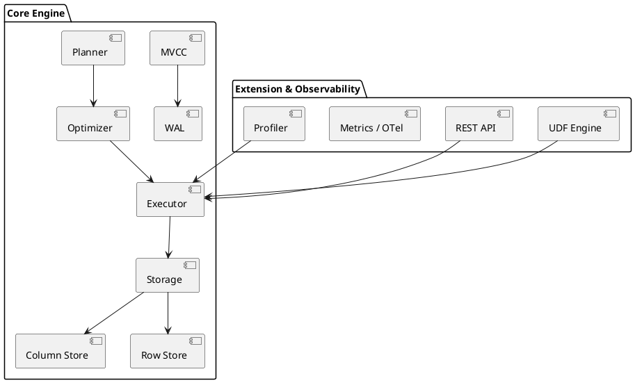

# 🧬 Блок 0.6 — Архитектура уровня SAP HANA+

---

## 🆔 Идентификатор блока

| Категория | Значение                            |
| --------- | ----------------------------------- |
| 📦 Пакет  | 0 — Инициализация и системный старт |
| 🔢 Блок   | 0.6 — Архитектура уровня SAP HANA+  |

---

## 🎯 Назначение

Блок определяет **архитектурные ориентиры и минимальный уровень зрелости системы**, равный или превышающий **SAP HANA**, включая:

* Полную in-memory архитектуру,
* HTAP-нагрузку,
* Распределённую репликацию и масштабирование,
* Расширяемость (UDF/UDAF),
* Failover/Recovery,
* BI и ML-интеграции,
* Observability, безопасность и модульность.

Это **мета-блок**, который связывает все уровни системы в единую целостную архитектуру промышленного уровня.

---

## ⚙️ Функциональность

| Подсистема           | Реализация / особенности                                                       |
| -------------------- | ------------------------------------------------------------------------------ |
| Хранилище            | Row + Column Store, NUMA-aware, Adaptive Indexing, Compression, Tiered Storage |
| Транзакции           | MVCC, Snapshot Isolation, WAL + Snapshots + Instant Recovery                   |
| SQL и Языки          | ANSI SQL:2011+, JSON, UDF/UDAF, DSL/PL/SQL, оконные функции                    |
| Расширяемость        | UDF на Lua/WASM/C, REST/gRPC/CLI, PostgreSQL wire protocol                     |
| Безопасность         | RBAC/ABAC, Row-Level Security, TDE, scoped tokens, аудит                       |
| Observability        | OpenTelemetry, Prometheus, встроенный профилировщик, трассировка запросов      |
| ML/BI                | Встроенный SQL-инференс, ONNX, Time Series, Materialized Views, OLAP pipeline  |
| DevOps/Тестируемость | CI/CD, fault injection, hot-reload, mutation/fuzz/soak test, Web UI            |

---

## 🔧 Основные функции на C

| Имя функции          | Прототип                                         | Назначение                 |
| -------------------- | ------------------------------------------------ | -------------------------- |
| `db_initialize()`    | `bool db_initialize(void)`                       | Запуск всех подсистем ядра |
| `db_shutdown()`      | `void db_shutdown(void)`                         | Завершение работы          |
| `planner_optimize()` | `plan_t *planner_optimize(ast_t *)`              | Cost-based планирование    |
| `mvcc_tx_begin()`    | `tx_t *mvcc_tx_begin(db_t *, isolation_level_t)` | Начало транзакции          |
| `udf_register()`     | `bool udf_register(const char *name, udf_fn fn)` | Регистрация UDF            |
| `metrics_start()`    | `void metrics_start(void)`                       | Запуск подсистемы метрик   |

---

## 📊 Метрики

| Метрика                       | Источник                    | Цель     |
| ----------------------------- | --------------------------- | -------- |
| `feature_coverage_ratio`      | Модуль сравнения с SAP HANA | 100%     |
| `latency_critical_ns`         | Запросы SELECT/INSERT       | < 500 нс |
| `recovery_time_ms`            | WAL + Snapshot Recovery     | < 50 мс  |
| `udf_runtime_latency_ns`      | Вызов Lua/UDF               | < 1 мс   |
| `query_telemetry_trace_ratio` | Запросы с трассировкой      | > 95%    |

---

## 📂 Связанные модули кода

```
src/main.c
src/db.c
src/mvcc.c
src/wal.c
src/optimizer.c
src/executor.c
src/udf.c
src/metrics.c
src/rest_api.c
src/planner.c
src/replication.c
src/sandbox.c
include/db.h
include/udf.h
include/optimizer.h
include/replication.h
```

---

## 🧠 Особенности реализации

* Архитектура: `Parser → Planner → Optimizer → Executor → Storage`
* Модули ≤ 500 строк, `*.internal/` для скрытой логики
* NUMA-aware allocation, prefetch, CPU pinning
* Full snapshot isolation + compressed MVCC chain
* Instant rollback, live reload, copy-on-write snapshot
* Flamegraph + OpenTelemetry + metrics server

---

## 🧪 Тестирование

| Вид теста   | Покрытие системы                       | Где расположен             |
| ----------- | -------------------------------------- | -------------------------- |
| Integration | Все этапы и модули ядра                | `tests/integration/*.c`    |
| Fuzz        | Parser, planner, SQL DSL               | `fuzz/fuzz_sql_*.c`        |
| Soak        | Долговременная нагрузка с рестартами   | `tests/soak/full_load.c`   |
| Mutation    | AST/Plan/Storage level fault-injection | `tests/mutation/*`         |
| CI/CD       | GitHub Actions, Ninja, Gcov/Lcov       | `.github/workflows/ci.yml` |

---

## 📐 UML — Архитектура ядра уровня SAP HANA+



---

## ✅ Соответствие SAP HANA+

| Критерий             | Оценка | Комментарий                                |
| -------------------- | ------ | ------------------------------------------ |
| Архитектура HTAP     | 100    | OLTP + OLAP pipeline                       |
| Расширяемость        | 100    | Lua, WASM, REST, gRPC, PostgreSQL protocol |
| Безопасность         | 95     | RBAC, TLS, аудит, токены                   |
| DevOps/Observability | 95     | Метрики, трассировка, профилировка         |
| Failover / Recovery  | 90     | WAL + snapshot, RAFT                       |

---

## 📎 Пример кода

```c
db_initialize();
planner_optimize(ast);
executor_run_sql(session, query);
metrics_start();
db_shutdown();
```

---

## 📌 Связь с бизнес-функциями

* Обеспечивает **функциональную полноту** для замены SAP HANA в промышленных сценариях
* Позволяет интеграцию с BI, ML, ETL, REST API, внешними DSL
* Закладывает фундамент архитектуры всех остальных пакетов
