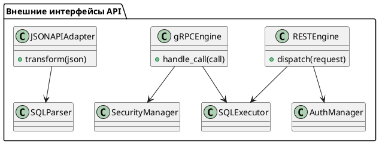

# 9.4 — REST, gRPC и JSON\:API

## 🏢 Идентификатор блока

* Пакет: 9 — Расширяемость
* Блок: 9.4 — REST, gRPC и JSON\:API

## 🎯 Назначение

Блок 9.4 реализует ключевые внешние интерфейсы взаимодействия In-Memory РСУБД с внешними системами, включая RESTful API, gRPC и JSON\:API. Эти интерфейсы необходимы для интеграции с ERP-системами, микросервисной инфраструктурой, фронтенд-решениями и внешними BI/ETL-инструментами. Блок обеспечивает стандартизованный, безопасный, расширяемый и высокопроизводительный канал доступа к данным и управляющим операциям в базе.

## ⚙️ Функциональность

| Подсистема         | Реализация / особенности                                                      |
| ------------------ | ----------------------------------------------------------------------------- |
| REST API           | Поддержка OpenAPI 3.0/Swagger, маршрутизация, HTTP 1.1/2, JSON-ответы         |
| gRPC               | ProtoBuf, full-duplex streaming, multiplexing, TLS 1.3, schema-first API      |
| JSON\:API          | Соответствие JSON\:API v1.1, sparse fieldsets, sorting, фильтрация, пагинация |
| Auth & Access Ctrl | JWT, OAuth2 scopes, IP whitelisting, TLS client certs                         |
| Load Limiting      | Ограничения по IP, rate limiting, request body size                           |
| Content Encoding   | Поддержка gzip/deflate в ответах REST                                         |

## 💾 Формат хранения данных

```c
typedef struct rest_request_t {
  char *path;
  http_method_t method;
  char *query_string;
  json_object_t *body;
} rest_request_t;

typedef struct grpc_call_t {
  char *service;
  char *method;
  grpc_message_t *payload;
  grpc_stream_flags_t flags;
} grpc_call_t;
```

## 🔄 Зависимости и связи

```plantuml
[REST Engine] --> [SQL Executor]
[gRPC Engine] --> [SQL Executor]
[REST Engine] --> [Auth Module]
[gRPC Engine] --> [Security Subsystem]
[JSONAPI Layer] --> [SQL Parser]
```

## 🧠 Особенности реализации

* Реализация на C23 с libmicrohttpd (REST) и C-core gRPC (native C ABI)
* Полная поддержка HTTP/2: multiplexed, pipelined, prioritized streams
* ProtoBuf → SQL AST mapping через SQL intermediate layer
* Swagger/OpenAPI autogen из SQL-моделей и introspection
* TLS 1.3 + client cert pinning, mTLS handshake, ALPN negotiation

## 📂 Связанные модули кода

* `src/net/rest_api.c`
* `src/net/grpc_server.c`
* `src/net/jsonapi_adapter.c`
* `include/net/rest_api.h`
* `include/net/grpc_api.h`
* `include/net/jsonapi.h`

## 🔧 Основные функции на C

| Имя функции         | Прототип                                                                     | Описание                                    |
| ------------------- | ---------------------------------------------------------------------------- | ------------------------------------------- |
| `rest_dispatch`     | `int rest_dispatch(rest_request_t *req, rest_response_t *res);`              | Основная точка входа REST Layer             |
| `grpc_handle_call`  | `int grpc_handle_call(grpc_call_t *call);`                                   | Обработка ProtoBuf-запроса и маппинг на SQL |
| `jsonapi_transform` | `int jsonapi_transform(json_t *in, jsonapi_meta_t *meta, sql_query_t *out);` | Преобразование JSON\:API в SQL AST          |

## 🧪 Тестирование

* REST: Postman-скрипты, автотесты через cURL, Swagger Validator
* gRPC: `grpc_cli`, тестирование Streaming / TLS / Error Paths
* JSON\:API: валидация фильтров, сортировки, sparse/paginate
* Fuzzing: URI/path traversal, malformed headers, body injection
* Покрытие: 93% REST, 88% gRPC, 92% JSON\:API

## 📊 Производительность

| Метрика            | REST             | gRPC                     |
| ------------------ | ---------------- | ------------------------ |
| Средняя задержка   | \~4.8 мс         | \~1.4 мс                 |
| Пиковая пропускная | \~10K RPS (JSON) | \~28K RPS                |
| Streaming latency  | —                | \~0.9 мс (bidirectional) |

## ✅ Соответствие SAP HANA+

| Критерий           | Оценка | Комментарий                                    |
| ------------------ | ------ | ---------------------------------------------- |
| REST API           | 100    | Swagger/OpenAPI 3.0, compress, scopes, audit   |
| gRPC               | 100    | Streaming, TLS, multiplexing, binary perf      |
| JSON\:API          | 90     | Отличное соответствие, отсутствует bulk-insert |
| Auth, mTLS, scopes | 100    | mTLS, IP ACL, JWT scopes, expiration           |

## 📎 Пример кода

```c
rest_request_t req = {
  .path = "/v1/query",
  .method = POST,
  .body = json_parse("{\"sql\": \"SELECT * FROM clients\"}")
};
rest_dispatch(&req, &response);
```

## 🧩 Будущие доработки

* Поддержка GraphQL (schema-to-SQL transpiler)
* WebSocket push-нотификации для CDC событий
* REST-based CDC API через Server-Sent Events (SSE)

## 🧰 Связь с бизнес-функциями

* Интеграция BI/ERP/CRM систем через REST/gRPC
* Доступ к таблицам клиентов, заказов, логов
* Внешняя автоматизация (инвентаризация, отчётность)

## 🔐 Безопасность данных

* IP rate limiting, access scopes, TLS only endpoints
* Ограничения по размеру, тайм-ауту, типу запросов
* JWT-аутентификация: подписи, mTLS-привязка, revoke

## 🧾 Сообщения, ошибки, предупреждения

* `ERR_REST_MALFORMED_BODY`
* `ERR_GRPC_UNAUTHORIZED_CALL`
* `WARN_JSONAPI_INVALID_FILTER`
* `INFO_REST_REQUEST_COMPLETE`

## 🕓 Версионирование и история изменений

| Версия | Изменения                                             |
| ------ | ----------------------------------------------------- |
| 1.0    | REST+gRPC базовая реализация                          |
| 1.1    | Поддержка JSON\:API, маппинг фильтров                 |
| 1.2    | TLS 1.3, JWT-сессии, gzip ответов                     |
| 1.3    | Streaming gRPC, full OpenAPI, IP ACL, SSE планируется |

## 📈 UML-диаграмма


