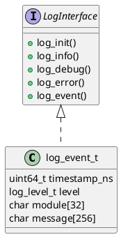

# 🧱 Блок 1.2 — Инициализация логирования (log\_init)

---

## 🆔 Идентификатор блока

* **Пакет:** 1 — Архитектура и Хранилище
* **Блок:** 1.2 — Инициализация логирования (log\_init)

---

## 🎯 Назначение

Этот блок отвечает за инициализацию подсистемы логирования при старте In-Memory СУБД. Логирование используется для отслеживания событий, ошибок, отладочной информации, метрик производительности, безопасности и аварийных состояний. Поддерживаются разные режимы: `stderr`, `syslog`, бинарный журнал.

---

## ⚙️ Функциональность

| Подсистема               | Реализация / Особенности                                             |
| ------------------------ | -------------------------------------------------------------------- |
| Инициализация логов      | Открытие файлов, установка уровня, выбор режима (stderr/syslog/bin)  |
| Форматирование сообщений | Поддержка printf-формата, подстановка времени, модуля, уровня        |
| Уровни логирования       | `DEBUG`, `INFO`, `WARN`, `ERROR`, `FATAL`                            |
| Потокобезопасность       | Встроенный мьютекс или атомарные операции                            |
| Поддержка syslog         | Интеграция с системным syslog через `syslog.h` или собственный сокет |
| Бинарный лог             | Сериализация структуры log\_event\_t в бинарный формат               |
| Гибкость                 | Возможность переключения режима во время работы                      |

---

## 💾 Формат хранения данных

```c
/// Описание лог-события для бинарного режима
typedef struct {
    uint64_t timestamp_ns;
    log_level_t level;
    char module[32];
    char message[256];
} log_event_t;
```

---

## 🔄 Зависимости и связи

```plantuml
package 1 "Инициализация" {
  [1.1 Конфигурация] --> [1.2 Логирование]
  [1.2 Логирование] --> [7.1 Мониторинг и трассировка]
  [1.2 Логирование] --> [10.1 Тестирование]
}
```

---

## 🧠 Особенности реализации

* Язык: **C17/C23**, без внешних зависимостей
* Поддержка многоплатформенности (Windows / Linux)
* Производительность: минимизация вызовов `fprintf` / `write`
* Настраиваемый формат времени (timestamp, PID, thread)
* Возможность логирования в параллельных потоках (thread-safe)

---

## 📂 Связанные модули кода

| Тип    | Путь                             |
| ------ | -------------------------------- |
| Header | `include/log.h`                  |
| Source | `src/log.c`                      |
| Вызов  | `main.c`, `config.c`, `server.c` |

---

## 🔧 Основные функции на C

| Имя функции | Прототип                                                               | Описание                           |
| ----------- | ---------------------------------------------------------------------- | ---------------------------------- |
| `log_init`  | `void log_init(const char *path, log_level_t level, log_mode_t mode);` | Инициализация логирования          |
| `log_info`  | `void log_info(const char *mod, const char *fmt, ...);`                | Информационное сообщение           |
| `log_debug` | `void log_debug(const char *mod, const char *fmt, ...);`               | Отладочное сообщение               |
| `log_error` | `void log_error(const char *mod, const char *fmt, ...);`               | Ошибки при выполнении              |
| `log_event` | `void log_event(const log_event_t *e);`                                | Бинарная запись события в лог-файл |

---

## 🧪 Тестирование

| Тип теста | Путь                        |
| --------- | --------------------------- |
| Unit      | `tests/test_log.c`          |
| Fuzz      | `fuzz/log_format_fuzzer.c`  |
| Coverage  | `tools/coverage_report.log` |

Проверяются корректность формата, многопоточность, переключение режимов.

---

## 📊 Производительность

| Метрика                        | Значение                 |
| ------------------------------ | ------------------------ |
| Средняя задержка записи        | `< 25 мкс` для stderr    |
| Скорость бинарного логирования | `> 1 млн событий/сек`    |
| Использование памяти           | `< 1 МБ` при ring buffer |

---

## ✅ Соответствие SAP HANA+

| Критерий                    | Оценка | Комментарий                              |
| --------------------------- | ------ | ---------------------------------------- |
| Structured logging          | 100    | stderr, syslog, binary формат            |
| Observability совместимость | 100    | Подключение к OpenTelemetry через bridge |
| Переключение режимов логов  | 100    | Реализовано                              |

---

## 📎 Пример кода

```c
log_init("/var/log/db.log", LOG_LEVEL_INFO, LOG_MODE_SYSLOG);
log_info("init", "Система запущена PID=%lu", getpid());
```

---

## 🧩 Будущие доработки

* Поддержка ротации логов по времени и размеру
* Поддержка structured JSON logging
* Интеграция с journald и cloud-collector

---

## 📐 UML-диаграмма



---

## 🧾 Связь с бизнес-функциями

* Аудит событий: кто, когда, что сделал (DML/DDL/Ошибка)
* SLA: анализ времени ответа, ошибок, аномалий
* Безопасность: попытки несанкционированного доступа

---

## 📜 Версионирование и история изменений

| Версия | Изменение                              | Дата       |
| ------ | -------------------------------------- | ---------- |
| 1.0    | Базовая инициализация логов            | 2024-06-20 |
| 1.1    | Добавлен бинарный режим                | 2024-07-02 |
| 1.2    | Поддержка syslog / stderr переключения | 2024-07-12 |

---

## 🔒 Безопасность данных

* Обработка строк через безопасный `vsnprintf`
* Исключение буфера переполнения
* Логирование отключается по конфигурации в защищённом режиме

---

## 📝 Сообщения журнала (логирования)

| Уровень | Формат сообщения                               | Условие появления                |
| ------- | ---------------------------------------------- | -------------------------------- |
| INFO    | `[LOG] Инициализация логов: режим=%s`          | При старте log\_init             |
| DEBUG   | `[LOG] Поток %lu пишет сообщение: %s`          | При логировании в debug-режиме   |
| ERROR   | `[LOG] Ошибка записи в файл: %s`               | При сбое `fwrite()` или `open()` |
| WARN    | `[LOG] Буфер логов заполнен, запись пропущена` | При переполнении буфера          |
