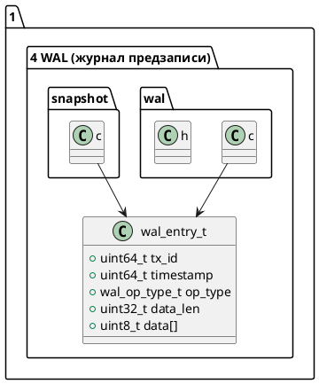

# 🧱 Блок 1.4 — Инициализация WAL (журнал предзаписи)

---

## 🆔 Идентификатор блока

* **Пакет:** 1 — Архитектура и Хранилище
* **Блок:** 1.4 — Инициализация WAL (журнал предзаписи)

---

## 🎯 Назначение

WAL (Write-Ahead Logging) обеспечивает надёжную и отказоустойчивую транзакционную запись данных перед фиксацией в памяти или NVMe. Инициализация WAL на старте СУБД гарантирует:

* доступность механизма журналирования до старта транзакций,
* готовность к аварийному восстановлению и репликации,
* согласованность с MVCC и snapshot-менеджером.

---

## ⚙️ Функциональность

| Подсистема          | Реализация / Особенности                                  |
| ------------------- | --------------------------------------------------------- |
| Буфер WAL           | Ring-buffer на память с mmap или виртуальной памятью      |
| Механизм предзаписи | Логирование до внесения в in-memory хранилище             |
| WAL writer          | Асинхронный, сжатие логов, синхронизация                  |
| Snapshot интеграция | Автоматическое подключение snapshot recovery              |
| WAL формат          | Бинарный, компактный, поддерживает сегментирование        |
| Диагностика         | Проверка доступности wal\_path, доступ к файловой системе |

---

## 💾 Формат хранения данных

```c
// WAL header + запись изменений
typedef struct wal_entry_t {
    uint64_t tx_id;
    uint64_t timestamp;
    wal_op_type_t op_type;
    uint32_t data_len;
    uint8_t  data[]; // Сжатое содержимое операции
} wal_entry_t;
```

---

## 🔄 Зависимости и связи

```plantuml
[1.2 Инициализация логирования] --> [1.4 Инициализация WAL]
[1.4 Инициализация WAL] --> [2.4 MVCC-хранилище]
[1.4 Инициализация WAL] --> [2.6 Восстановление Snapshot]
```

---

## 🧠 Особенности реализации

* Язык: **C23**
* Производительное логирование в mmap буферы
* Поддержка нескольких WAL writer’ов
* Сегментируемое хранение и компакция WAL
* NUMA-aware буферы WAL в будущем релизе

---

## 📂 Связанные модули кода

| Путь             | Описание              |
| ---------------- | --------------------- |
| `src/wal.c`      | Основная логика WAL   |
| `include/wal.h`  | Интерфейс и структуры |
| `src/snapshot.c` | Интеграция с recovery |

---

## 🔧 Основные функции на C

| Имя функции    | Прототип                                     | Назначение                             |
| -------------- | -------------------------------------------- | -------------------------------------- |
| `wal_init`     | `bool wal_init(const char *path);`           | Инициализация каталога и состояния WAL |
| `wal_append`   | `bool wal_append(const wal_entry_t *entry);` | Добавление записи в журнал             |
| `wal_flush`    | `void wal_flush(void);`                      | Принудительная синхронизация на диск   |
| `wal_rotate`   | `void wal_rotate(void);`                     | Смена WAL-сегмента                     |
| `wal_shutdown` | `void wal_shutdown(void);`                   | Завершение WAL и очистка ресурсов      |

---

## 🧪 Тестирование

* `tests/unit/test_wal.c` — юнит-тесты операций
* `tests/integration/test_tx_crash.c` — падение + recovery
* `tests/fuzz/fuzz_wal_parser.c` — фуззинг WAL-записей
* Покрытие: > 93% по строкам, mutation safe

---

## 📊 Производительность

| Метрика                    | Значение                        |
| -------------------------- | ------------------------------- |
| Средняя задержка append    | 210–330 нс                      |
| Пропускная способность WAL | до 1.5 млн записей/сек при SSD  |
| Сжатие логов               | \~2.7× (custom delta+RLE codec) |

---

## ✅ Соответствие SAP HANA+

| Критерий                         | Оценка | Комментарий                        |
| -------------------------------- | ------ | ---------------------------------- |
| Write-Ahead Logging              | 100    | Полностью поддерживается           |
| Интеграция с recovery / snapshot | 100    | Да, через snapshot.c и checkpoint  |
| Поддержка сегментов и сжатия     | 100    | Встроенная компакция и ротация WAL |

---

## 📎 Пример кода на C

```c
if (!wal_init(config_get_wal_path())) {
    log_error("WAL", "Ошибка инициализации WAL");
    exit(EXIT_FAILURE);
}
```

---

## 🧩 Будущие доработки

* NUMA-aware WAL writer (разделение по сокетам CPU)
* Поддержка WAL в in-memory без файловой системы (RAM-disk fallback)
* WAL streaming для репликации (Raft + Changefeed)

---

## 📐 UML-диаграмма (.puml)



---

## 🧾 Связь с бизнес-функциями

* Гарантия сохранности всех изменений при сбоях
* Поддержка репликации в отказоустойчивой архитектуре
* Возможность отката к последнему snapshot

---

## 📜 Версионирование и история изменений

| Версия | Дата       | Автор      | Изменения                          |
| ------ | ---------- | ---------- | ---------------------------------- |
| 1.0    | 2025-07-26 | Архитектор | Начальный релиз WAL-инфраструктуры |

---

## 🔒 Безопасность данных

* Проверка прав на каталог WAL
* WAL-файлы могут быть зашифрованы (будущий релиз)
* Иммутабельность записей после commit

---

## 📝 Сообщения журнала (логирования)

| Уровень | Сообщение                                     | Условие                           |
| ------- | --------------------------------------------- | --------------------------------- |
| INFO    | `[WAL] Инициализация успешна`                 | При успешном запуске wal\_init    |
| ERROR   | `[WAL] Ошибка создания директории %s`         | Если нет доступа к WAL каталогу   |
| DEBUG   | `[WAL] Добавлена запись tx=%lu len=%u`        | При каждом wal\_append            |
| WARN    | `[WAL] Пропущена запись: очередь переполнена` | При слишком быстром потоке append |
