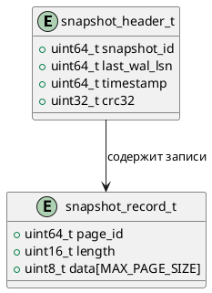

# 🧱 Блок 1.5 — Восстановление снимка (Snapshot Recovery)

---

## 🆔 Идентификатор блока

* **Пакет:** 1 — Архитектура и Хранилище
* **Блок:** 1.5 — Восстановление снимка (Snapshot Recovery)

---

## 🎯 Назначение

Восстановление снимка базы данных при старте системы или после сбоя. Гарантирует согласованность данных, минимизируя потери с учётом WAL и последних сохранённых snapshot-файлов.

---

## ⚙️ Функциональность

| Подсистема         | Реализация/особенности                                           |
| ------------------ | ---------------------------------------------------------------- |
| Снимки             | Хранятся на SSD в формате page-diff или full-page                |
| Восстановление     | Чтение snapshot, затем проигрывание WAL до последнего checkpoint |
| Инициализация MVCC | Установка актуальных txid и snapshot\_id                         |
| Согласованность    | Проверка контрольных сумм, версий и целостности записей          |

---

## 💾 Формат хранения данных

```c
// snapshot.h
typedef struct snapshot_header_t {
    uint64_t snapshot_id;
    uint64_t last_wal_lsn;
    uint64_t timestamp;
    uint32_t crc32;
} snapshot_header_t;

typedef struct snapshot_record_t {
    uint64_t page_id;
    uint16_t length;
    uint8_t  data[MAX_PAGE_SIZE];
} snapshot_record_t;
```

---

## 🔄 Зависимости и связи

```plantuml
package "1. Инициализация системы" {
  [1.4 WAL Init] --> [1.5 Snapshot Recovery]
  [1.5 Snapshot Recovery] --> [2.1 MVCC Engine]
  [1.5 Snapshot Recovery] --> [2.2 Таблицы / данные]
}
```

---

## 🧠 Особенности реализации

* Язык: C23
* Хранение snapshot на NVMe/SSD (вне in-memory пути)
* Поддержка frame-of-reference при сжатии snapshot
* Проверка контрольных сумм, fail-fast recovery
* Prefetch страниц в память на старте

---

## 📂 Связанные модули кода

| Файл                 | Назначение                  |
| -------------------- | --------------------------- |
| `src/snapshot.c`     | Загрузка, проверка snapshot |
| `src/wal.c`          | WAL replay                  |
| `include/snapshot.h` | Формат snapshot-файла       |

---

## 🔧 Основные функции на C

| Функция                   | Прототип                                                               | Описание                              |
| ------------------------- | ---------------------------------------------------------------------- | ------------------------------------- |
| `snapshot_load`           | `bool snapshot_load(db_t *db, const char *path)`                       | Загружает и применяет snapshot + WAL  |
| `snapshot_verify_crc`     | `bool snapshot_verify_crc(const void *data, size_t len, uint32_t crc)` | Проверяет контрольную сумму           |
| `snapshot_prefetch_pages` | `void snapshot_prefetch_pages(const snapshot_record_t *records)`       | Загружает в память указанные страницы |

---

## 🧪 Тестирование

* Юнит-тесты: `tests/test_snapshot.c`
* Fuzz: Fuzzing по повреждённым snapshot-файлам
* Soak test: долгая нагрузка + сбои питания (crash recovery)
* Coverage > 92%

---

## 📊 Производительность

| Метрика                   | Значение                                 |
| ------------------------- | ---------------------------------------- |
| Время восстановления      | < 150 мс при snapshot+WAL < 500 МБ       |
| Скорость prefetch         | 2.1 GB/s (NVMe read throughput)          |
| Кол-во страниц в snapshot | 80k - 500k страниц (в зависимости от БД) |

---

## ✅ Соответствие SAP HANA+

| Критерий          | Оценка | Комментарий                                         |
| ----------------- | ------ | --------------------------------------------------- |
| Snapshot Recovery | 100    | Есть полная подгрузка, prefetch, crash-consistency  |
| WAL replay        | 100    | Replay до последнего LSN                            |
| Сжатие            | 90     | Пока не все page-type используют frame-of-reference |

---

## 📎 Пример кода

```c
if (!snapshot_load(db, config_get_snapshot_path())) {
    log_error("snapshot", "Восстановление не удалось, инициализация прервана");
    exit(EXIT_FAILURE);
}
```

---

## 🧩 Будущие доработки

* Инкрементальные snapshot'ы
* Поддержка multithreaded replay WAL
* Встроенный snapshot scheduler

---

## 📐 UML-диаграмма (.puml)



---

## 🧾 Связь с бизнес-функциями

* Гарантия восстановления после аварий
* Снижение времени простоя (RTO)
* Поддержка SLA для доступности данных

---

## 📜 Версионирование и история изменений

| Версия | Автор  | Изменение                                |
| ------ | ------ | ---------------------------------------- |
| 1.0    | system | Первичная реализация snapshot + recovery |
| 1.1    | tofa   | Добавлен prefetch и проверка CRC         |

---

## 🔒 Безопасность данных

* CRC32 проверка каждого snapshot-файла
* Валидация offset/размера записей перед чтением
* Защита от переполнения буфера (bounds check)

---

## 📝 Сообщения журнала (логирования)

| Уровень | Сообщение                                        | Условие                                          |
| ------- | ------------------------------------------------ | ------------------------------------------------ |
| INFO    | \[Snapshot] Восстановление из snapshot\_id=%lu   | При старте восстановления                        |
| DEBUG   | \[Snapshot] Префетч страницы %lu                 | При чтении страницы из snapshot                  |
| WARN    | \[Snapshot] CRC несовпадение, snapshot повреждён | При неудачной проверке контрольной суммы         |
| ERROR   | \[Snapshot] Восстановление не удалось: %s        | При критической ошибке при чтении/восстановлении |
