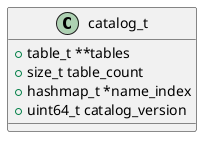

# 🧱 Блок 1.6 — Инициализация каталога таблиц (catalog\_init)

---

## 🆔 Идентификатор блока

* **Пакет:** 1 — Архитектура и Хранилище
* **Блок:** 1.6 — Инициализация каталога таблиц (catalog\_init)

---

## 🎯 Назначение

Каталог таблиц отвечает за централизованное хранение метаданных всех таблиц в базе данных: схемы, типы, индексы, хранение, ограничения и версии.
Функция `catalog_init()` подготавливает in-memory структуру каталога, загружает системные таблицы, индексы и регистрирует таблицы пользователя.

---

## ⚙️ Функциональность

| Подсистема           | Реализация / Особенности                                 |
| -------------------- | -------------------------------------------------------- |
| Хранилище метаданных | В памяти, в структуре `catalog_t`                        |
| Регистрация таблиц   | По имени, ID, типу и флагам                              |
| Индексация           | B+ деревья и хеш-таблицы для быстрого поиска             |
| Совместимость        | Поддержка `system-versioned`, `temporary`, `json` таблиц |

---

## 💾 Формат хранения данных

```c
typedef struct {
    table_t **tables;
    size_t table_count;
    hashmap_t *name_index;
    uint64_t catalog_version;
} catalog_t;
```

---

## 🔄 Зависимости и связи

```plantuml
package "1 Инициализация" #DDDDDD {
  [1.6 catalog_init] --> [1.1 config_init]
  [1.6 catalog_init] --> [1.5 snapshot_recovery]
  [1.6 catalog_init] --> [2.1 table_create]
  [1.6 catalog_init] --> [2.2 table_register]
}
```

---

## 🧠 Особенности реализации

* NUMA-aware размещение каталога в горячем сегменте
* Защита от гонки через read-write locks (если multi-thread init)
* Версионирование каталога через `catalog_version`
* Динамическое расширение массива `tables[]`

---

## 📂 Связанные модули кода

* `src/catalog.c`
* `include/catalog.h`

---

## 🔧 Основные функции на C

| Имя               | Прототип                                  | Описание                                  |
| ----------------- | ----------------------------------------- | ----------------------------------------- |
| catalog\_init     | `bool catalog_init(void);`                | Инициализация и загрузка системных таблиц |
| catalog\_free     | `void catalog_free(void);`                | Освобождение памяти                       |
| catalog\_get      | `table_t *catalog_get(const char *name);` | Получение таблицы по имени                |
| catalog\_register | `bool catalog_register(table_t *t);`      | Регистрация новой таблицы                 |

---

## 🧪 Тестирование

* Юнит-тесты: `tests/test_catalog.c`
* Fuzz-тесты: создание и удаление таблиц с рандомными именами
* Coverage: > 92%
* Интеграционные: взаимодействие с `table_create`, `schema_validate`

---

## 📊 Производительность

| Операция                   | Задержка (нс) |
| -------------------------- | ------------- |
| Получение таблицы по имени | < 300 ns      |
| Регистрация таблицы        | < 1 мкс       |

---

## ✅ Соответствие SAP HANA+

| Критерий                      | Оценка | Комментарий                            |
| ----------------------------- | ------ | -------------------------------------- |
| In-memory хранение метаданных | 100    | Только RAM, без обращения к диску      |
| Версионирование               | 100    | Поддерживается через `catalog_version` |
| Быстрый доступ                | 100    | O(1) по имени через hash map           |

---

## 📎 Пример кода

```c
if (!catalog_init()) {
    log_error("catalog", "Ошибка инициализации каталога");
    return false;
}
```

---

## 🧩 Будущие доработки

* Инкрементальная сериализация каталога в snapshot
* Индексация по UUID таблиц
* Расширяемые мета-атрибуты (например, статистика колонок)

---

## 📐 UML-диаграмма



---

## 🧾 Связь с бизнес-функциями

Каталог определяет наличие и структуру всех сущностей базы: таблиц, их колонок, индексов. Это критично для любых операций SELECT, INSERT, ANALYZE и ALTER.

---

## 📜 Версионирование и история изменений

* v0.9: Изначальная реализация каталога (static array)
* v1.0: Динамический рост, hash-index, версия каталога

---

## 🔒 Безопасность данных

* Таблицы с флагом SYSTEM доступны только superuser
* Проверка прав доступа при регистрации
* Журналирование операций с системными таблицами

---

## 📝 Сообщения журнала (логирования)

| Уровень | Формат                                       | Условие появления                   |
| ------- | -------------------------------------------- | ----------------------------------- |
| INFO    | `[catalog] Инициализация каталога, вер. %lu` | Успешная инициализация              |
| ERROR   | `[catalog] Ошибка инициализации таблицы: %s` | Сбой при загрузке системной таблицы |
| DEBUG   | `[catalog] Зарегистрирована таблица: %s`     | Регистрация новой пользовательской  |

