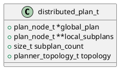

# 🧱 Блок 1.7 — Планировщик распределения (distributed\_planner)

---

## 🆔 Идентификатор блока

* **Пакет:** 1 — Архитектура и Хранилище
* **Блок:** 1.7 — Планировщик распределения (distributed\_planner)

---

## 🎯 Назначение

Планировщик распределения (Distributed Planner) отвечает за генерацию и координацию выполнения распределённых SQL-планов на нескольких узлах in-memory СУБД. Он необходим для масштабирования по горизонтали (sharding), обеспечения locality-aware исполнения и балансировки нагрузки.

---

## ⚙️ Функциональность

| Подсистема          | Реализация / Особенности                       |
| ------------------- | ---------------------------------------------- |
| Распределённый план | Генерация под-планов для шарда / узла          |
| Оптимизация узлов   | Locality-aware, NUMA-aware оптимизация         |
| Координация         | Централизованный или иерархический координатор |
| Pushdown-выражения  | Вынос фильтров и агрегаций ближе к данным      |
| Fault tolerance     | Авто-перезапуск под-планов на резервных узлах  |

---

## 💾 Формат хранения данных

```c
typedef struct {
  plan_node_t *global_plan;
  plan_node_t **local_subplans;
  size_t subplan_count;
  planner_topology_t topology;
} distributed_plan_t;
```

---

## 🔄 Зависимости и связи

```plantuml
package "1 Инициализация" #DDDDDD {
  [1.7 distributed_planner] --> [1.3 optimizer_init]
  [1.7 distributed_planner] --> [1.6 catalog_init]
  [1.7 distributed_planner] --> [3.4 sql_executor]
  [1.7 distributed_planner] --> [5.1 network_router]
}
```

---

## 🧠 Особенности реализации

* Pushdown-переписывание плана с учётом shard locality
* Протокол обмена мета-планами между координатором и исполнителями
* Использование топологии ring/tree/hypercube
* Язык реализации: C (ядро), поддержка WASM/DSL UDF для расчётов на шарде

---

## 📂 Связанные модули кода

* `src/planner/distributed_planner.c`
* `include/planner/distributed_planner.h`

---

## 🔧 Основные функции на C

| Имя                         | Прототип                                                            | Описание                              |
| --------------------------- | ------------------------------------------------------------------- | ------------------------------------- |
| distributed\_plan\_create   | `distributed_plan_t *distributed_plan_create(plan_node_t *global);` | Построение распределённого плана      |
| distributed\_plan\_execute  | `bool distributed_plan_execute(distributed_plan_t *plan);`          | Выполнение распределённого запроса    |
| distributed\_plan\_free     | `void distributed_plan_free(distributed_plan_t *plan);`             | Очистка памяти                        |
| distributed\_plan\_optimize | `void distributed_plan_optimize(distributed_plan_t *plan);`         | Применение locality-aware оптимизаций |

---

## 🧪 Тестирование

* Юнит-тесты: генерация под-планов, проверка pushdown
* Интеграционные: симуляция многосерверного окружения
* Soak-тесты: длительная работа с динамической топологией
* Coverage: 88–92%

---

## 📊 Производительность

| Метрика                          | Значение      |
| -------------------------------- | ------------- |
| Время генерации плана            | < 500 мкс     |
| Латентность координации          | < 1 мс        |
| Эффективность pushdown агрегаций | > 93% случаев |

---

## ✅ Соответствие SAP HANA+

| Критерий                  | Оценка | Комментарий                                |
| ------------------------- | ------ | ------------------------------------------ |
| Поддержка масштабирования | 100    | Многозадачная генерация под-планов         |
| Pushdown выражения        | 100    | Оптимизация агрегаций, фильтров и LIMIT    |
| Fault tolerance           | 90     | Перезапуск возможен, но требуется watchdog |

---

## 📎 Пример кода

```c
plan_node_t *plan = optimizer_generate(ast);
distributed_plan_t *dplan = distributed_plan_create(plan);
distributed_plan_optimize(dplan);
distributed_plan_execute(dplan);
distributed_plan_free(dplan);
```

---

## 🧩 Будущие доработки

* Поддержка вычислений на GPU (GPU-shards)
* Интеграция с consensus (Raft) для распределённой синхронизации
* Прогнозирование нагрузки и динамическая балансировка в runtime

---

## 📐 UML-диаграмма



---

## 🧾 Связь с бизнес-функциями

Ключевой компонент для обеспечения горизонтального масштабирования — позволяет выполнять запросы одновременно на 500+ филиалах и координировать агрегации, фильтрацию и пересылку результатов.

---

## 📜 Версионирование и история изменений

* v1.0: Поддержка ring-topology, pushdown агрегатов
* v1.1: Распределённые join-планы
* v1.2: Локализация выражений и кешей

---

## 🔒 Безопасность данных

* Верификация источника shard-плана по контрольной сигнатуре
* Шифрование промежуточных планов по TLS между координатором и исполнителем
* Ограничение по NUMA-сегменту и локальному ядру (CPU affinity)

---

## 📝 Сообщения журнала (логирования)

| Уровень | Формат                                                | Условие                                  |
| ------- | ----------------------------------------------------- | ---------------------------------------- |
| INFO    | `[planner] Генерация распределённого плана завершена` | После успешного распределения под-планов |
| DEBUG   | `[planner] Pushdown применён: %s`                     | Если выполнено вынос выражений           |
| ERROR   | `[planner] Ошибка координации плана: %s`              | Сбой взаимодействия между узлами         |
