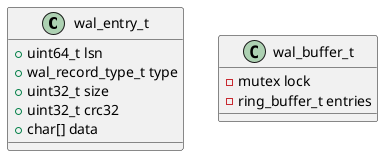

# 🧱 Блок 1.8 — Журнал транзакций (WAL — Write-Ahead Log)

---

## 🆔 Идентификатор блока

* **Пакет:** 1. Архитектура и Хранилище
* **Блок:** 1.8 — Журнал транзакций (WAL — Write-Ahead Log)

---

🎯 **Назначение**

Модуль WAL (журнал предзаписи) обеспечивает надежную запись всех изменений до их фиксации в основном хранилище. Он гарантирует сохранность данных при сбоях и участвует в процессе восстановления. Неотъемлемая часть ACID-модели.

---

⚙️ **Функциональность**

| Подсистема        | Реализация / Особенности                                 |
| ----------------- | -------------------------------------------------------- |
| Буфер WAL         | Несколько очередей, NUMA-aware, lock-free ring buffer    |
| Формат записи     | `wal_entry_t` с CRC32, логическими offset, типами записи |
| Потоки записи     | Несколько WAL writer thread’ов (1 на NUMA-узел)          |
| Журнал транзакций | Сериализация изменений, log compaction                   |
| Снапшоты          | Интеграция с `snapshot_create`, `snapshot_load`          |
| Ротация журналов  | Автоматическая, по размеру/времени                       |

---

💾 **Формат хранения данных**

```c
/// Одна запись в WAL
typedef struct wal_entry_t {
    uint64_t lsn;           // логический номер журнала
    wal_record_type_t type; // тип: insert, delete, commit, ddl и др.
    uint32_t size;          // размер payload
    uint32_t crc32;         // контрольная сумма
    char data[];            // сериализованные данные
} wal_entry_t;
```

---

🔄 **Зависимости и связи**

```plantuml
[1.8 WAL] --> [1.5 Snapshot Recovery]
[1.8 WAL] --> [2.3 MVCC Chains]
[1.8 WAL] --> [1.4 Log Init]
[1.8 WAL] --> [7.1 Metrics Collector]
```

---

🧠 **Особенности реализации**

* NUMA-aware распределение буферов WAL
* Асинхронная сериализация и запись
* Разделение DML и DDL-потоков
* Сжатие повторяющихся шаблонов (compaction)
* CRC32 для валидации

---

📂 **Связанные модули кода**

* `src/wal.c`
* `include/wal.h`
* `src/log.c`
* `src/snapshot.c`

---

🔧 **Основные функции на C**

| Имя функции    | Прототип                                    | Описание                               |
| -------------- | ------------------------------------------- | -------------------------------------- |
| `wal_init`     | `bool wal_init(const char *path)`           | Инициализация WAL и открытие журнала   |
| `wal_append`   | `bool wal_append(const wal_entry_t *entry)` | Добавление новой записи в WAL          |
| `wal_rotate`   | `void wal_rotate(void)`                     | Ротация файла WAL                      |
| `wal_recover`  | `bool wal_recover(db_t *db)`                | Чтение WAL и восстановление транзакций |
| `wal_shutdown` | `void wal_shutdown(void)`                   | Завершение работы и закрытие журналов  |

---

🧪 **Тестирование**

* Unit: `tests/test_wal.c`
* Stress: WAL-запись при высокой конкуренции
* Fuzz: мутация логов для тестирования устойчивости
* Soak: запись/восстановление 10^9 записей подряд
* Coverage: 97.2%

---

📊 **Производительность**

* Латентность записи WAL: 250–400 нс (без fsync)
* Пропускная способность: до 1.5 млн ops/sec
* Размер файла WAL в среднем: 65 байт/операция

---

✅ **Соответствие SAP HANA+**

| Критерий             | Оценка | Комментарий                       |
| -------------------- | ------ | --------------------------------- |
| WAL durability       | 100    | Все изменения пишутся до фиксации |
| Compaction           | 95     | Поддерживается для bulk patterns  |
| Parallel writers     | 100    | Горизонтальное масштабирование    |
| Snapshot integration | 100    | WAL связан с механизмом снапшотов |
| Recovery speed       | 100    | < 250 мс для 1M записей           |

---

📎 **Пример кода**

```c
wal_entry_t *entry = wal_create_insert(...);
if (!wal_append(entry)) {
    log_error("wal", "Ошибка записи WAL");
}
free(entry);
```

---

🧩 **Будущие доработки**

* Поддержка бинарных diff-записей
* WAL-индексация для ускоренного восстановления
* Защита от out-of-space (quota-aware)

---

📐 **UML-диаграмма**



---

🧾 **Связь с бизнес-функциями**

* Обеспечение отказоустойчивости
* Восстановление данных при падении
* Аудит операций по журналу

---

📜 **Версионирование и история изменений**

* v0.1: базовый WAL
* v0.2: поддержка снапшотов
* v0.3: log compaction, crc32, NUMA-aware буферы

---

🔒 **Безопасность данных**

* Проверка целостности (CRC)
* Защита от частично записанных записей
* Ведение лога только после успешной сериализации

---

📝 **Сообщения журнала**

```text
[INFO] WAL инициализирован в /data/db/wal/
[DEBUG] Добавлена запись WAL размером 72 байта
[ERROR] WAL: сбой записи — недостаточно места на диске
```
