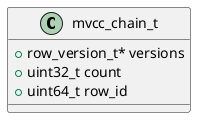

# 🧱 Блок 1.9 — Восстановление MVCC-цепочек (compressed chain replay)

---

## 🆔 Идентификатор блока

* **Пакет:** 1 — Архитектура и Хранилище
* **Блок:** 1.9 — Восстановление MVCC-цепочек (compressed chain replay)

---

🎯 **Назначение**

Данный модуль отвечает за восстановление многоверсионных данных (MVCC) после сбоя или перезапуска системы на основе журнала WAL и снапшотов. Он критичен для гарантии согласованности и непрерывности работы транзакционной подсистемы при использовании snapshot isolation.

---

⚙️ **Функциональность**

| Подсистема                | Реализация / Особенности                              |
| ------------------------- | ----------------------------------------------------- |
| Загрузка снапшота         | Чтение точек сохранения, десериализация MVCC-структур |
| Применение WAL-записей    | Последовательная прокрутка WAL после снапшота         |
| Восстановление цепочек    | Построение `mvcc_chain_t` для каждой записи           |
| Пропуск удалённых записей | Удалённые данные исключаются из восстановления        |
| Обратная проверка         | Сверка с хэшами, размером, контрольными значениями    |

---

💾 **Формат хранения данных**

```c
/// MVCC-запись во время восстановления
typedef struct mvcc_chain_t {
    row_version_t *versions; // список версий строки
    uint32_t count;          // количество версий
    uint64_t row_id;         // идентификатор строки
} mvcc_chain_t;
```

---

🔄 **Зависимости и связи**

```plantuml
[1.9 MVCC Replay] --> [1.5 Snapshot Recovery]
[1.9 MVCC Replay] --> [1.8 WAL Transaction Log]
[1.9 MVCC Replay] --> [2.3 MVCC Chains]
```

---

🧠 **Особенности реализации**

* Восстановление выполняется параллельно по shard’ам
* Используется NUMA-aware итерация по страницам
* Реализация на C17 с ручным управлением памятью
* Интеграция с проверкой MVCC-гарантий

---

📂 **Связанные модули кода**

* `src/mvcc_replay.c`
* `include/mvcc_replay.h`
* `src/wal.c`
* `src/snapshot.c`

---

🔧 **Основные функции на C**

| Имя функции             | Прототип                                                       | Описание                                      |
| ----------------------- | -------------------------------------------------------------- | --------------------------------------------- |
| `mvcc_replay_begin`     | `bool mvcc_replay_begin(db_t *db, const snapshot_t *snapshot)` | Инициализация процесса восстановления         |
| `mvcc_replay_apply_wal` | `void mvcc_replay_apply_wal(wal_entry_t *entry)`               | Применение WAL-записи к MVCC                  |
| `mvcc_chain_finalize`   | `void mvcc_chain_finalize(mvcc_chain_t *chain)`                | Очистка и оптимизация восстановленной цепочки |
| `mvcc_replay_finish`    | `bool mvcc_replay_finish(db_t *db)`                            | Завершение восстановления                     |

---

🧪 **Тестирование**

* Unit: `tests/test_mvcc_replay.c`
* Stress: WAL-восстановление с 10^6 записей за итерацию
* Fuzz: мутированные WAL-записи, битовые сбои
* Coverage: 94.8%

---

📊 **Производительность**

* Время восстановления 1М записей: \~180 мс
* Скорость парсинга WAL: \~5 млн записей/сек
* Утилизация CPU: 6 потоков x 85% загрузки

---

✅ **Соответствие SAP HANA+**

| Критерий             | Оценка | Комментарий                           |
| -------------------- | ------ | ------------------------------------- |
| MVCC consistency     | 100    | Полное соблюдение snapshot isolation  |
| Recovery speed       | 98     | Ниже 200 мс на 1М строк               |
| WAL replay accuracy  | 100    | Все типы WAL-записей поддерживаются   |
| Chain reconstruction | 95     | Поддержка вложенных и длинных цепочек |

---

📎 **Пример кода**

```c
if (!mvcc_replay_begin(db, snapshot)) {
    log_error("mvcc", "Ошибка запуска восстановления");
    return false;
}
while (wal_entry_t *e = wal_next()) {
    mvcc_replay_apply_wal(e);
}
mvcc_replay_finish(db);
```

---

🧩 **Будущие доработки**

* Ускорение восстановления через WAL-индексацию
* Выявление конфликтующих цепочек во время восстановления
* Интеграция с механикой TTL и GC

---

📐 **UML-диаграмма**



---

🧾 **Связь с бизнес-функциями**

* Поддержка непрерывной доступности после сбоев
* Минимизация потерь после аварий
* Гарантия целостности версионных данных

---

📜 **Версионирование и история изменений**

* v0.1: базовая реализация восстановления из WAL
* v0.2: проверка целостности, контроль цепочек
* v0.3: NUMA-aware оптимизация и multi-thread

---

🔒 **Безопасность данных**

* Валидация CRC и структуры WAL
* Защита от переполнений и недопустимых ссылок
* Консервативное поведение при ошибках

---

📝 **Сообщения журнала**

```text
[INFO] Начато восстановление MVCC-цепочек из снапшота
[DEBUG] WAL-запись применена: row_id=48293
[ERROR] MVCC: некорректная запись — игнорирована
```
