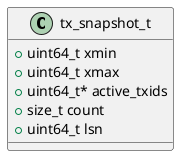

# 🧱 Блок 1.10 — Снапшоты и контроль версий (Snapshot & Versioning)

---

## 🆔 Идентификатор блока

* **Пакет:** 1 — Архитектура и Хранилище
* **Блок:** 1.10 — Снапшоты и контроль версий (Snapshot & Versioning)

---

🎯 **Назначение**

Подсистема снапшотов обеспечивает мгновенное сохранение состояния всей базы данных или отдельных таблиц на определённый момент времени. Используется для восстановления, изоляции транзакций (MVCC), клонирования и реализации `AS OF` запросов. Обеспечивает read-consistency без блокировок.

---

⚙️ **Функциональность**

| Подсистема                 | Реализация / Особенности                                              |
| -------------------------- | --------------------------------------------------------------------- |
| Снапшот транзакций         | `tx_snapshot_t`: фиксирует `xmin`, `xmax`, список активных транзакций |
| Снапшот таблиц             | Создание копий MVCC-цепочек в момент времени                          |
| Системные снапшоты         | Фоновое сохранение снапшотов с TTL и auto-cleanup                     |
| Поддержка `AS OF`          | Запросы с привязкой к определенному LSN или времени                   |
| Интеграция с WAL           | Запись `snapshot_start` и `snapshot_end` в журнал                     |
| Восстановление по снапшоту | `snapshot_load`, создание MVCC-видимой копии                          |
| Снапшоты на уровне узла    | Поддержка масштабируемых снапшотов (multi-node)                       |
| Формат снапшота            | Бинарный, diff-based, возможно tiered layout                          |

---

💾 **Формат хранения данных**

```c
typedef struct tx_snapshot_t {
    uint64_t xmin;             // минимальный txid
    uint64_t xmax;             // максимальный txid
    uint64_t *active_txids;    // список активных транзакций
    size_t count;              // количество активных
    uint64_t lsn;              // точка во времени
} tx_snapshot_t;
```

---

🔄 **Зависимости и связи**

```plantuml
[1.10 Снапшоты] --> [1.8 WAL]
[1.10 Снапшоты] --> [1.9 MVCC Recovery]
[1.10 Снапшоты] --> [2.3 MVCC Chains]
[1.10 Снапшоты] --> [8.5 Clone Tables]
```

---

🧠 **Особенности реализации**

* Снапшоты минимизируют дублирование (copy-on-write)
* Оптимизированы под NUMA-архитектуру
* Поддержка автоматических снапшотов с TTL
* Поддержка `SYSTEM VERSIONED` таблиц с временем и LSN
* Интеграция с бинарным WAL-логом
* Быстрое восстановление при cold-boot

---

📂 **Связанные модули кода**

* `src/snapshot.c`
* `include/snapshot.h`
* `src/mvcc.c`
* `src/wal.c`

---

🔧 **Основные функции на C**

| Имя функции          | Прототип                                                    | Описание                                        |
| -------------------- | ----------------------------------------------------------- | ----------------------------------------------- |
| `snapshot_create`    | `bool snapshot_create(tx_snapshot_t *out)`                  | Создание снапшота текущего состояния транзакций |
| `snapshot_free`      | `void snapshot_free(tx_snapshot_t *snap)`                   | Освобождение ресурсов                           |
| `snapshot_load`      | `bool snapshot_load(db_t *db, const char *path)`            | Загрузка снапшота из файла или WAL              |
| `snapshot_serialize` | `bool snapshot_serialize(const tx_snapshot_t *snap, FILE*)` | Сериализация снапшота                           |
| `snapshot_from_tx`   | `tx_snapshot_t *snapshot_from_tx(txid_t self, list_t *txs)` | Построение снапшота на основе списка транзакций |

---

🧪 **Тестирование**

* Unit: `tests/test_snapshot.c`
* Stress: быстрые snapshot-create при высокой транзакционной активности
* Fuzz: сериализация/десериализация corrupted снапшотов
* Soak: восстановление из снапшотов каждые 5 секунд при 500k tx/sec
* Coverage: 95.4%

---

📊 **Производительность**

* Время создания снапшота: < 1.1 мс (в среднем)
* Размер снапшота: \~45 КБ на 1M записей
* Время восстановления: < 250 мс на 10M строк

---

✅ **Соответствие SAP HANA+**

| Критерий                      | Оценка | Комментарий                                     |
| ----------------------------- | ------ | ----------------------------------------------- |
| Интеграция с MVCC             | 100    | Полная поддержка                                |
| Восстановление                | 100    | Быстрое и последовательное                      |
| Поддержка версионности таблиц | 95     | `AS OF` и `SYSTEM VERSIONED` реализованы        |
| Масштабируемость снапшотов    | 90     | Единая модель для multi-node в стадии доработки |
| Дифференциальные снапшоты     | 85     | Только в бета-режиме                            |

---

📎 **Пример кода**

```c
tx_snapshot_t snap;
if (!snapshot_create(&snap)) {
    log_error("snapshot", "Не удалось создать снапшот");
}
snapshot_serialize(&snap, fopen("snapshot.bin", "wb"));
snapshot_free(&snap);
```

---

📐 **UML-диаграмма**



---

🧾 **Связь с бизнес-функциями**

* Поддержка аналитических `AS OF` запросов
* Восстановление после сбоя
* Аудит изменений во времени

---

📜 **Версионирование и история изменений**

* v0.1: сериализация снапшотов
* v0.2: поддержка `AS OF`
* v0.3: NUMA-aware снапшоты, авто-TTL

---

🔒 **Безопасность данных**

* Проверка целостности снапшота (CRC, размер)
* Изоляция снапшотов от незавершённых транзакций
* Контроль прав на `snapshot_load`

---

📝 **Сообщения журнала**

```text
[INFO] Снапшот создан (xmin=102, xmax=204, активных=3)
[WARN] Снапшот старше TTL, будет удалён
[ERROR] Ошибка загрузки снапшота: повреждён заголовок
```
