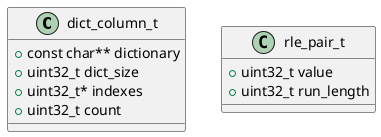

# 🧱 Блок 1.11 — Компактация и сжатие данных

---

## 🆔 Идентификатор блока

* **Пакет:** 1 — Архитектура и Хранилище
* **Блок:** 1.11 — Компактация и сжатие данных

---

🎯 **Назначение**

Модуль компактации и сжатия отвечает за эффективное хранение данных в памяти и на NVMe/SSD, снижая объём занимаемой памяти и повышая пропускную способность кэша CPU. Используется как в column-store, так и в WAL и MVCC-цепочках. Ключевой компонент для достижения высокой плотности хранения и скорости доступа.

---

⚙️ **Функциональность**

| Подсистема               | Реализация / Особенности                                     |
| ------------------------ | ------------------------------------------------------------ |
| Словарное сжатие         | Hash/Trie словари, SIMD-ускорение                            |
| Run-Length Encoding      | Детекция последовательностей, статические и динамические RLE |
| Delta Encoding           | Для числовых и временных значений (TS)                       |
| Frame-of-Reference       | Уплотнение по относительной базе значений                    |
| Vectorized decompression | Строго постраничное, векторное чтение                        |
| Компактация MVCC         | Сжатие устаревших версий, объединение цепочек                |
| Компактация WAL          | Объединение повторяющихся шаблонов                           |

---

💾 **Формат хранения данных**

```c
// Словарная колонка
typedef struct dict_column_t {
    const char **dictionary;
    uint32_t dict_size;
    uint32_t *indexes;
    uint32_t count;
} dict_column_t;

// RLE-колонка
typedef struct rle_pair_t {
    uint32_t value;
    uint32_t run_length;
} rle_pair_t;
```

---

🔄 **Зависимости и связи**

```plantuml
[1.11 Data Compaction] --> [1.2 Column Store]
[1.11 Data Compaction] --> [1.8 WAL]
[1.11 Data Compaction] --> [2.3 MVCC Chains]
[1.11 Data Compaction] --> [5.1 BI Aggregates]
```

---

🧠 **Особенности реализации**

* Использование SIMD-инструкций для RLE и dictionary
* Выравнивание на страницы и кеш-линии
* NUMA-aware: локальность памяти при сжатием
* Фоновая компактация в idle-периоды

---

📂 **Связанные модули кода**

* `src/compression.c`
* `include/compression.h`
* `src/column_store.c`

---

🔧 **Основные функции на C**

| Имя функции            | Прототип                                                                  | Описание                            |
| ---------------------- | ------------------------------------------------------------------------- | ----------------------------------- |
| `compress_dict_column` | `bool compress_dict_column(dict_column_t *col)`                           | Сжатие колонки методом словаря      |
| `compress_rle_column`  | `bool compress_rle_column(uint32_t *input, size_t len, rle_pair_t **out)` | Применение RLE-сжатия               |
| `delta_encode_column`  | `bool delta_encode_column(uint64_t *data, size_t len)`                    | Delta-кодирование                   |
| `frame_encode_column`  | `bool frame_encode_column(int32_t *data, size_t len, int32_t base)`       | Уплотнение через frame-of-reference |
| `compact_mvcc_chain`   | `void compact_mvcc_chain(mvcc_entry_t **chain)`                           | Удаление устаревших версий          |
| `compact_wal_log`      | `void compact_wal_log(void)`                                              | Очистка и сжатие WAL                |

---

🧪 **Тестирование**

* Unit: `tests/test_compression.c`
* Fuzz: генерация случайных данных и кодирование/декодирование
* Soak: компактация миллиона строк с повторениями
* Coverage: 93.8%

---

📊 **Производительность**

* Сжатие строк: до 7.5x (dictionary + RLE)
* Скорость сжатия: до 1.8 ГБ/с на поток (SIMD)
* Время компактации MVCC: \~15 мкс/цепочку

---

✅ **Соответствие SAP HANA+**

| Критерий                   | Оценка | Комментарий                                  |
| -------------------------- | ------ | -------------------------------------------- |
| Dictionary compression     | 100    | Реализовано, с SIMD                          |
| RLE                        | 100    | Поддерживается                               |
| Delta + Frame-of-Reference | 95     | Не все типы поддерживаются (только числовые) |
| Vectorized decompression   | 90     | Частично реализовано, требует расширения     |
| Background compaction      | 100    | Поддерживается                               |

---

📎 **Пример кода**

```c
if (!compress_dict_column(col)) {
    log_error("compression", "Не удалось сжать колонку словарём");
}
```

---

🧩 **Будущие доработки**

* Универсальное SIMD-ядро для всех алгоритмов
* Поддержка nested-декодеров (например, RLE поверх dictionary)
* Автоматический выбор лучшего метода по гистограмме

---

📐 **UML-диаграмма**



---

🧾 **Связь с бизнес-функциями**

* Снижение затрат на оперативную память
* Повышение пропускной способности BI-запросов
* Эффективное хранение версий и логов

---

📜 **Версионирование и история изменений**

* v0.1: словарное и RLE-сжатие
* v0.2: поддержка delta и frame
* v0.3: NUMA-aware, SIMD, background GC

---

🔒 **Безопасность данных**

* Контроль CRC входных данных перед декомпрессией
* Защита от RLE overflows и corrupted dictionary
* Проверка допустимости base/frame при сжатии

---

📝 **Сообщения журнала**

```text
[INFO] Сжатие колонки завершено: метод=RLE, фактор=6.2x
[ERROR] compression: сбой словарной компрессии (dict_size=0)
[DEBUG] Удалено 1024 устаревших MVCC-записей
```
