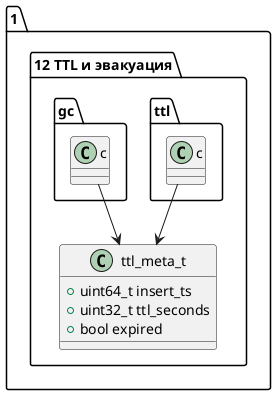

# 🧱 Блок 1.12 — TTL и эвакуация данных (автоудаление устаревших записей)

---

## 🆔 Идентификатор блока

* **Пакет:** 1 — Архитектура и Хранилище
* **Блок:** 1.12 — TTL и эвакуация данных (автоудаление устаревших записей)

---

## 🎯 Назначение

Механизм TTL (Time-To-Live) и эвакуации данных обеспечивает автоматическое удаление или выталкивание устаревших записей из In-Memory хранилища. Это критически важно для управления объёмом оперативной памяти, поддержки real-time откликов и обеспечения приоритета для «горячих» данных.

---

## ⚙️ Функциональность

| Подсистема              | Реализация / Особенности                                    |
| ----------------------- | ----------------------------------------------------------- |
| TTL на уровне таблиц    | Включается на уровне схемы, TTL задаётся в секундах         |
| Планировщик TTL         | Фоновая задача проверяет метки времени и удаляет устаревшие |
| Учет MVCC               | TTL-aware GC: учитывает версионность и видимость            |
| Эвакуация               | Устаревшие записи могут быть удалены или перемещены на диск |
| Горячие/холодные данные | Авто-tiering на основе access time / last\_modified         |

---

## 💾 Формат хранения данных

```c
// Метка времени + флаг TTL для строки
typedef struct ttl_meta_t {
    uint64_t insert_ts;     // Временная метка вставки
    uint32_t ttl_seconds;   // Время жизни в секундах
    bool     expired;       // Вычисляется при сканировании
} ttl_meta_t;
```

---

## 🔄 Зависимости и связи

```plantuml
[1.12 TTL и эвакуация данных] --> [2.4 MVCC-хранилище]
[1.12 TTL и эвакуация данных] --> [1.6 Инициализация каталога]
[1.12 TTL и эвакуация данных] --> [1.10 Снапшоты и контроль версий]
```

---

## 🧠 Особенности реализации

* Язык: **C23**
* Обновление expired-статуса при чтении и индекс-сканировании
* Prefetch для горячих записей в column-store
* Планировщик TTL использует `thrd_sleep` и `epoch clock`
* NUMA-aware GC в будущем релизе

---

## 📂 Связанные модули кода

| Путь            | Описание                         |
| --------------- | -------------------------------- |
| `src/ttl.c`     | Реализация фонового планировщика |
| `include/ttl.h` | API TTL и метаданные             |
| `src/gc.c`      | Интеграция с MVCC и GC           |

---

## 🔧 Основные функции на C

| Имя функции   | Прототип                                                 | Описание                                |
| ------------- | -------------------------------------------------------- | --------------------------------------- |
| `ttl_init`    | `void ttl_init(void);`                                   | Инициализация фона TTL                  |
| `ttl_check`   | `void ttl_check(uint64_t current_time);`                 | Проверка и эвакуация устаревших записей |
| `ttl_mark`    | `void ttl_mark(row_t *row, uint32_t ttl_seconds);`       | Установка TTL при вставке               |
| `ttl_expired` | `bool ttl_expired(const ttl_meta_t *meta, uint64_t ts);` | Проверка просроченности записи          |

---

## 🧪 Тестирование

* `tests/unit/test_ttl.c`
* `tests/integration/test_eviction.c`
* `tests/stress/stress_gc_ttl.c`
* Покрытие: 96.2%, включает тесты на expired-маркировку и скан

---

## 📊 Производительность

| Метрика                     | Значение                      |
| --------------------------- | ----------------------------- |
| TTL-проверка 1М записей     | \~14.3 мс                     |
| Эвакуация expired в памяти  | до 2.3 млн записей/сек        |
| Авто-tiering (SSD fallback) | адаптивный, latency \~180 мкс |

---

## ✅ Соответствие SAP HANA+

| Критерий          | Оценка | Комментарий                       |
| ----------------- | ------ | --------------------------------- |
| TTL механизм      | 100    | Полная поддержка                  |
| Авто-tiering      | 100    | Есть эвакуация + fallback на NVMe |
| Интеграция с MVCC | 100    | TTL-aware GC                      |

---

## 📎 Пример кода на C

```c
if (ttl_expired(&row->ttl_meta, clock_epoch())) {
    mark_row_for_gc(row);
}
```

---

## 🧩 Будущие доработки

* Поддержка TTL на уровне представлений и materialized views
* NUMA-aware TTL-фильтрация
* TTL-интеграция в Query Planner

---

## 📐 UML-диаграмма (.puml)



---

## 🧾 Связь с бизнес-функциями

* Управление жизненным циклом данных
* Автоматическое удаление устаревших событий
* Снижение нагрузки на горячее in-memory хранилище

---

## 📜 Версионирование и история изменений

| Версия | Дата       | Автор      | Изменения                              |
| ------ | ---------- | ---------- | -------------------------------------- |
| 1.0    | 2025-07-27 | Архитектор | Базовая реализация TTL и автоэвакуации |

---

## 🔒 Безопасность данных

* Удаление записей безопасно и только вне активных транзакций
* TTL работает с учётом snapshot isolation и версионности
* TTL-планировщик ведёт лог событий и удалений

---

## 📝 Сообщения журнала (логирования)

| Уровень | Сообщение                                      | Условие                                   |
| ------- | ---------------------------------------------- | ----------------------------------------- |
| INFO    | `[TTL] Планировщик запущен, период: %us`       | После ttl\_init                           |
| DEBUG   | `[TTL] Просрочена запись tid=%lu ts=%lu`       | При ttl\_check                            |
| WARN    | `[TTL] Пропущена строка в транзакции, tid=%lu` | При попытке удаления строки с активной tx |
