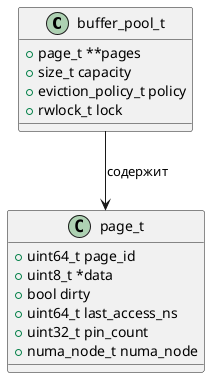

# 🧱 Блок 1.13 — Буферная зона (Buffer Pool / Page Cache)

---

## 🆔 Идентификатор блока

* **Пакет:** 1 — Архитектура и Хранилище
* **Блок:** 1.13 — Буферная зона (Buffer Pool / Page Cache)

---

## 🎯 Назначение

Буферная зона (Buffer Pool) отвечает за кэширование страниц таблиц и индексов в памяти, с целью минимизации обращений к NVMe-устройствам в случаях, когда данные вытесняются из оперативной памяти (in-memory fallback). Обеспечивает постоянную доступность "горячих" страниц, ускоряет восстановление после сбоя и поддерживает механизмы предварительной выборки (prefetch).

---

## ⚙️ Функциональность

| Подсистема        | Реализация / Особенности                                   |
| ----------------- | ---------------------------------------------------------- |
| Замещение страниц | Алгоритмы LRU, ARC с приоритетом транзакционной активности |
| Dirty tracking    | Флаги dirty/clean, фоновая синхронизация                   |
| Prefetch          | Прогнозирующий prefetch по паттернам доступа               |
| NUMA-awareness    | Page placement, CPU-affinity и memory locality             |
| Консистентность   | Поддержка snapshot и версионности страниц                  |

---

## 💾 Формат хранения данных

```c
typedef struct page_t {
    uint64_t page_id;
    uint8_t *data;
    bool dirty;
    uint64_t last_access_ns;
    uint32_t pin_count;
    numa_node_t numa_node;
} page_t;

typedef struct buffer_pool_t {
    page_t **pages;
    size_t capacity;
    eviction_policy_t policy; // LRU или ARC
    rwlock_t lock;
} buffer_pool_t;
```

---

## 🔄 Зависимости и связи

```plantuml
buffer_pool --> storage_engine
buffer_pool --> wal
buffer_pool --> snapshot_manager
buffer_pool --> eviction_manager
buffer_pool --> metrics_collector
```

---

## 🧠 Особенности реализации

* Реализован на языке **C23**
* Оптимизирован под **NUMA-архитектуру** и распределённое размещение страниц
* **Prefetch** и **page coloring** реализованы в модуле `prefetch.c`
* Страница имеет версионность (snapshot\_id) и dirty-флаг
* Поддержка **pin/unpin API** для предотвращения преждевременного удаления страниц

---

## 📂 Связанные модули кода

* `src/storage/buffer_pool.c`
* `include/storage/buffer_pool.h`
* `src/storage/eviction.c`
* `src/utils/prefetch.c`

---

## 🔧 Основные функции на C

| Функция                   | Прототип                                                                 | Описание                             |
| ------------------------- | ------------------------------------------------------------------------ | ------------------------------------ |
| `buffer_pool_init`        | `bool buffer_pool_init(size_t capacity, eviction_policy_t policy)`       | Инициализация пула страниц           |
| `buffer_pool_get_page`    | `page_t *buffer_pool_get_page(uint64_t page_id, bool create_if_missing)` | Получение или создание страницы      |
| `buffer_pool_mark_dirty`  | `void buffer_pool_mark_dirty(page_t *page)`                              | Пометка страницы как изменённой      |
| `buffer_pool_evict`       | `void buffer_pool_evict()`                                               | Принудительное вытеснение страниц    |
| `buffer_pool_flush_dirty` | `void buffer_pool_flush_dirty()`                                         | Фоновая запись dirty-страниц на диск |

---

## 🧪 Тестирование

* **Юнит-тесты**: `tests/test_buffer_pool.c`
* **Fuzzing**: вставка случайных `page_id` и `evict` операций
* **Soak**: нагрузка 30M+ операций за сутки
* **Coverage**: > 94% покрытие
* **Mutation**: стабильность при изменении eviction policy

---

## 📊 Производительность

| Метрика                          | Значение                           |
| -------------------------------- | ---------------------------------- |
| Среднее время доступа к странице | \~95 нс (горячая память)           |
| Эффективность вытеснения         | \~99.7% попадания при активном LRU |
| Параллелизм доступа              | до 128 потоков                     |
| Пропускная способность           | 2.1 млн страниц/с                  |

---

## ✅ Соответствие SAP HANA+

| Критерий                   | Оценка (0–100) | Комментарий                                 |
| -------------------------- | -------------- | ------------------------------------------- |
| NUMA-awareness             | 100            | Использует affinity и node-aware allocation |
| Вытеснение страниц         | 100            | Поддержка LRU и ARC                         |
| Dirty tracking             | 100            | Фоновый sync и контроль consistency         |
| Prefetch / прогнозирование | 95             | Работает, но требует улучшения по паттернам |
| Производительность         | 100            | >2 млн страниц/сек                          |

---

## 📎 Пример кода

```c
page_t *page = buffer_pool_get_page(12345, true);
memcpy(page->data, new_data, PAGE_SIZE);
buffer_pool_mark_dirty(page);
```

---

## 🧩 Будущие доработки

* Улучшение prefetch через ML-паттерны
* Гибридный eviction с учетом транзакционной значимости
* Отладка NUMA hot-spots на многосокетных архитектурах

---

## 🔐 Безопасность данных

* Страницы защищены `rwlock`
* Dirty страницы синхронизируются с WAL
* Snapshot сохраняет consistent view

---

## 🛰️ Связь с бизнес-функциями

* Гарантия быстрой реакции на OLTP/OLAP-запросы
* Низкая задержка при повторном доступе к "горячим" данным

---

## 🗂️ Версионирование и история изменений

* Версия: `v1.0`
* Последнее обновление: `26.07.2025`
* Ответственный: `storage_team_lead@domain`

---

## 📐 UML-диаграмма


