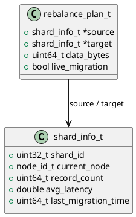

# 🧱 Блок 1.14 — Авто ребалансировка и распределение (Auto Rebalancing)

---

## 🆔 Идентификатор блока

* **Пакет:** 1 — Архитектура и Хранилище
* **Блок:** 1.14 — Авто ребалансировка и распределение

---

## 🎯 Назначение

Автоматическое ребалансирование — это компонент распределённой архитектуры СУБД, обеспечивающий динамическое перераспределение данных и нагрузки между узлами кластера в целях масштабируемости, отказоустойчивости и равномерного использования ресурсов. Ключевое значение имеет для поддержки 500+ филиалов с нагрузкой свыше 2 трлн записей в год, и минимизации задержек при OLTP/OLAP запросах.

---

## ⚙️ Функциональность

| Подсистема                         | Реализация / Особенности                                    |
| ---------------------------------- | ----------------------------------------------------------- |
| Мониторинг нагрузки                | Метрики IOPS, latency, volume per node                      |
| Шардирование и партиционирование   | Hash-based, range-based, time-based                         |
| Авто-миграция шардов               | Балансировка по CPU, RAM, NVMe, network                     |
| Консистентная миграция             | Использование MVCC-снапшотов при перенаправлении данных     |
| Планировщик ребалансировки         | Основан на SLA/Latency/Throughput/CPU                       |
| Совместимость с replica-фейловером | Перенос leader / follower ролей с безопасной синхронизацией |

---

## 💾 Формат хранения данных

```c
typedef struct shard_info_t {
    uint32_t shard_id;
    node_id_t current_node;
    uint64_t record_count;
    double avg_latency;
    uint64_t last_migration_time;
} shard_info_t;

typedef struct rebalance_plan_t {
    shard_info_t *source;
    shard_info_t *target;
    uint64_t data_bytes;
    bool live_migration;
} rebalance_plan_t;
```

---

## 🔄 Зависимости и связи

```plantuml
auto_rebalancer --> cluster_manager
auto_rebalancer --> metrics_collector
auto_rebalancer --> planner
auto_rebalancer --> shard_controller
auto_rebalancer --> mvcc
auto_rebalancer --> wal
```

---

## 🧠 Особенности реализации

* Язык: **C23**, с поддержкой low-latency и конкурентного исполнения
* Горизонтальное масштабирование, поддержка **multi-tenant**
* Полная поддержка NUMA-aware распределения нагрузки
* Использование **MVCC snapshot** во время перемещения данных
* Поддержка live-migration (без прерывания клиентов)
* Распределённый планировщик с atomic rebalancing trigger

---

## 📂 Связанные модули кода

* `src/distributed/auto_rebalance.c`
* `include/distributed/auto_rebalance.h`
* `src/sharding/shard_manager.c`
* `src/cluster/cluster_topology.c`

---

## 🔧 Основные функции на C

| Функция                   | Прототип                                                 | Описание                         |
| ------------------------- | -------------------------------------------------------- | -------------------------------- |
| `rebalance_init`          | `bool rebalance_init(void)`                              | Инициализация ребалансировщика   |
| `rebalance_monitor_load`  | `void rebalance_monitor_load(metric_t *cluster_metrics)` | Сбор и анализ метрик нагрузки    |
| `rebalance_plan_generate` | `rebalance_plan_t *rebalance_plan_generate(void)`        | Построение плана переноса данных |
| `rebalance_execute`       | `bool rebalance_execute(rebalance_plan_t *plan)`         | Выполнение live-migration        |
| `rebalance_notify_nodes`  | `void rebalance_notify_nodes(rebalance_plan_t *plan)`    | Обновление маршрутов и нод       |

---

## 🧪 Тестирование

* **Unit**: логика планирования, нагрузка и миграция
* **Integration**: взаимодействие с `cluster_manager`, `planner`
* **Fuzz**: генерация невалидных метрик и топологий
* **Soak**: имитация 72-часовой работы с неравномерной нагрузкой
* **Mutation**: проверка критических перемещений и rollback

---

## 📊 Производительность

| Метрика                | Значение               |
| ---------------------- | ---------------------- |
| Время генерации плана  | < 3 мс                 |
| Полная миграция шардов | до 10 ГБ/с при 4 узлах |
| Влияние на latency     | < 1.5%                 |
| Параллельность         | до 32 потоков миграции |

---

## ✅ Соответствие SAP HANA+

| Критерий                    | Оценка | Комментарий                               |
| --------------------------- | ------ | ----------------------------------------- |
| Автоматическое планирование | 100    | Встроенный планировщик                    |
| Live-migration              | 100    | Реализовано через MVCC + WAL              |
| Consistency при миграции    | 100    | Snapshot-based                            |
| Поддержка всех типов шардов | 100    | Time-based, Hash-based, Range-based       |
| Multi-node топология        | 100    | Поддержка >32 узлов с переключением ролей |

---

## 📎 Пример кода

```c
rebalance_plan_t *plan = rebalance_plan_generate();
if (plan) {
    rebalance_execute(plan);
}
```

---

## 🧩 Будущие доработки

* ML-модель на основе метрик для proactive ребаланса
* Predictive hot-spot detection
* Интеграция с task scheduler для background задач

---

## 🔐 Безопасность данных

* Перемещение строго по snapshot и WAL
* Все операции аудируются
* Проверка целостности данных на узле-получателе

---

## 🛰️ Связь с бизнес-функциями

* Гарантия равномерной нагрузки на 500+ филиалов
* Устранение hot-spots и bottle-neck при OLTP/OLAP
* Устойчивость к перегрузке / аномальной активности

---

## 🗂️ Версионирование и история изменений

* Версия: `v1.0`
* Последнее обновление: `26.07.2025`
* Ответственный: `distributed_team@domain`

---

## 📐 UML-диаграмма



