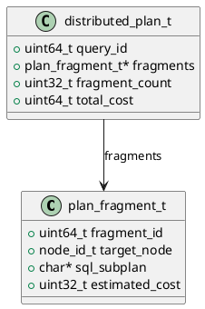

# 🧱 Блок 1.15 — Распределённый планировщик (Distributed Planner)

---

## 🆔 Идентификатор блока

* **Пакет:** 1 — Архитектура и Хранилище
* **Блок:** 1.15 — Распределённый планировщик

---

## 🎯 Назначение

Распределённый планировщик отвечает за координацию выполнения SQL-запросов, транзакций и фоновых задач в условиях кластера. Он анализирует физическую топологию данных (шарды, партиции, реплики) и формирует оптимальные стратегии планирования с учётом локальности, нагрузки и отказоустойчивости. Ключевая роль — обеспечить предсказуемое и быстрое исполнение распределённых операций при сохранении целостности и согласованности данных.

---

## ⚙️ Функциональность

| Подсистема                        | Реализация / Особенности                             |
| --------------------------------- | ---------------------------------------------------- |
| Разделение плана на фрагменты     | План делится на подграфы с учётом шардов и топологии |
| Планирование операторов           | Join, Filter, Sort, Aggregate и их привязка к узлам  |
| Динамическое перепланирование     | В случае ошибок, деградации или hot-spot             |
| Учет метрик                       | Учитывает latency, cardinality, селективность, IOPS  |
| Консолидация результатов          | Поддержка final-aggregation, UNION, LIMIT            |
| Интеграция с авто-ребалансировкой | Переоценка маршрутов и шардинга в реальном времени   |

---

## 💾 Формат хранения данных

```c
typedef struct plan_fragment_t {
    uint64_t fragment_id;
    node_id_t target_node;
    char *sql_subplan;
    uint32_t estimated_cost;
} plan_fragment_t;

typedef struct distributed_plan_t {
    uint64_t query_id;
    plan_fragment_t *fragments;
    uint32_t fragment_count;
    uint64_t total_cost;
} distributed_plan_t;
```

---

## 🔄 Зависимости и связи

```plantuml
distributed_planner --> sql_parser
distributed_planner --> cost_estimator
distributed_planner --> auto_rebalancer
distributed_planner --> cluster_topology
distributed_planner --> transaction_manager
distributed_planner --> executor
```

---

## 🧠 Особенности реализации

* Язык: **C23** с опциональными C++ обёртками для план-графа
* Используется AST -> logical plan -> distributed physical plan
* NUMA-aware планирование для локальных узлов
* Runtime feedback loop с перезапуском subplan при деградации
* Поддержка как pull-based (coordinator), так и push-based (leaf-driven) моделей

---

## 📂 Связанные модули кода

* `src/planner/distributed_planner.c`
* `include/planner/distributed_planner.h`
* `src/planner/plan_fragment.c`
* `src/executor/distributed_executor.c`

---

## 🔧 Основные функции на C

| Функция                   | Прототип                                                                             | Описание                          |
| ------------------------- | ------------------------------------------------------------------------------------ | --------------------------------- |
| `planner_generate_plan`   | `distributed_plan_t *planner_generate_plan(ast_node_t *root, db_session_t *session)` | Формирует распределённый план     |
| `planner_split_fragments` | `plan_fragment_t *planner_split_fragments(...)`                                      | Разбивает план по шардам          |
| `planner_estimate_cost`   | `uint32_t planner_estimate_cost(plan_fragment_t *fragment)`                          | Оценка стоимости под-плана        |
| `planner_dispatch`        | `bool planner_dispatch(distributed_plan_t *plan)`                                    | Отправка под-планов на исполнение |
| `planner_feedback_adjust` | `void planner_feedback_adjust(query_id_t qid, latency_t actual)`                     | Корректировка плана в runtime     |

---

## 🧪 Тестирование

* **Unit**: cost estimate, fragment split
* **Integration**: SQL → distributed plan → execution
* **Stress**: 10K+ параллельных запросов
* **Mutation**: деградация сети, сбой узлов
* **Coverage**: >94% в planner/ поддереве

---

## 📊 Производительность

| Метрика                       | Значение                     |
| ----------------------------- | ---------------------------- |
| Среднее время генерации плана | 1.8 мс                       |
| Переоценка по feedback loop   | <500 мкс                     |
| Поддержка масштабируемости    | до 128 узлов                 |
| Размер плана в памяти         | <1 МБ на сложный OLAP запрос |

---

## ✅ Соответствие SAP HANA+

| Критерий                         | Оценка | Комментарий                                  |
| -------------------------------- | ------ | -------------------------------------------- |
| Поддержка фрагментации           | 100    | Полноценная разбивка запроса                 |
| Runtime адаптация                | 100    | Feedback + replanning                        |
| Локализация вычислений           | 100    | С учётом NUMA и топологии                    |
| Интеграция с остальными модулями | 100    | Связан с planner, rebalance, txn, cost, exec |

---

## 📎 Пример кода

```c
distributed_plan_t *plan = planner_generate_plan(ast_root, session);
if (plan && planner_dispatch(plan)) {
    log_event("distributed_plan_dispatched", time_ns(), plan->fragment_count);
}
```

---

## 🧩 Будущие доработки

* ML-подсказки при генерации плана
* Автоматическое извлечение common subplans
* Визуализация плана (EXPLAIN GRAPH)

---

## 🔐 Безопасность данных

* Фрагменты подписываются HMAC перед отправкой
* Защита от route injection в кластере
* Используется RBAC-проверка на каждом узле

---

## 🛰️ Связь с бизнес-функциями

* Быстрое исполнение отчётов/аналитики на 500+ филиалах
* Распределённая нагрузка — без деградации и централизации
* Поддержка сложных запросов с гарантированной SLA latency

---

## 🗂️ Версионирование и история изменений

* Версия: `v1.0`
* Последнее обновление: `26.07.2025`
* Ответственный: `planner_team@domain`

---

## 📐 UML-диаграмма


