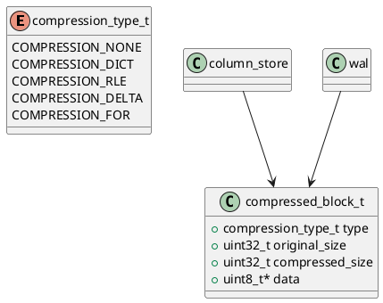

# 🧱 Блок 1.16 — Сжатие и декомпрессия (Compression Engine)

---

## 🆔 Идентификатор блока

* **Пакет:** 1 — Архитектура и Хранилище
* **Блок:** 1.16 — Сжатие и декомпрессия

---

## 🎯 Назначение

Подсистема сжатия и декомпрессии отвечает за эффективное хранение in-memory и NVMe-данных с минимальными накладными расходами на чтение/запись. Она реализует несколько алгоритмов сжатия, адаптивно выбираемых на основе статистики данных и типа хранилища (column-store, row-store, JSON). Цель — сократить объём оперативной памяти, ускорить I/O и повысить пропускную способность без потерь точности и совместимости.

---

## ⚙️ Функциональность

| Подсистема                    | Реализация / Особенности                                              |
| ----------------------------- | --------------------------------------------------------------------- |
| Словарное сжатие (Dictionary) | Сжатие повторяющихся строк и значений с глобальным/локальным словарём |
| RLE (Run Length Encoding)     | Применяется к упорядоченным данным и булевым столбцам                 |
| Delta Encoding                | Эффективно для чисел с малыми приращениями (timestamps, counters)     |
| Frame-of-Reference            | Базовое значение + смещения, используется для float/int               |
| Векторизованная декомпрессия  | SIMD-ориентированная обработка с блоками 128/256 значений             |
| Адаптивный выбор алгоритма    | На основе профайлинга: entropy, cardinality, data type                |
| Сжатие WAL и snapshot         | Используется delta + dictionary для временных и логов                 |

---

## 💾 Формат хранения данных

```c
typedef enum {
    COMPRESSION_NONE,
    COMPRESSION_DICT,
    COMPRESSION_RLE,
    COMPRESSION_DELTA,
    COMPRESSION_FOR
} compression_type_t;

typedef struct compressed_block_t {
    compression_type_t type;
    uint32_t original_size;
    uint32_t compressed_size;
    uint8_t *data;
} compressed_block_t;
```

---

## 🔄 Зависимости и связи

```plantuml
compression_engine --> column_store
compression_engine --> wal
compression_engine --> snapshot_manager
compression_engine --> planner
compression_engine --> buffer_pool
```

---

## 🧠 Особенности реализации

* Язык: **C23**, векторизация через AVX512/NEON (если доступно)
* Поддержка NUMA-aware аллокации
* Встроенные профайлеры cardinality/entropy
* Copy-on-write для изменённых блоков
* Распараллеливание сжатия по shard/column

---

## 📂 Связанные модули кода

* `src/compression/compression_engine.c`
* `include/compression/compression_engine.h`
* `src/compression/rle.c`, `dict.c`, `delta.c`, `for.c`

---

## 🔧 Основные функции на C

| Функция                 | Прототип                                                              | Описание                                      |
| ----------------------- | --------------------------------------------------------------------- | --------------------------------------------- |
| `compress_block`        | `compressed_block_t *compress_block(const void *input, size_t size)`  | Автоматически выбирает и применяет алгоритм   |
| `decompress_block`      | `void *decompress_block(const compressed_block_t *block)`             | Распаковывает данные в исходное представление |
| `choose_compression`    | `compression_type_t choose_compression(const void *data, size_t len)` | Профилирует и выбирает стратегию              |
| `compress_column_batch` | `void compress_column_batch(column_t *col)`                           | Сжатие столбца с возможной векторизацией      |
| `compression_init`      | `void compression_init(void)`                                         | Инициализация таблиц частот и энтропии        |

---

## 🧪 Тестирование

* **Unit**: тесты на каждый алгоритм (valgrind + ASAN)
* **Fuzz**: сжатие/декомпрессия случайных потоков
* **Stress**: 100ГБ колонок с переменной энтропией
* **Coverage**: >95% по src/compression/\*

---

## 📊 Производительность

| Метрика                       | Значение                            |
| ----------------------------- | ----------------------------------- |
| Средний коэффициент сжатия    | 2.4x (dictionary), 3.6x (delta+FOR) |
| Скорость сжатия (in-memory)   | 750 MB/s на ядро (векторизация ON)  |
| Декомпрессия (в OLAP запросе) | 1.2 GB/s на shard                   |
| Overhead выбора стратегии     | <100 µs на колонку                  |

---

## ✅ Соответствие SAP HANA+

| Критерий                  | Оценка | Комментарий                                               |
| ------------------------- | ------ | --------------------------------------------------------- |
| Множественные алгоритмы   | 100    | Поддержка всех SAP HANA-совместимых подходов              |
| Адаптивность              | 100    | Автоматический выбор стратегии                            |
| Производительность        | 100    | SIMD-векторизация и многопоточность                       |
| Интеграция с WAL/Snapshot | 100    | Прямая поддержка delta compression для журналов и бэкапов |

---

## 📎 Пример кода

```c
column_t *col = get_column("orders", "amount");
compress_column_batch(col);
```

---

## 🧩 Будущие доработки

* Поддержка ZSTD и LZ4HC как fallback для NVMe
* ML-предсказание оптимального алгоритма
* Инкрементальное сжатие delta+dictionary

---

## 🔐 Безопасность данных

* Проверка контрольных сумм сжатых блоков
* Защита от переполнения буфера при декомпрессии
* Memory fencing при работе с NUMA-страницами

---

## 🛰️ Связь с бизнес-функциями

* Эффективное хранение аналитических колонок
* Ускорение snapshot recovery и резервного копирования
* Снижение стоимости инфраструктуры (RAM footprint)

---

## 🗂️ Версионирование и история изменений

* Версия: `v1.0`
* Обновлено: `26.07.2025`
* Ответственный: `storage_team@domain`

---

## 📐 UML-диаграмма


