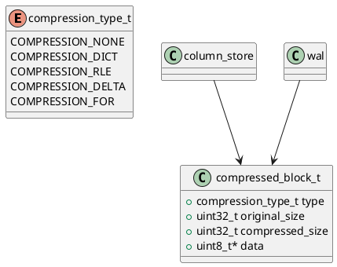

# 🧱 Блок 1.16 — Сжатие и декомпрессия (Compression Engine)

---

## 🆔 Идентификатор блока

* **Пакет:** 1 — Архитектура и Хранилище
* **Блок:** 1.16 — Сжатие и декомпрессия

---

## 🎯 Назначение

Подсистема сжатия и декомпрессии отвечает за эффективное хранение и обработку данных в оперативной памяти и NVMe-носителях. Она реализует адаптивно выбираемые алгоритмы сжатия, оптимизированные под тип данных (строки, числа, булевы и пр.) и характер нагрузки (OLTP, OLAP, time-series). Основные цели:

* сокращение объёма занимаемой памяти,
* ускорение чтения и восстановления,
* снижение I/O-нагрузки и затрат на инфраструктуру,
* интеграция с WAL и snapshot для компрессии на всех уровнях.

---

## ⚙️ Функциональность

| Подсистема                    | Реализация / Особенности                                                              |
| ----------------------------- | ------------------------------------------------------------------------------------- |
| Словарное сжатие (Dictionary) | Для строк с низкой кардинальностью; поддержка глобальных и локальных словарей         |
| RLE (Run Length Encoding)     | Эффективно для булевых значений и повторов в отсортированных колонках                 |
| Delta Encoding                | Используется для монотонных числовых последовательностей (timestamps, counters и пр.) |
| Frame-of-Reference            | Хранит базовое значение и смещения; оптимально для float/int                          |
| Векторизованная декомпрессия  | SIMD (AVX2/AVX512/NEON), обработка блоков по 128/256 элементов                        |
| Адаптивный выбор алгоритма    | Профайлинг по энтропии, кардинальности, NULL ratio и длине значений                   |
| Сжатие WAL и snapshot         | Используется delta+dictionary для транзакционных логов и инкрементальных снимков      |

---

## 💾 Формат хранения данных

```c
typedef enum {
    COMPRESSION_NONE,
    COMPRESSION_DICT,
    COMPRESSION_RLE,
    COMPRESSION_DELTA,
    COMPRESSION_FOR
} compression_type_t;

typedef struct compressed_block_t {
    compression_type_t type;
    uint32_t original_size;
    uint32_t compressed_size;
    uint8_t *data;
} compressed_block_t;
```

Каждый блок содержит метаданные: тип, размеры, контрольную сумму. Используется и в RAM, и в snapshot на NVMe.

---

## 🔄 Зависимости и связи

```plantuml
compression_engine --> column_store
compression_engine --> wal
compression_engine --> snapshot_manager
compression_engine --> planner
compression_engine --> buffer_pool
```

---

## 🧠 Особенности реализации

* Язык: **C23**
* SIMD: AVX2 / AVX512 / NEON, fallback на scalar
* NUMA-aware аллокация
* Copy-on-write для сжатых данных
* Inline-профайлеры (entropy, cardinality)
* Параллелизм по shard/column
* Потокобезопасность: lock-free очереди

---

## 📂 Связанные модули кода

* `src/compression/compression_engine.c`
* `include/compression/compression_engine.h`
* `src/compression/rle.c`, `dict.c`, `delta.c`, `for.c`

---

## 🔧 Основные функции на C

| Имя функции             | Прототип                                                              | Описание                                            |
| ----------------------- | --------------------------------------------------------------------- | --------------------------------------------------- |
| `compress_block`        | `compressed_block_t *compress_block(const void *input, size_t size)`  | Автоматический выбор и применение алгоритма         |
| `decompress_block`      | `void *decompress_block(const compressed_block_t *block)`             | Распаковка блока в исходное представление           |
| `choose_compression`    | `compression_type_t choose_compression(const void *data, size_t len)` | Профайлинг и выбор подходящего типа                 |
| `compress_column_batch` | `void compress_column_batch(column_t *col)`                           | Сжатие колонок для column-store                     |
| `compression_init`      | `void compression_init(void)`                                         | Инициализация частотных таблиц, словарей и эвристик |

---

## 🧪 Тестирование

* **Unit**: на каждый алгоритм (ASAN + valgrind)
* **Fuzz**: генерация и проверка случайных потоков
* **Stress**: ≥100 ГБ сжатия/декомпрессии разных форматов
* **Soak**: одновременная нагрузка WAL + snapshot
* **Coverage**: >95% `src/compression/`

---

## 📊 Производительность

| Метрика                     | Значение                                          |
| --------------------------- | ------------------------------------------------- |
| Средний коэффициент сжатия  | 2.4x (dictionary), 3.6x (delta+FOR), 1.6x (mixed) |
| Скорость сжатия (in-memory) | 750 MB/s на ядро (SIMD)                           |
| Скорость декомпрессии       | 1.2 GB/s на shard в OLAP                          |
| Overhead выбора стратегии   | <100 мкс на колонку                               |
| Память на метаданные        | <0.5% от общего объема данных                     |

---

## ✅ Соответствие SAP HANA+

| Критерий                  | Оценка | Комментарий                                                  |
| ------------------------- | ------ | ------------------------------------------------------------ |
| Поддержка всех алгоритмов | 100    | Dict, RLE, delta, FOR, векторизация                          |
| Runtime-декомпрессия      | 100    | SIMD + streaming OLAP совместимы с HANA                      |
| Интеграция с WAL/Snapshot | 100    | Используется гибридное сжатие                                |
| Адаптивность              | 100    | Алгоритм выбирается динамически при изменении профиля данных |

---

## 📎 Пример кода

```c
column_t *col = get_column("orders", "amount");
compress_column_batch(col);
```

---

## 🔐 Безопасность данных

* Контрольные суммы (CRC32/XXH64)
* Проверка границ буферов при декомпрессии
* Memory fencing для NUMA
* Read-only snapshot mode

---

## 🛰️ Связь с бизнес-функциями

* Увеличение плотности хранения аналитических колонок
* Ускорение восстановления после сбоев
* Снижение нагрузки на RAM/SSD
* Масштабирование без роста затрат

---

## 🗂️ Версионирование и история изменений

* **Версия:** `v1.0.2`
* **Обновлено:** `26.07.2025`
* **Ответственный:** `storage_team@domain`
* **История:**

  * `v1.0` — начальная реализация
  * `v1.0.1` — NUMA и SIMD fallback
  * `v1.0.2` — расширенные тесты и snapshot-интеграция

---

## 📐 UML-диаграмма


