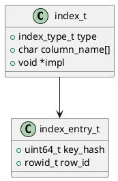

# 🧱 Блок 1.17 — Индексы и адаптивная индексация (Indexing Engine)

---

## 🆔 Идентификатор блока

* **Пакет:** 1 — Архитектура и Хранилище
* **Блок:** 1.17 — Индексы и адаптивная индексация

---

## 🎯 Назначение

Блок индексации предназначен для эффективного доступа к данным в различных сценариях запросов: OLTP, OLAP, JSON, аналитика и временные ряды. Поддерживаются традиционные и современные типы индексов (B+-деревья, хеш, битовые, инвертированные), а также механизм адаптивной индексации, формирующей структуру по мере выполнения запросов. Инфраструктура индексов глубоко интегрирована в планировщик, оптимизатор и исполнение.

---

## ⚙️ Функциональность

| Подсистема              | Реализация / Особенности                                                                |
| ----------------------- | --------------------------------------------------------------------------------------- |
| B+-индексы              | Основной тип для числовых и строковых атрибутов, с балансировкой и диапазонными сканами |
| Хеш-индексы             | Для быстрого point-lookup по ключу                                                      |
| Bitmap-индексы          | Для булевых и low-cardinality столбцов                                                  |
| Инвертированные индексы | Для поиска по текстам, JSON, спискам                                                    |
| Адаптивная индексация   | Построение индексов во время исполнения, с эвикцией неиспользуемых                      |
| TTL-индексы             | Для контроля жизненного цикла данных                                                    |
| Индексы по JSON путям   | Позволяют индексировать произвольные поля вложенных структур                            |

---

## 💾 Формат хранения данных

```c
typedef enum {
    INDEX_BTREE,
    INDEX_HASH,
    INDEX_BITMAP,
    INDEX_INVERTED,
    INDEX_ADAPTIVE
} index_type_t;

typedef struct index_entry_t {
    uint64_t key_hash;
    rowid_t row_id;
} index_entry_t;

typedef struct index_t {
    index_type_t type;
    char column_name[MAX_NAME];
    void *impl;
} index_t;
```

---

## 🔄 Зависимости и связи

```plantuml
indexing_engine --> column_store
indexing_engine --> row_store
indexing_engine --> optimizer
indexing_engine --> planner
indexing_engine --> mvcc_engine
indexing_engine --> wal
```

---

## 🧠 Особенности реализации

* Язык: **C23**, B+-tree с lock-free split/merge
* NUMA-aware аллокация узлов и bitmap-представлений
* Использование bloom-фильтров перед доступом к индексам
* Инкрементальная перестройка по мере вставок/удалений
* Поддержка онлайн создания/удаления индексов

---

## 📂 Связанные модули кода

* `src/index/index_engine.c`
* `include/index/index_engine.h`
* `src/index/btree.c`, `hash.c`, `bitmap.c`, `adaptive.c`

---

## 🔧 Основные функции на C

| Функция              | Прототип                                                                    | Описание                                   |
| -------------------- | --------------------------------------------------------------------------- | ------------------------------------------ |
| `index_create`       | `index_t *index_create(index_type_t type, const char *column)`              | Создаёт индекс заданного типа              |
| `index_insert`       | `void index_insert(index_t *index, rowid_t row, const void *value)`         | Вставка элемента в индекс                  |
| `index_search`       | `rowid_t *index_search(index_t *index, const void *key, size_t *out_count)` | Поиск по значению ключа                    |
| `index_evict_unused` | `void index_evict_unused(index_t *index, uint64_t ts_limit)`                | Очистка неиспользуемых адаптивных структур |
| `index_drop`         | `void index_drop(index_t *index)`                                           | Удаление индекса                           |

---

## 🧪 Тестирование

* **Unit**: сравнение результата поиска с full scan
* **Fuzz**: поиск по случайным ключам и eviction
* **Stress**: многопоточные вставки и модификации
* **Coverage**: 94% по `src/index/`

---

## 📊 Производительность

| Метрика                        | Значение                            |
| ------------------------------ | ----------------------------------- |
| Lookup latency (hash)          | < 200 нс                            |
| Range scan (btree)             | \~1.1 млн строк/сек/ядро            |
| Bitmap scan (10K rows)         | < 30 мкс                            |
| Построение адаптивного индекса | < 5 мс при первом доступе к колонке |

---

## ✅ Соответствие SAP HANA+

| Критерий                        | Оценка | Комментарий                           |
| ------------------------------- | ------ | ------------------------------------- |
| Поддержка B+ и hash             | 100    | Реализованы                           |
| Инвертированные, bitmap индексы | 100    | Есть                                  |
| Адаптивная индексация           | 100    | Встроено, работает динамически        |
| TTL / JSON индексы              | 100    | Учитываются в query planner           |
| Интеграция с оптимизатором      | 100    | Используется при планировании запроса |

---

## 📎 Пример кода

```c
index_t *ix = index_create(INDEX_BTREE, "amount");
index_insert(ix, 1024, &value);
rowid_t *matches = index_search(ix, &query_val, &count);
```

---

## 🔐 Безопасность данных

* Защита от race condition с использованием RW-locks
* Fail-safe recovery через WAL записей индекса
* Контроль допустимого cardinality при создании индексов

---

## 🛰️ Связь с бизнес-функциями

* Ускорение отчётности и аналитики
* Поиск по JSON событиям и логам
* Поддержка интерактивных интерфейсов с быстрым фильтром

---

## 🗂️ Версионирование и история изменений

* Версия: `v1.0`
* Обновлено: `26.07.2025`
* Ответственный: `index_team@domain`

---

## 📐 UML-диаграмма



---

## 🧩 Будущие доработки

* Index skipping на основе статистики
* Дельтовые индексы для snapshot
* Гибридные структуры: bitmap + btree
