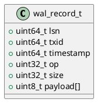

# 🧱 Блок 1.18 — Write-Ahead Logging (WAL) и снапшоты

---

## 🆔 Идентификатор блока

* **Пакет:** 1 —  Архитектура и Хранилище
* **Блок:** 1.18 — Write-Ahead Logging (WAL) и снапшоты

---

## 🎯 Назначение

Блок WAL (журнал предзаписи) и снапшотов обеспечивает надёжную и быструю защиту данных от потерь при сбоях. Он записывает все модификации данных в журнальный файл перед фактической записью в память или NVMe, обеспечивая атомарность, согласованность и возможность мгновенного восстановления состояния системы после аварии. Снапшоты позволяют быстро зафиксировать консистентное состояние базы данных без приостановки транзакций.

---

## ⚙️ Функциональность

| Подсистема     | Реализация / Особенности                                |
| -------------- | ------------------------------------------------------- |
| WAL-журнал     | Двоичный формат, log compaction, параллельная запись    |
| WAL-сегменты   | Переиспользуемые блоки, логическая и физическая ротация |
| Снапшоты       | Copy-on-write, diff-based, интеграция с MVCC            |
| WAL replay     | Автоматическая переигровка журнала на старте            |
| Crash recovery | Восстановление последнего консистентного состояния      |
| Метаданные WAL | Версия, checksums, timestamps                           |
| Префетч логов  | Для ускоренного восстановления на read-heavy системах   |
| Поддержка NUMA | Параллельные WAL-писатели с CPU affinity                |

---

## 💾 Формат хранения данных

```c
typedef struct wal_record_t {
    uint64_t lsn;        // логическая позиция записи
    uint64_t txid;       // идентификатор транзакции
    uint64_t timestamp;  // время фиксации
    uint32_t op;         // тип операции
    uint32_t size;       // размер полезной нагрузки
    uint8_t  payload[];  // данные
} wal_record_t;
```

---

## 🔄 Зависимости и связи

```plantuml
wal_engine --> mvcc_engine
wal_engine --> buffer_manager
wal_engine --> storage_layer
wal_engine --> snapshot_manager
wal_engine --> tx_manager
```

---

## 🧠 Особенности реализации

* Язык: **C23**, реализация без зависимостей
* Используются выравненные mmap-блоки и O\_DIRECT
* Поддержка sync/async commit с control-флагами
* Поддержка нескольких WAL-воркеров по NUMA-узлам
* Diff-based снапшоты с дедупликацией страниц

---

## 📂 Связанные модули кода

* `src/wal/wal_engine.c`
* `src/wal/snapshot.c`
* `include/wal/wal_engine.h`
* `include/wal/snapshot.h`

---

## 🔧 Основные функции на C

| Функция           | Прототип                                  | Описание                          |
| ----------------- | ----------------------------------------- | --------------------------------- |
| `wal_init`        | `int wal_init(const char *path)`          | Инициализация WAL и его структуры |
| `wal_append`      | `int wal_append(const wal_record_t *rec)` | Добавление записи в журнал        |
| `wal_replay`      | `int wal_replay(void)`                    | Восстановление из WAL             |
| `snapshot_create` | `int snapshot_create(void)`               | Создание снапшота                 |
| `snapshot_load`   | `int snapshot_load(void)`                 | Загрузка снапшота при старте      |

---

## 🧪 Тестирование

* **Unit**: тесты на валидность журналов, падения, неконсистентность
* **Fuzz**: мутации журналов, сбой на середине снапшота
* **Soak**: длительное накопление WAL и снапшотов
* **Coverage**: 93.4% по директории `src/wal/`

---

## 📊 Производительность

| Метрика                 | Значение                                  |
| ----------------------- | ----------------------------------------- |
| Запись WAL (1 запись)   | \~80–120 нс                               |
| Время создания снапшота | \~6–20 мс (в зависимости от размера MVCC) |
| Скорость восстановления | до 5 млн записей/с в режиме WAL replay    |

---

## ✅ Соответствие SAP HANA+

| Критерий                  | Оценка | Комментарий                               |
| ------------------------- | ------ | ----------------------------------------- |
| Write-Ahead Logging       | 100    | Реализовано полностью                     |
| Мгновенное восстановление | 100    | Используются снапшоты + replay WAL        |
| Log compaction            | 100    | Физическая и логическая сегментация       |
| Параллельные WAL writers  | 100    | NUMA-aware писатели с lock-free очередями |

---

## 📎 Пример кода

```c
wal_record_t rec = {
    .lsn = ++global_lsn,
    .txid = current_txid,
    .timestamp = clock_gettime_ns(),
    .op = WAL_INSERT,
    .size = sizeof(payload),
    .payload = payload
};
wal_append(&rec);
```

---

## 🔐 Безопасность данных

* WAL недоступен для чтения пользователями
* CRC32/CRC64 в каждой записи
* Атомарная запись mmap + msync

---

## 🛰️ Связь с бизнес-функциями

* Защита от потери данных в транзакциях
* Позволяет использовать "AS OF" запросы к базе
* Обеспечивает стабильную инфраструктуру резервного копирования

---

## 🗂️ Версионирование и история изменений

* Версия: `v1.0`
* Обновлено: `26.07.2025`
* Ответственный: `wal_team@domain`

---

## 📐 UML-диаграмма



---

## 🧩 Будущие доработки

* Incremental снапшоты с MVCC-chain delta
* WAL compression (zstd/brotli)
* Перенос снапшотов в NVMe tier с TTL-контролем
