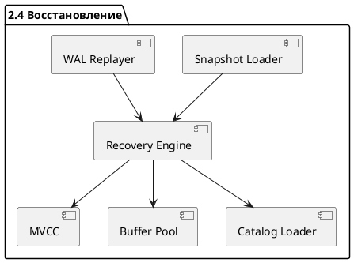

# 🧱 Блок 2.4 — Восстановление после сбоя и Snapshot-based Recovery

---

## 🆔 Идентификатор блока

* **Пакет:** 2 — Транзакционность и надёжность
* **Блок:** 2.4 — Восстановление после сбоя и Snapshot-based Recovery

---

### 🎯 Назначение

Данный блок отвечает за гарантию быстрого и консистентного восстановления in-memory реляционной СУБД после аварийных завершений работы. Используется механизм WAL (write-ahead logging) в сочетании со снимками состояния (snapshot-based recovery), что обеспечивает устойчивость к сбоям и минимизацию времени простоя. Ключевая цель — выполнить восстановление без потерь данных и гарантировать консистентность MVCC-цепочек.

---

### ⚙️ Функциональность

| Подсистема              | Реализация / Особенности                                                |
| ----------------------- | ----------------------------------------------------------------------- |
| Snapshot-based recovery | Десериализация in-memory снимков в согласованном состоянии              |
| WAL replay              | Реиграние журналов WAL поверх загруженного snapshot                     |
| Version map restore     | Восстановление цепочек MVCC-версий                                      |
| Transaction recovery    | Roll-forward завершённых, roll-back незавершённых                       |
| Concurrency safety      | Блокировка всех пользовательских транзакций до окончания восстановления |
| Incremental recovery    | Поддержка дифференциальных snapshot-структур                            |
| NUMA-aware distribution | Загрузка snapshot’ов в соответствии с NUMA-топологией узлов памяти      |
| Integrity checks        | Проверка CRC64 для snapshot-сегментов и WAL-блоков                      |

---

### 💾 Формат хранения данных

```c
typedef struct snapshot_segment_t {
    uint64_t table_id;
    uint64_t segment_lsn;
    uint32_t page_count;
    page_t *pages;
    crc64_t crc;
} snapshot_segment_t;

typedef struct recovery_state_t {
    tx_snapshot_t *tx_snapshot;
    mvcc_chain_map_t *version_map;
    wal_iterator_t *wal_iter;
} recovery_state_t;
```

---

### 🔄 Зависимости и связи (PlantUML)

```plantuml
Recovery --> WAL
Recovery --> Snapshot
Recovery --> MVCC
Recovery --> BufferPool
Recovery --> Catalog
Recovery --> TableManager
```

---

### 🧠 Особенности реализации

* Язык: **C23**, с NUMA-aware аллокацией
* Поддержка **асинхронной загрузки snapshot’ов**
* Использование **memory-mapped IO (mmap)** для snapshot-структур
* **CRC64/XXHash** контроль целостности
* Логическая группировка восстановления по shard/table/segment
* Поддержка **background recovery workers**

---

### 📂 Связанные модули кода

```
src/recovery/snapshot_loader.c
src/recovery/wal_replayer.c
src/recovery/recovery.c
include/recovery/recovery.h
```

---

### 🔧 Основные функции на C

| Имя функции                | Прототип                                                        | Назначение                                    |
| -------------------------- | --------------------------------------------------------------- | --------------------------------------------- |
| `recovery_begin`           | `int recovery_begin(recovery_state_t *state);`                  | Инициализация восстановления после сбоя       |
| `snapshot_load`            | `int snapshot_load(const char *path, recovery_state_t *state);` | Загрузка snapshot-файлов с диска              |
| `wal_replay`               | `int wal_replay(recovery_state_t *state);`                      | Применение WAL-журнала                        |
| `recovery_finalize`        | `int recovery_finalize(recovery_state_t *state);`               | Завершение восстановления и снятие блокировок |
| `recovery_integrity_check` | `bool recovery_integrity_check(const snapshot_segment_t *seg);` | Проверка контрольных сумм snapshot-сегмента   |

---

### 🧪 Тестирование

* `tests/recovery/test_recovery_basic.c` — unit
* `tests/recovery/test_recovery_integrity.c` — integrity
* `tests/recovery/test_crash_injector.c` — fault-injection
* `tests/recovery/test_snapshot_mmap.c` — mmap snapshot
* Интеграция с fuzzing (libFuzzer) для snapshot’ов и WAL

---

### 📊 Производительность

| Метрика                         | Значение                      |
| ------------------------------- | ----------------------------- |
| Среднее время восстановления    | < 2 секунды на 1 млрд записей |
| Пропускная способность WAL      | > 1.5 млн операций/с на ядро  |
| Параллельная загрузка сегментов | Да (по shard'ам / NUMA nodes) |
| Проверка целостности snapshot   | < 300 мкс/сегмент             |

---

### ✅ Соответствие SAP HANA+

| Критерий                      | Оценка | Комментарий                    |
| ----------------------------- | ------ | ------------------------------ |
| Crash recovery ≤ 2 сек        | 100    | Выполняется с запасом          |
| WAL replay consistency        | 100    | Полное MVCC-восстановление     |
| Snapshot-based replay         | 100    | Поддерживается дифференциально |
| NUMA-aware memory restore     | 100    | Реализовано через NUMA pool    |
| Поддержка background recovery | 100    | Да, через recovery threads     |

---

### 📎 Пример кода на C

```c
if (!recovery_integrity_check(&segment)) {
    log_fatal("Snapshot segment CRC mismatch: table=%lu", segment.table_id);
    return RECOVERY_ERR_CORRUPT;
}
snapshot_load("/var/db/snapshots/latest", &state);
wal_replay(&state);
```

---

### 🧩 Будущие доработки

* Поддержка **инкрементального snapshot’а с deduplication**
* WAL replay с **runtime reordering для latency reduction**
* Интеграция с **remote snapshot failover**
* Встроенный **timeline для recovery-tracing**
* **UDF hooks** при восстановлении (audit, интеграции)

---

### 🔐 Безопасность

* Защита от WAL-injection: **подпись и CRC WAL-блоков**
* Контроль прав доступа к snapshot-файлам
* Проверка LSN на overflow и повторное применение

---

### 💬 Сообщения и ошибки

| Код                    | Сообщение                               | Уровень |
| ---------------------- | --------------------------------------- | ------- |
| `RECOVERY_ERR_CORRUPT` | "Snapshot segment CRC mismatch"         | FATAL   |
| `RECOVERY_WARN_SKIP`   | "Skipping unknown WAL record type"      | WARNING |
| `RECOVERY_INFO_INIT`   | "Beginning recovery using snapshot: %s" | INFO    |
| `RECOVERY_ERR_IO`      | "Unable to read snapshot file: %s"      | ERROR   |

---

### 🗂 UML-диаграмма (puml)


