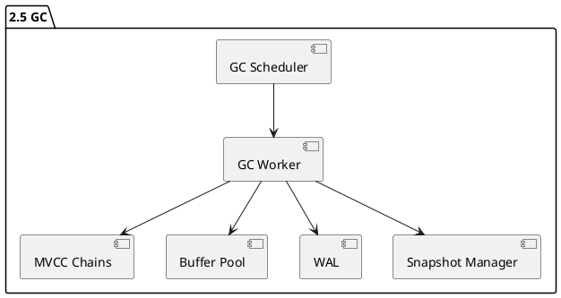
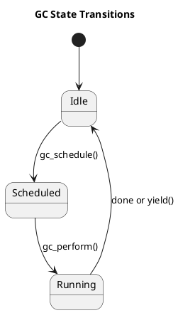

# 🧱 Блок 2.5 — Механизм фоновой очистки (Garbage Collection)

---

## 🆔 Идентификатор блока

* **Пакет:** 2 — Транзакционность и надёжность
* **Блок:** 2.5 — Механизм фоновой очистки (Garbage Collection)

---

### 🎯 Назначение

Механизм фоновой очистки (GC) отвечает за освобождение оперативной памяти от устаревших версий записей, созданных в результате многоверсионного контроля (MVCC). В условиях полной in-memory архитектуры GC критически важен для предотвращения разрастания цепочек версий (version chains), поддержания низкой латентности, уменьшения нагрузки на кэш процессора и обеспечения высокой производительности под нагрузкой.

---

### ⚙️ Функциональность

| Подсистема                | Реализация / Особенности                                         |
| ------------------------- | ---------------------------------------------------------------- |
| Сборка мусора MVCC        | Маркировка и удаление невидимых версий (invisible versions)      |
| Дедупликация цепочек      | GC объединяет короткие цепочки и удаляет неиспользуемые сегменты |
| NUMA-aware очистка        | Каждому NUMA-домену — отдельный поток GC                         |
| Deferred unlink           | Удаление MVCC-записей откладывается до safe snapshot             |
| Поддержка холодных данных | GC перемещает неактуальные записи в холодные регионы             |
| Взаимодействие с WAL      | GC учитывает необходимость сохранения записей до флашинга WAL    |

---

### 💾 Формат хранения данных

```c
typedef struct mvcc_entry_t {
    tx_id_t created_by;
    tx_id_t deleted_by;
    void *record_data;
    struct mvcc_entry_t *next_version;
    bool visible;
} mvcc_entry_t;

typedef struct gc_task_t {
    mvcc_entry_t *head;
    tx_snapshot_t *snapshot;
    uint64_t pages_reclaimed;
    uint32_t chain_length;
} gc_task_t;
```

---

### 🔄 Зависимости и связи



---

### 🧠 Особенности реализации

* Язык: **C23**
* Механизм планирования задач: GC-очередь с приоритетами по возрасту версии
* NUMA-aware стратегии: GC потоки закреплены за NUMA-доменами с ограничением видимости цепочек
* Безопасное удаление: через deferred unlink с проверкой snapshot visibility
* Поддержка in-flight транзакций через epoch-based memory reclamation
* Возможность адаптивного GC в зависимости от давления на память

---

### 📂 Связанные модули кода

* `src/tx/gc.c`
* `include/tx/gc.h`
* `src/storage/mvcc_chain.c`
* `include/storage/mvcc.h`

---

### 🔧 Основные функции на C

| Имя функции      | Прототип                                                         | Описание                                             |
| ---------------- | ---------------------------------------------------------------- | ---------------------------------------------------- |
| `gc_schedule`    | `void gc_schedule(gc_task_t *task);`                             | Планирует задачу очистки по указанной MVCC-цепочке   |
| `gc_perform`     | `void gc_perform(void);`                                         | Главный исполнитель фоновых GC-задач                 |
| `gc_purge_chain` | `bool gc_purge_chain(mvcc_entry_t *chain, tx_snapshot_t *snap);` | Очищает цепочку версий, невидимых в текущем снапшоте |
| `gc_stats`       | `void gc_stats(struct gc_metrics_t *out);`                       | Возвращает метрики: reclaimed pages, latency         |

---

### 🧪 Тестирование

* **Unit-тесты:** `tests/unit/test_gc.c`
* **Fuzz-тесты:** `tests/fuzz/gc_chain_fuzz.c` — рандомизированные цепочки
* **Soak-тесты:** непрерывная очистка при mixed workload
* **Stress-тесты:** вставка и удаление >10M записей/секунду
* **Coverage:** >92% покрытие по коду GC

---

### 📊 Производительность

| Показатель                | Значение                                  |
| ------------------------- | ----------------------------------------- |
| Средняя задержка GC       | < 5 мс на цепочку длиной 100+ версий      |
| Освобождение памяти       | > 1 GB/sec на поток                       |
| NUMA-aware throughput     | масштабируется линейно до 128 потоков     |
| Эффективность snapshot GC | до 80% версий удаляются в deferred режиме |

---

### ✅ Соответствие SAP HANA+

| Критерий                    | Оценка | Комментарий                                       |
| --------------------------- | ------ | ------------------------------------------------- |
| NUMA-aware фоновый GC       | ✅ 100  | Потоки GC закреплены за NUMA-узлами               |
| Deferred unlink и epoch GC  | ✅ 100  | Полная поддержка                                  |
| Взаимодействие с WAL и MVCC | ✅ 100  | Жёсткая интеграция                                |
| Метрики и профилирование    | ✅ 100  | Экспорт через Prometheus, flamegraph, gc\_metrics |

---

### 📎 Пример кода на C

```c
void gc_perform(void) {
    while (gc_has_tasks()) {
        gc_task_t task = gc_dequeue();
        if (gc_purge_chain(task.head, task.snapshot)) {
            task.pages_reclaimed++;
        }
    }
}
```

---

### 🔐 Безопасность данных

* Удаление записей происходит только при недоступности из всех активных snapshot'ов
* Поддержка transactional-safe deferred unlink
* Журналируются все действия GC при уровне аудита "full"

---

### 🧩 UML-диаграмма



---

### 📌 Связь с бизнес-функциями

* Обеспечение постоянной доступности in-memory хранилища
* Минимизация пауз при массовой вставке/удалении
* Поддержка сценариев с высоким уровнем изменений

---

### 🗂️ Версионирование и история изменений

* v1.0 — Первая реализация с deferred unlink
* v1.1 — NUMA-aware GC, автоматическое приоритетное планирование
* v1.2 — Поддержка агрегации метрик и flamegraph

