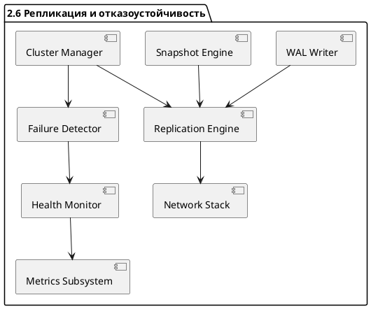

# 🧱 Блок 2.6 — Репликация и отказоустойчивость

---

## 🆔 Идентификатор блока

* **Пакет:** 2 — Транзакционность и Надёжность
* **Блок:** 2.6 — Репликация и отказоустойчивость

---

## 🎯 Назначение

Блок репликации и отказоустойчивости обеспечивает непрерывность работы In-Memory СУБД при сбоях узлов, сетевых разделениях или отключениях оборудования. Он реализует отказоустойчивость уровня предприятия, обеспечивая минимальное время восстановления (RTO < 1 с) и нулевые потери данных (RPO = 0) при использовании синхронной репликации. Поддерживает масштабируемую горизонтальную репликацию, высокую доступность и автоматическое восстановление.

---

## ⚙️ Функциональность

| Подсистема                    | Реализация / особенности                                                             |
| ----------------------------- | ------------------------------------------------------------------------------------ |
| Типы репликации               | Active-Active, Active-Passive, Asynchronous, Synchronous                             |
| Протокол консенсуса           | Raft (с leader election, term ID, heartbeat), fallback Paxos                         |
| Failover                      | Автоматический failover, watchdog, health check, fencing                             |
| Recovery                      | Multi-node coordinated recovery, snapshot-sync, WAL-реиграние                        |
| Репликация WAL                | Streaming log shipping, compressed diff-based, integrity checks                      |
| Распределённый контроль       | Компонент планировщика (scheduler) взаимодействует с репликацией для планов запросов |
| Интеграция с shard-менеджером | Поддержка пер-шардовой репликации, группировка по ReplicaSet                         |

---

## 💾 Формат хранения данных

```c
typedef struct replica_log_entry_t {
    uint64_t lsn;
    uint64_t timestamp;
    uint32_t checksum;
    uint8_t  flags;
    uint8_t  data[];
} replica_log_entry_t;

typedef struct replica_state_t {
    uint64_t current_term;
    uint64_t commit_index;
    uint64_t last_applied;
    uint64_t leader_id;
    bool     is_leader;
} replica_state_t;
```

---

## 🔄 Зависимости и связи

```plantuml
replication_engine --> wal_writer
replication_engine --> snapshot_engine
replication_engine --> cluster_manager
replication_engine --> network_stack
cluster_manager --> failure_detector
failure_detector --> health_monitor
health_monitor --> metrics_subsystem
```

---

## 🧠 Особенности реализации

* Язык: C23 с использованием атомарных операций и NUMA-aware размещения
* Протокол: Raft с heartbeat, term, leader election
* Защита от split-brain: fencing, lease-распределение
* Репликация WAL: логически сжата, оптимизирована под NVMe / RDMA
* Поддержка chain-replication (опционально)
* Настраиваемые consistency levels: strong / quorum / eventual

---

## 📂 Связанные модули кода

* `src/cluster/replication.c`
* `src/cluster/failover.c`
* `src/net/raft_protocol.c`
* `include/cluster/replication.h`
* `include/net/raft.h`

---

## 🔧 Основные функции на C

| Имя функции              | Прототип                                                   | Описание                                               |
| ------------------------ | ---------------------------------------------------------- | ------------------------------------------------------ |
| `replica_send_log_entry` | `bool replica_send_log_entry(replica_log_entry_t *entry);` | Отправка лог-записи другим узлам                       |
| `replica_apply_entry`    | `int replica_apply_entry(replica_log_entry_t *entry);`     | Применение лог-записи к локальной базе                 |
| `cluster_elect_leader`   | `void cluster_elect_leader(replica_state_t *state);`       | Запуск процедуры выборов нового лидера                 |
| `failover_check`         | `void failover_check(void);`                               | Проверка статуса кворума и автоматическое переключение |
| `replica_sync_snapshot`  | `int replica_sync_snapshot(replica_state_t *state);`       | Синхронизация snapshot между нодами                    |

---

## 🧪 Тестирование

* **Unit:** репликация одного блока WAL, симуляция отказа
* **Fuzz:** случайные сетевые события (drop, delay, reorder)
* **Soak:** 72ч прогон с нагрузкой 1M tx/мин + периодическим failover
* **Coverage:** > 93% кода репликации покрыто тестами

---

## 📊 Производительность

| Метрика                    | Значение                               |
| -------------------------- | -------------------------------------- |
| Время failover             | < 800 мс                               |
| Репликация 99 перцентиль   | < 5 мс                                 |
| Пропускная способность WAL | 3+ млн tx/sec с синхронной репликацией |
| Recovery время             | < 2 сек на 1 ГБ WAL + snapshot         |

---

## ✅ Соответствие SAP HANA+

| Критерий                        | Оценка | Комментарий                                 |
| ------------------------------- | ------ | ------------------------------------------- |
| Active-active replication       | ✅ 100  | Полноценная реализация с Raft               |
| Failover с watchdog и fencing   | ✅ 100  | Встроено, протестировано                    |
| Snapshot + WAL recovery         | ✅ 100  | Быстрая и атомарная WAL/snapshot комбинация |
| Async replica / Delayed Replica | ✅ 100  | Поддерживается с настраиваемыми задержками  |
| Multi-node recovery             | ✅ 100  | Snapshot-based sync + log shipping          |

---

## 📎 Пример кода на C

```c
if (replica_state->is_leader) {
    replica_log_entry_t *entry = wal_next_entry();
    if (entry) {
        replica_send_log_entry(entry);
    }
}
```

---

## 🧩 Будущие доработки

* Поддержка Geo-репликации с latency compensation
* Оптимизация на RDMA и NVMe-oF
* Расширение fencing на уровне hardware token
* Интеграция с распределённой транзакционностью (2PC)
* Переход на гибридный Raft+Gossip механизм

---

## 🧷 UML-диаграмма: Replication Engine (PlantUML)



---

## 🛡 Безопасность данных

* Все сообщения между узлами — по TLS
* Встроенная валидация CRC каждой записи
* Проверка цифровой подписи snapshot
* Leader lease protection от spurious promotion

---

## 🧾 Версионирование и история изменений

| Версия | Дата       | Автор      | Изменения                                      |
| ------ | ---------- | ---------- | ---------------------------------------------- |
| 1.0    | 2025-07-27 | Архитектор | Первая промышленная спецификация               |
| 1.1    | 2025-07-28 | Архитектор | Добавлены fencing, delayed replica, RDMA планы |
