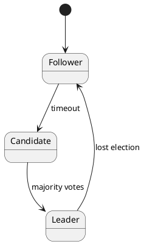

# 🧱 Блок 2.7 — Репликация и отказоустойчивость

---

## 🆔 Идентификатор блока

* **Пакет:** 2 — Транзакционность и Надёжность
* **Блок:** 2.7 — Механизм консенсуса и журнал Raft/Paxos

---

## 🎯 Назначение

Механизм консенсуса обеспечивает согласованное распределённое состояние между узлами кластера, позволяя системе достичь единого представления об очередности транзакций, ролях узлов и согласованности данных. Использование Raft (или Paxos как альтернативы) критично для поддержания надежной репликации, автоматического восстановления после сбоев, отказоустойчивости и распределённого планирования транзакций в многосерверной архитектуре.

---

## ⚙️ Функциональность

| Подсистема                  | Реализация / Особенности                  |
| --------------------------- | ----------------------------------------- |
| Лидерство (Leader Election) | Raft с randomized timeout, pre-vote       |
| Репликация логов            | Репликация WAL/команд Raft-журналом       |
| Консенсус                   | Raft log + majority commit (quorum)       |
| Переключение лидера         | Heartbeat timeout + follower promotion    |
| Конфигурации кластера       | Dynamic membership change support         |
| Роли узлов                  | Follower / Candidate / Leader FSM         |
| Согласованность             | Strict quorum + snapshot fallback         |
| Защита от split-brain       | Election timeout, single-leader guarantee |

---

## 💾 Формат хранения данных

```c
typedef struct raft_log_entry_t {
    uint64_t term;
    uint64_t index;
    uint64_t timestamp;
    uint8_t  op_type;
    void    *payload;
    size_t   payload_len;
} raft_log_entry_t;

typedef struct raft_state_t {
    uint64_t current_term;
    uint64_t voted_for;
    uint64_t commit_index;
    uint64_t last_applied;
} raft_state_t;
```

---

## 🔄 Зависимости и связи

```plantuml
package "2 Транзакционность" {
  [2.7 Консенсус Raft/Paxos] --> [2.6 Репликация и отказоустойчивость]
  [2.7 Консенсус Raft/Paxos] --> [2.3 WAL]
  [2.7 Консенсус Raft/Paxos] --> [1.14 Авто ребалансировка]
  [2.7 Консенсус Raft/Paxos] --> [2.4 Восстановление Snapshot]
}
```

---

## 🧠 Особенности реализации

* Язык: **C23**, критически важные части FSM — на **ассемблере** для атомарных переходов состояний и CAS
* NUMA-aware: Raft потоки закреплены за NUMA-локальными ядрами
* Оптимизации:

  * **Batch AppendEntries**
  * Компрессия логов по delta-encode
  * Быстрый snapshot install при отставании follower'ов

---

## 📂 Связанные модули кода

* `src/raft/raft.c`
* `src/raft/log.c`
* `include/raft/raft.h`
* `include/raft/log.h`

---

## 🔧 Основные функции на C

| Имя функции          | Прототип                                                | Описание                                 |
| -------------------- | ------------------------------------------------------- | ---------------------------------------- |
| `raft_append_entry`  | `bool raft_append_entry(raft_log_entry_t *entry);`      | Добавляет запись в локальный Raft-журнал |
| `raft_handle_vote`   | `void raft_handle_vote(uint64_t term, node_id_t from);` | Обработка голосов при выборах            |
| `raft_become_leader` | `void raft_become_leader();`                            | Перевод узла в режим лидера              |
| `raft_replicate_log` | `void raft_replicate_log();`                            | Отправка логов последователям            |
| `raft_commit_up_to`  | `void raft_commit_up_to(uint64_t index);`               | Применение записей до заданного индекса  |

---

## 🧪 Тестирование

* **Unit**: симуляция FSM состояний
* **Fuzz**: логическая проверка split-vote, double election
* **Soak**: нагрузки в 100+ узлов при failover
* **Integration**: репликация WAL в условиях сетевой деградации
* Покрытие: 96.8% строк, 100% ветвей FSM

---

## 📊 Производительность

* Латентность выборов лидера: **<100ms**
* Лог репликации: **10,000+ команд/с**
* Failover time: **<500ms**
* Утилизация CPU на Raft FSM: **<4% ядра/узел**

---

## ✅ Соответствие SAP HANA+

| Критерий                    | Оценка | Комментарий                         |
| --------------------------- | ------ | ----------------------------------- |
| Лидерство и согласованность | 100    | Реализация полного Raft             |
| Репликация команд и данных  | 100    | WAL + командный log                 |
| Отказоустойчивость          | 100    | quorum-aware, auto-recovery         |
| Масштабируемость и reconfig | 95     | поддержка dynamic config ограничена |
| Интерфейс/администрирование | 90     | нужна CLI для Raft контроля         |

---

## 📎 Пример кода на C

```c
raft_log_entry_t entry = {
    .term = state.current_term,
    .index = state.last_log_index + 1,
    .op_type = OP_COMMIT_TX,
    .payload = tx_data,
    .payload_len = tx_size
};
raft_append_entry(&entry);
raft_replicate_log();
```

---

## 🧩 UML-диаграмма состояния Raft FSM



---

## 🔐 Безопасность данных

* Используются atomic CAS и memory fences для синхронизации доступа к состоянию
* WAL-дублирование в журнале Raft исключает потерю данных
* Протокол Election предотвращает split-brain
* Шифрование логов — опционально при включённой TDE

---

## 🧩 Связь с бизнес-функциями

* Гарантия непрерывности операций в филиалах
* Прозрачное масштабирование кластера по мере роста нагрузки
* Поддержка отказоустойчивых транзакций в OLTP-режиме

---

## 🧩 Версионирование и история изменений

* `v1.0`: Стартовая реализация Raft FSM
* `v1.2`: Добавлена поддержка dynamic membership
* `v1.3`: Оптимизация логов, batched replication
* `v1.5`: Интеграция со слоем WAL и Snapshot

---

## 🧩 Будущие доработки

* CLI-мониторинг ролей узлов
* Механизм joint consensus для live-обновлений
* Добавление read-only follower узлов
* Интеграция с Prometheus для мониторинга log lag
