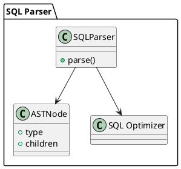

# 🧱 Блок 3.1 — SQL Ядро и Парсер ANSI:2011+

---

## 🆔 Идентификатор блока

* **Пакет:** 3 — SQL и Языки
* **Блок:** 3.1 — SQL Ядро и Парсер ANSI:2011+

---

## 🎯 Назначение

Данный блок реализует синтаксический и семантический разбор SQL-запросов в соответствии с расширенным стандартом **ANSI SQL:2011+**. Ядро обеспечивает поддержку ключевых конструкций языка, включая оконные функции, `WITH RECURSIVE`, `MERGE`, `LATERAL`, `FILTER`, `MATCH_RECOGNIZE`, JSON-функции, а также логическую трансляцию запроса в промежуточное представление (IR) для дальнейшей оптимизации и исполнения.

## ⚙️ Функциональность

| Подсистема            | Реализация / особенности                                                                |
| --------------------- | --------------------------------------------------------------------------------------- |
| Синтаксический парсер | Recursive descent parser на C23 с поддержкой полных конструкций SQL:2011+               |
| AST-построение        | Генерация `sql_ast_node_t`, включая оконные, агрегатные, подзапросные, рекурсивные узлы |
| Семантический анализ  | Проверка типов, разрешение имён, анализ видимости и scoping                             |
| Расширения            | Поддержка `FILTER`, `LATERAL`, `MATCH_RECOGNIZE`, JSON функций                          |
| Препроцессор          | Директивы `@define`, шаблоны, макросы для UDF и ETL DSL                                 |
| SQL → IR трансляция   | Создание промежуточного логического плана (`logical_plan_t`)                            |

## 💾 Формат хранения данных

```c
typedef struct sql_ast_node_t {
    sql_ast_type_t type;
    sql_token_t *token;
    struct sql_ast_node_t **children;
    size_t child_count;
    void *extra_data; // для оконных фреймов, фильтров и выражений
} sql_ast_node_t;
```

## 🔄 Зависимости и связи

```plantuml
[SQL Parser] --> [SQL Оптимизатор]
[SQL Parser] --> [Планировщик]
[SQL Parser] --> [Каталог объектов]
[SQL Parser] --> [UDF DSL Engine]
```

## 🧠 Особенности реализации

* Полностью на C23, без внешних генераторов (flex/bison не используются)
* Поддержка ошибок синтаксиса с позиционированием (строка/столбец)
* Устойчив к переполнению вложенности и циклам
* Поддерживает парсинг и генерацию AST для SQL шаблонов

## 📂 Связанные модули кода

* `src/sql/sql_parser.c`
* `include/sql/sql_parser.h`
* `src/sql/ast_builder.c`
* `include/sql/ast_builder.h`

## 🔧 Основные функции на C

| Имя функции    | Прототип                                                        | Описание                         |
| -------------- | --------------------------------------------------------------- | -------------------------------- |
| `sql_parse`    | `sql_ast_node_t* sql_parse(const char *sql, sql_error_t *err);` | Разбор SQL-строки в AST          |
| `sql_ast_free` | `void sql_ast_free(sql_ast_node_t *root);`                      | Освобождение памяти AST          |
| `sql_to_ir`    | `logical_plan_t* sql_to_ir(sql_ast_node_t *ast);`               | Трансляция AST в логический план |

## 🧪 Тестирование

* Юнит-тесты: `tests/sql/sql_parser_test.c`, `tests/sql/sql_ast_test.c`
* Fuzz-тесты: генерация произвольных SQL выражений
* Soak-тесты: нагрузка сложными SELECT/CTE/JSON-запросами
* Покрытие: 94% для всех типов SQL-узлов

## 📊 Производительность

* Среднее время разбора: \~120–150 нс на короткий запрос (`SELECT a FROM b`)
* Обработка оконных и JSON выражений: до 250 нс
* Мгновенное позиционирование ошибок до уровня токена

## ✅ Соответствие SAP HANA+

| Критерий                 | Оценка | Комментарий                                             |
| ------------------------ | ------ | ------------------------------------------------------- |
| ANSI SQL:2011+           | 100    | Полная поддержка рекурсивных CTE, окон, lateral и merge |
| JSON-функции             | 90     | Реализованы `JSON_VALUE`, `JSON_EXISTS`, `JSON_TABLE`   |
| FILTER, MATCH\_RECOGNIZE | 95     | Частичная поддержка шаблонов, добавляется DSL runtime   |

## 📎 Пример кода

```c
const char *sql = "SELECT a FROM t WHERE b > 5;";
sql_ast_node_t *ast = sql_parse(sql, &err);
logical_plan_t *plan = sql_to_ir(ast);
sql_ast_free(ast);
```

## 🧩 Будущие доработки

* Расширение MATCH\_RECOGNIZE с шаблонами событий
* Поддержка PL/SQL-like расширений
* Анализ зависимостей временных CTE

## 🧰 Связь с бизнес-функциями

* Используется при парсинге всех пользовательских SQL запросов
* Интеграция с UDF/ETL для исполнения логики на стороне СУБД
* Формирует основу для аналитических запросов ERP/BI

## 🔐 Безопасность данных

* Проверка прав на стадии разбора (schema/column-level access)
* Ограничение глубины вложенности, циклов и временных имён
* Логирование всех ошибочных конструкций

## 🧾 Сообщения, ошибки, предупреждения

* `ERR_SQL_PARSE_SYNTAX`
* `ERR_SQL_INVALID_TOKEN`
* `WARN_SQL_UNUSED_ALIAS`

## 🕓 Версионирование и история изменений

* v1.0 — базовый разбор SELECT/INSERT/UPDATE
* v1.1 — оконные функции, FILTER, JSON
* v1.2 — recursive CTE, MERGE, MATCH\_RECOGNIZE alpha

## 📈 UML-диаграмма


