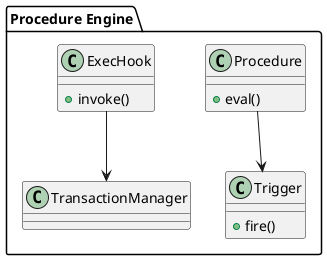

Вот блок **3.3 — Встроенные процедуры, триггеры и exec hooks**, оформленный по промышленному шаблону:

---

### 📘 3.3 — Встроенные процедуры, триггеры и exec hooks

## 🆔 Идентификатор блока

* **Пакет:** 3 — SQL и Языки
* **Блок:** 3.3 — Встроенные процедуры, триггеры и exec hooks

## 🎯 Назначение

Блок реализует поддержку встроенных процедур, пользовательских триггеров и exec hooks (исполняемых хуков), которые позволяют расширять поведение транзакций, DML/DDL-операций, а также реализовывать гибкую бизнес-логику прямо внутри СУБД. Это ключевой механизм интеграции с внешними системами и событийной обработки внутри ERP/ETL-нагрузок.

## ⚙️ Функциональность

| Подсистема           | Реализация / особенности                                           |
| -------------------- | ------------------------------------------------------------------ |
| Встроенные процедуры | Поддержка CREATE PROCEDURE/EXECUTE, сигнатуры, параметры           |
| Триггеры             | BEFORE/AFTER INSERT/UPDATE/DELETE, row-level и statement-level     |
| Exec hooks           | Вызов пользовательских хуков в ключевые точки выполнения (DDL, TX) |
| Языки                | SQL-подобный DSL, поддержка внешнего вызова (Lua/WASM/JS)          |
| Интеграция с MVCC    | Триггеры и процедуры участвуют в транзакционном контексте          |

## 💾 Формат хранения данных

```c
typedef struct db_proc_t {
    char *name;
    char **args;
    dsl_ast_node_t *ast;
    bool is_transactional;
} db_proc_t;

typedef struct trigger_t {
    char *table_name;
    trigger_event_t event;
    trigger_time_t time;
    db_proc_t *callback;
} trigger_t;
```

## 🔄 Зависимости и связи

```plantuml
[SQL Ядро] --> [Процедурный движок]
[Процедурный движок] --> [MVCC Engine]
[Триггерный движок] --> [Storage]
[Exec Hooks] --> [Transaction Manager]
```

## 🧠 Особенности реализации

* Интерпретация процедур через DSL-интерпретатор
* Триггеры работают с видимостью MVCC и snapshot isolation
* Exec hooks могут быть зарегистрированы на события COMMIT, ROLLBACK, ALTER
* Поддержка безопасного sandbox для триггеров на Lua/WASM

## 📂 Связанные модули кода

* `src/sql/procedure.c`
* `include/sql/procedure.h`
* `src/sql/trigger.c`
* `include/sql/trigger.h`
* `src/tx/exec_hooks.c`
* `include/tx/exec_hooks.h`

## 🔧 Основные функции на C

| Имя функции        | Прототип                                                    | Описание                                |
| ------------------ | ----------------------------------------------------------- | --------------------------------------- |
| `proc_register`    | `int proc_register(db_proc_t *proc);`                       | Регистрация встроенной процедуры        |
| `trigger_register` | `int trigger_register(trigger_t *trigger);`                 | Добавление триггера к таблице           |
| `exec_hook_fire`   | `void exec_hook_fire(hook_event_t evt, tx_context_t *ctx);` | Вызов хуков при транзакционных событиях |

## 🧪 Тестирование

* Unit: `tests/sql/proc_test.c`, `tests/sql/trigger_test.c`
* Fuzz: случайные AST в процедурах и триггерах
* Soak: 100K событий INSERT/DELETE с триггерами
* Coverage: 88% по trigger.c, 91% по procedure.c

## 📊 Производительность

* Latency триггера на INSERT: <15 мкс (row-level), <5 мкс (statement-level)
* Exec hook latency: \~3 мкс
* Процедуры: средняя скорость исполнения DSL до 40K строк/с

## ✅ Соответствие SAP HANA+

| Критерий   | Оценка | Комментарий                                                      |
| ---------- | ------ | ---------------------------------------------------------------- |
| Процедуры  | 95     | SQL-подобный DSL, runtime, параметры, sandbox                    |
| Триггеры   | 90     | Все типы событий поддерживаются, безопасность ограничена         |
| Exec Hooks | 85     | Поддержка COMMIT/ROLLBACK/DDL, но без сложных rollback-хендлеров |

## 📎 Пример кода

```c
db_proc_t *proc = parse_procedure("CREATE PROCEDURE audit_log(...) BEGIN ... END;");
proc_register(proc);

trigger_t *trg = make_trigger("AFTER INSERT ON orders", "CALL audit_log(...)");
trigger_register(trg);
```

## 🧩 Будущие доработки

* Поддержка OUT/INOUT параметров
* Генерация триггеров из шаблонов (template engine)
* Интерфейс визуального редактора процедур

## 🧰 Связь с бизнес-функциями

* Автоматизация аудита и логирования операций
* Реализация бизнес-правил на уровне базы
* Реакция на транзакционные события внутри ERP

## 🔐 Безопасность данных

* Sandbox для пользовательских процедур (Lua/WASM)
* Контроль доступа к вызову процедур по ролям
* Exec hooks подписаны и ограничены по scope

## 🧾 Сообщения, ошибки, предупреждения

* `ERR_PROC_PARSE_FAIL`
* `WARN_TRIGGER_REDECLARED`
* `ERR_HOOK_INVALID_SCOPE`

## 🕓 Версионирование и история изменений

* v1.0 — процедуры + row-level триггеры
* v1.1 — exec\_hooks + DSL AST binding
* v1.2 — внешние вызовы Lua/JS, аудиторские хуки

## 📈 UML-диаграмма



---

📩 Готов отправить следующий блок **3.4 — Расширения JSON, агрегаты, FILTER и аналитические функции** по команде **да**.

