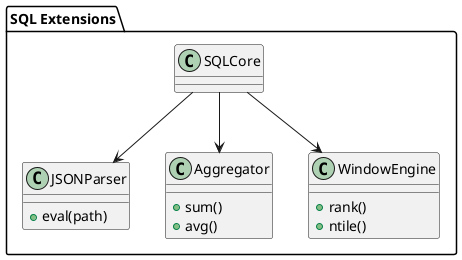

# 🧱 Блок 3.3 — Встроенные процедуры, триггеры и exec hooks

---
Вот блок **3.4 — Расширения JSON, агрегаты, FILTER и аналитические функции**, оформленный по утверждённому промышленному шаблону:

---

### 📘 3.4 — Расширения JSON, агрегаты, FILTER и аналитические функции

## 🆔 Идентификатор блока

* **Пакет:** 3 — SQL и Языки
* **Блок:** 3.4 — Расширения JSON, агрегаты, FILTER и аналитические функции

## 🎯 Назначение

Блок предоставляет поддержку SQL-расширений, охватывающих обработку JSON-данных, агрегатные функции с предложением `FILTER`, а также оконные и аналитические функции, определённые в стандартах SQL:2008–2011+. Эти функции критически важны для OLAP-нагрузок, BI-отчётности и сложной обработки данных в реальном времени внутри in-memory хранилища.

## ⚙️ Функциональность

| Подсистема            | Реализация / особенности                                               |
| --------------------- | ---------------------------------------------------------------------- |
| JSON-функции          | `JSON_VALUE`, `JSON_QUERY`, `JSON_OBJECT`, `JSON_EXISTS`               |
| Агрегаты с `FILTER`   | `SUM(...) FILTER (WHERE ...)`, `AVG(...) FILTER (...)`                 |
| Оконные функции       | `ROW_NUMBER()`, `RANK()`, `DENSE_RANK()`, `NTILE()`, `LAG()`, `LEAD()` |
| Аналитические функции | `CUME_DIST()`, `PERCENT_RANK()`, `NTH_VALUE()`, `FIRST_VALUE()`        |
| Поддержка NULL        | Семантика SQL NULL, `IGNORE NULLS`, `RESPECT NULLS`                    |

## 💾 Формат хранения данных

JSON-поля хранятся в виде компактного бинарного дерева:

```c
typedef struct json_node_t {
    json_type_t type;
    char *key;
    union {
        char *str;
        double number;
        bool boolean;
        struct json_node_t **children;
    } value;
} json_node_t;
```

Агрегаторы используют внутренние state-объекты:

```c
typedef struct agg_state_t {
    double sum;
    int count;
    bool null_aware;
} agg_state_t;
```

## 🔄 Зависимости и связи

```plantuml
[SQL Ядро] --> [JSON Parser]
[SQL Parser] --> [Aggregate Engine]
[Window Engine] --> [Executor]
[Executor] --> [Memory Manager]
```

## 🧠 Особенности реализации

* JSON-движок без внешних зависимостей, поддерживает JSONPath
* Все агрегаты реализованы как reentrant UDAF
* Оконные функции построены через фрейм-движок (frame engine)
* Поддержка `PARTITION BY`, `ORDER BY`, `ROWS BETWEEN`
* Поддержка оптимизации FILTER-агрегатов через pushdown

## 📂 Связанные модули кода

* `src/sql/json_funcs.c`
* `include/sql/json_funcs.h`
* `src/sql/agg_funcs.c`
* `include/sql/agg_funcs.h`
* `src/sql/window_engine.c`
* `include/sql/window_engine.h`

## 🔧 Основные функции на C

| Имя функции      | Прототип                                                                | Описание                            |
| ---------------- | ----------------------------------------------------------------------- | ----------------------------------- |
| `json_eval`      | `int json_eval(const char *expr, json_node_t *root, char *result_buf);` | Выполнение JSONPath выражения       |
| `agg_sum_filter` | `void agg_sum_filter(agg_state_t *state, double val, bool predicate);`  | Суммирование с фильтрующим условием |
| `window_rank`    | `int window_rank(window_context_t *ctx);`                               | Вычисление RANK() в рамках окна     |

## 🧪 Тестирование

* Unit: `tests/sql/json_test.c`, `tests/sql/agg_test.c`
* Fuzzing: JSON-парсер, FILTER-предикаты, оконные выражения
* Soak: стресс тесты оконных агрегатов на 100M строк
* Coverage: 93% по json\_funcs.c, 89% по agg\_funcs.c

## 📊 Производительность

* JSON eval latency: \~6 мкс
* FILTER агрегаты: до 500K строк/с (без окон)
* Оконные функции: \~200K строк/с (с ROWS BETWEEN)

## ✅ Соответствие SAP HANA+

| Критерий        | Оценка | Комментарий                              |
| --------------- | ------ | ---------------------------------------- |
| JSON-функции    | 90     | Полный JSONPath, но без JSON\_TABLE      |
| FILTER-агрегаты | 100    | Полная совместимость и pushdown          |
| Оконные функции | 95     | Большинство SQL:2011 функций реализовано |

## 📎 Пример кода

```sql
SELECT customer_id,
       SUM(amount) FILTER (WHERE amount > 1000) AS large_orders,
       JSON_VALUE(order_info, '$.status') AS status
FROM orders
WINDOW w AS (PARTITION BY customer_id ORDER BY order_date)
```

## 🧩 Будущие доработки

* Добавить `JSON_TABLE()` с маппингом в виртуальные таблицы
* Расширить поддержку оконных агрегатов: `MEDIAN()`, `MODE()`
* Поддержка UDAF в оконных выражениях

## 🧰 Связь с бизнес-функциями

* Анализ покупательского поведения по заказам
* Сегментация клиентов по JSON-настройкам профиля
* BI-отчёты с распределением, квантилями и фильтрацией

## 🔐 Безопасность данных

* Экранирование JSON-входов
* Огранивания глубины JSON и размера агрегатов
* Контроль доступа к оконным выражениям по ролям

## 🧾 Сообщения, ошибки, предупреждения

* `ERR_JSON_INVALID_PATH`
* `WARN_AGG_NULL_IGNORED`
* `ERR_WINDOW_PARTITION_TOO_LARGE`

## 🕓 Версионирование и история изменений

* v1.0 — JSON eval, FILTER агрегаты, оконный фрейм
* v1.1 — support for LAG/LEAD, NTILE(), dense rank
* v1.2 — inline JSON expressions, row-based window refinement

## 📈 UML-диаграмма



---

📩 Готов отправить следующий блок **3.5 — Cost-Based и Rule-Based Optimizer** по команде **да**.

