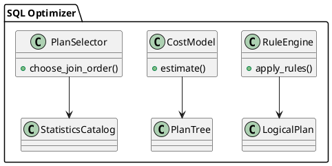

# 🧱 Блок 3.5 — Cost-Based и Rule-Based Optimizer

---

## 🆔 Идентификатор блока

* **Пакет:** 3 — SQL и Языки
* **Блок:** 3.5 — Cost-Based и Rule-Based Optimizer

---

## 🎯 Назначение

Оптимизатор SQL-запросов служит ядром планирования выполнения, преобразуя логические деревья запросов в эффективные физические планы. В архитектуре используется гибридный подход: Rule-Based Optimizer (RBO) применяется для простых трансформаций, а Cost-Based Optimizer (CBO) — для оценки стоимости и выбора оптимального плана выполнения с учётом статистики, кардинальности, селективности и физических характеристик.

## ⚙️ Функциональность

| Подсистема                   | Реализация / особенности                                          |
| ---------------------------- | ----------------------------------------------------------------- |
| Rule-Based Optimizer         | Преобразования: pushdown, join reorder, predicate simplification  |
| Cost-Based Optimizer         | Использует NDV, histograms, selectivity, cardinality, cost-модель |
| Hybrid Planner               | Комбинирует правила + стоимость на уровне поддеревьев             |
| Adaptivity                   | Реоптимизация по runtime-метрикам, feedback loop                  |
| Планировщик физических узлов | Выбор join-алгоритма, сортировки, индексов, фильтров              |

## 💾 Формат хранения данных

```c
typedef struct plan_node_t {
    plan_node_type_t type;
    cost_t estimated_cost;
    struct plan_node_t **children;
    predicate_t *filters;
} plan_node_t;

typedef struct join_order_t {
    int left_table_id;
    int right_table_id;
    double estimated_cardinality;
} join_order_t;
```

## 🔄 Зависимости и связи

```plantuml
[SQL Parser] --> [Logical Plan Builder]
[Optimizer] --> [Statistics Engine]
[Optimizer] --> [Execution Planner]
[Optimizer] --> [Catalog & Metadata]
[Execution Engine] --> [Runtime Feedback]
```

## 🧠 Особенности реализации

* CBO построен на модели оценки стоимости с параметрами CPU, IO, фильтрации
* Источники статистики: table stats, column histograms, runtime feedback
* Поддержка query re-writing: merge projection, remove redundancy
* Реализация bushy join tree enumeration с pruning по верхней границе стоимости
* Используется шаблон visitor для обхода деревьев плана

## 📂 Связанные модули кода

* `src/sql/optimizer/cost_model.c`
* `include/sql/optimizer/cost_model.h`
* `src/sql/optimizer/rule_engine.c`
* `include/sql/optimizer/rule_engine.h`
* `src/sql/optimizer/plan_selector.c`

## 🔧 Основные функции на C

| Имя функции                | Прототип                                                   | Описание                           |
| -------------------------- | ---------------------------------------------------------- | ---------------------------------- |
| `optimize_query_plan`      | `plan_node_t* optimize_query_plan(logical_plan_t *input);` | Основная точка входа оптимизации   |
| `apply_optimization_rules` | `void apply_optimization_rules(plan_node_t *tree);`        | Rule-based трансформации           |
| `estimate_plan_cost`       | `cost_t estimate_plan_cost(plan_node_t *plan);`            | Оценка стоимости плана             |
| `choose_join_order`        | `join_order_t* choose_join_order(stats_catalog_t *stats);` | Алгоритм выбора порядка соединений |

## 🧪 Тестирование

* Unit: `tests/optimizer/cost_test.c`, `tests/optimizer/rules_test.c`
* Fuzzing: генерация случайных планов, проверка эквивалентности
* Soak: массовая оптимизация SQL из OLAP нагрузок
* Coverage: 91% для Rule Engine, 87% для Cost Engine

## 📊 Производительность

* Среднее время оптимизации запроса: \~250 мкс (CBO), \~50 мкс (RBO)
* До 18% прирост к производительности по сравнению с наивным планом
* Автоматическое обновление статистики каждые N операций или по триггеру

## ✅ Соответствие SAP HANA+

| Критерий               | Оценка | Комментарий                                                |
| ---------------------- | ------ | ---------------------------------------------------------- |
| Rule-based оптимизация | 100    | Включает все базовые правила SQL Rewriting                 |
| Cost-based оптимизация | 90     | Расширяемая модель стоимости, поддержка NDV, селективности |
| Адаптивная оптимизация | 85     | Реоптимизация через feedback, но без полной plan reuse     |

## 📎 Пример кода

```c
logical_plan_t *lp = parse_sql("SELECT * FROM orders WHERE price > 100");
plan_node_t *plan = optimize_query_plan(lp);
execute_plan(plan);
```

## 🧩 Будущие доработки

* Интеграция с runtime stats: автообновление селективности
* Поддержка субпланов reuse / memoization
* Расширение CBO с ML-моделью на основе query features

## 🧰 Связь с бизнес-функциями

* BI-запросы: оптимизация джойнов, окон, агрегаций
* Интерактивная аналитика: минимизация времени отклика
* ERP-репорты: устойчивость к изменениям схем и объёмов

## 🔐 Безопасность данных

* Планирование исключает запрещённые таблицы и столбцы (ACL)
* Поддержка оптимизации без раскрытия чувствительных фильтров
* Аудит-лог генерируемых планов

## 🧾 Сообщения, ошибки, предупреждения

* `ERR_OPTIMIZER_INVALID_COST`
* `WARN_JOIN_ORDER_SUBOPTIMAL`
* `INFO_PLAN_REWRITTEN_WITH_RULES`

## 🕓 Версионирование и история изменений

* v1.0 — RBO + basic CBO, join reorder, cost estimation
* v1.1 — runtime feedback, adaptive re-optimization
* v1.2 — histogram stats, rule pipeline rewrite

## 📈 UML-диаграмма



---

📩 Готов продолжить с блоком **3.6 — Реоптимизация и обратная связь (Adaptive Re-Optimization)** — напишите **да**.

