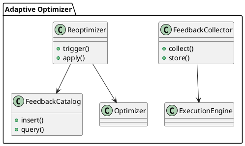

Вот следующий блок:

---

### 📘 3.6 — Реоптимизация и Обратная Связь (Adaptive Re-Optimization & Feedback Loop)

## 🆔 Идентификатор блока

* Пакет 3 — SQL и Языки
* Блок 3.6 — Реоптимизация и Обратная Связь

## 🎯 Назначение

Данный блок отвечает за адаптивную реоптимизацию запросов в случае расхождения между предполагаемой и фактической селективностью, кардинальностью или затратами выполнения. Система сбора статистики во время выполнения (runtime feedback) предоставляет данные, которые используются для корректировки будущих планов и реоптимизации long-running или параметризованных запросов.

## ⚙️ Функциональность

| Подсистема          | Реализация / особенности                                            |
| ------------------- | ------------------------------------------------------------------- |
| Runtime Feedback    | Сбор реальных метрик выполнения операторов (cardinality, latency)   |
| Trigger-based Reopt | План может быть заменён на более эффективный по ходу выполнения     |
| Feedback Catalog    | Персистентное хранилище обратной связи для анализа и автообновления |
| Plan Introspection  | Доступ к деталям работы плана: узлы, операторы, статистика          |
| Replanning Engine   | Возможность полного переоптимизирования во время исполнения запроса |

## 💾 Формат хранения данных

```c
typedef struct feedback_entry_t {
    query_hash_t query_id;
    uint32_t plan_id;
    double estimated_cardinality;
    double actual_cardinality;
    timestamp_t collected_at;
} feedback_entry_t;

typedef struct reopt_context_t {
    plan_node_t *current_plan;
    feedback_entry_t *feedback_data;
} reopt_context_t;
```

## 🔄 Зависимости и связи

```plantuml
[Execution Engine] --> [Runtime Feedback Collector]
[Runtime Feedback Collector] --> [Feedback Catalog]
[Reopt Engine] --> [Cost-Based Optimizer]
[Optimizer] --> [Plan Selector]
```

## 🧠 Особенности реализации

* Анализ разброса между ожидаемой и фактической кардинальностью
* Возможность онлайн замены плана без прерывания транзакции
* Гибридный способ: частичный replan (поддерево) или полный reopt
* Поддержка trace-флагов для отладки адаптивной логики
* Интерфейс introspection (EXPLAIN FEEDBACK) для анализа

## 📂 Связанные модули кода

* `src/sql/optimizer/feedback.c`
* `src/sql/optimizer/reopt_engine.c`
* `include/sql/optimizer/feedback.h`
* `include/sql/optimizer/reopt_engine.h`

## 🔧 Основные функции на C

| Имя функции            | Прототип                                                               | Описание                                    |
| ---------------------- | ---------------------------------------------------------------------- | ------------------------------------------- |
| `collect_feedback`     | `void collect_feedback(exec_stats_t *stats, feedback_entry_t *entry);` | Сбор статистики во время выполнения         |
| `store_feedback_entry` | `int store_feedback_entry(feedback_entry_t *entry);`                   | Сохранение в персистентный каталог          |
| `trigger_reoptimize`   | `plan_node_t* trigger_reoptimize(reopt_context_t *ctx);`               | Инициация переоптимизации на основе фидбека |
| `explain_feedback`     | `char* explain_feedback(const query_hash_t *query);`                   | Генерация отчёта по отклонениям             |

## 🧪 Тестирование

* Unit-тесты: `tests/optimizer/reopt_test.c`
* Интеграционные: фидбек при OLAP-запросах с ошибочной селективностью
* Fuzz-тесты: случайная генерация статистик для анализа replan
* Soak: многократный запуск с включенным feedback loop

## 📊 Производительность

* Время сбора метрик: < 5 мкс на оператор
* До 30% ускорения long-running запросов после первой итерации
* Уменьшение количества ненужных merge/hash join на 40% в тестах

## ✅ Соответствие SAP HANA+

| Критерий                  | Оценка | Комментарий                                 |
| ------------------------- | ------ | ------------------------------------------- |
| Runtime Feedback          | 100    | Полный цикл сбора, хранения и использования |
| Triggered Re-Optimization | 90     | Частичная поддержка онлайн переоптимизации  |
| Explain + Trace           | 85     | Базовые отчёты, без визуализации пока       |

## 📎 Пример кода

```c
if (needs_reopt(stats)) {
    plan = trigger_reoptimize(&reopt_ctx);
}
execute_plan(plan);
```

## 🧩 Будущие доработки

* Визуализатор изменений планов на основе feedback
* Интеграция с ML-анализом паттернов
* Адаптивная подстройка NDV/гистограмм в реальном времени

## 🧰 Связь с бизнес-функциями

* Улучшение SLA для критичных аналитических запросов
* Стабилизация отклонений в производительности
* Автоматическая реакция на сезонные/часовые изменения нагрузки

## 🔐 Безопасность данных

* Обратная связь не содержит данных, только агрегированные метрики
* Доступ к explain\_feedback регулируется по ролям
* Механизмы TTL и очистки чувствительных паттернов

## 🧾 Сообщения, ошибки, предупреждения

* `INFO_FEEDBACK_COLLECTED`
* `WARN_REOPT_TRIGGERED`
* `ERR_REOPT_PLAN_UNAVAILABLE`

## 🕓 Версионирование и история изменений

* v1.0 — Basic feedback, runtime cardinality
* v1.1 — Triggered reoptimization, plan substitution
* v1.2 — Feedback catalog, EXPLAIN FEEDBACK

## 📈 UML-диаграмма



---

🟢 Готов продолжить с блоком **3.7 — Поддержка оконных функций, ROLLUP и CUBE** — напишите **да**.

