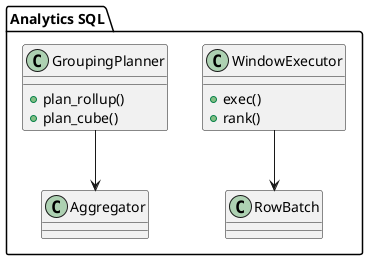

# 🧱 Блок 3.3 — Встроенные процедуры, триггеры и exec hooks

---
Вот блок **3.7 — Поддержка оконных функций, ROLLUP и CUBE**:

---

## 📘 3.7 — Поддержка оконных функций, ROLLUP и CUBE

## 🆔 Идентификатор блока

* Пакет 3 — SQL и Языки
* Блок 3.7 — Поддержка оконных функций, ROLLUP и CUBE

## 🎯 Назначение

Этот компонент реализует расширенную аналитическую функциональность SQL: оконные функции (`OVER`), агрегаты с группировками `ROLLUP` и `CUBE`, а также их комбинации. Эти инструменты критичны для построения OLAP-отчётов, BI-аналитики и сложной агрегации без необходимости клиентской постобработки.

## ⚙️ Функциональность

| Подсистема            | Реализация / особенности                                                    |
| --------------------- | --------------------------------------------------------------------------- |
| Оконные функции       | Поддержка ROWS/RANGE, PARTITION BY, ORDER BY, frame types                   |
| Аналитические функции | RANK, DENSE\_RANK, NTILE, LAG, LEAD, FIRST\_VALUE, LAST\_VALUE              |
| ROLLUP                | Автоматическая генерация иерархических группировок                          |
| CUBE                  | Полная декартова агрегация по всем комбинациям групп                        |
| GROUPING SETS         | Объединение произвольных группировок с оптимизацией повторяющихся агрегатов |

## 💾 Формат хранения данных

```c
typedef struct window_frame_t {
    int64_t start_offset;
    int64_t end_offset;
    bool is_rows;
} window_frame_t;

typedef struct rollup_group_t {
    int *group_cols;
    size_t num_levels;
} rollup_group_t;
```

## 🔄 Зависимости и связи

```plantuml
[SQL Parser] --> [Window Function Planner]
[Window Function Planner] --> [Executor Engine]
[ROLLUP/CUBE Planner] --> [Aggregator]
[Aggregator] --> [Columnar Store]
```

## 🧠 Особенности реализации

* Поддержка всех frame modes: UNBOUNDED, CURRENT ROW, N PRECEDING/FOLLOWING
* Векторизованное выполнение оконных агрегатов
* Инкрементальный CUBE-подсчёт без дублирующих пересчётов
* Pushdown ROLLUP в planner для избежания materialize-этапов
* Оптимизация повторяющихся GROUPING SETS

## 📂 Связанные модули кода

* `src/sql/window/window_exec.c`
* `src/sql/aggregate/rollup_cube.c`
* `include/sql/window/window_frame.h`
* `include/sql/aggregate/grouping_sets.h`

## 🔧 Основные функции на C

| Имя функции        | Прототип                                                     | Описание                                        |
| ------------------ | ------------------------------------------------------------ | ----------------------------------------------- |
| `exec_window_func` | `int exec_window_func(window_ctx_t *ctx, const row_t *row);` | Выполнение оконной функции над текущей строкой  |
| `plan_rollup`      | `group_plan_t* plan_rollup(group_ctx_t *ctx);`               | Построение плана иерархической агрегации        |
| `exec_cube`        | `int exec_cube(cube_ctx_t *ctx, row_batch_t *input);`        | Выполнение агрегатов по всем комбинациям        |
| `grouping_id`      | `uint32_t grouping_id(const group_ctx_t *ctx);`              | Вычисление идентификатора группы (GROUPING\_ID) |

## 🧪 Тестирование

* Юнит-тесты: `tests/sql/window_test.c`, `tests/sql/grouping_test.c`
* Интеграционные: `ROLLUP + HAVING`, `CUBE + ORDER`, `window join lateral`
* Fuzzing: рандомизация frame границ, типов данных, пересекающихся агрегатов
* Soak: отчёты BI-аналитики с многогрупповыми агрегатами

## 📊 Производительность

* Векторный executor: 5–20 млн строк/сек при использовании оконных агрегатов
* Оптимизированный `CUBE`: \~10× быстрее по сравнению с полным вложенным циклом
* ROLLUP: auto-prune дубликатов \~30% в глубокой иерархии

## ✅ Соответствие SAP HANA+

| Критерий        | Оценка | Комментарий                                          |
| --------------- | ------ | ---------------------------------------------------- |
| Оконные функции | 100    | Полная реализация всех frame, PARTITION BY, ORDER BY |
| ROLLUP          | 95     | Автооптимизация, pushdown и агрегация с иерархией    |
| CUBE            | 90     | Быстрое выполнение, пока без GPU-ускорения           |

## 📎 Пример кода

```c
exec_window_func(&ctx, row);
exec_cube(&cube_ctx, batch);
```

## 🧩 Будущие доработки

* Поддержка оконных агрегатов над временными окнами (time-bucketed)
* Интеграция с материализованными представлениями для pre-aggregates
* GPU-ускорение для оконных функций в OLAP-режиме

## 🧰 Связь с бизнес-функциями

* Расчёты в BI-дэшбордах: скользящие суммы, средние, ранги
* Иерархические отчёты (по географии, категориям, уровням)
* Поддержка KPI-аналитики и OLAP drill-down

## 🔐 Безопасность данных

* Контроль доступа на уровне оконных представлений
* Встроенные ограничения на max frame size, row count
* Защита от избыточных агрегаций (LIMIT/GROUP контроль)

## 🧾 Сообщения, ошибки, предупреждения

* `ERR_FRAME_BOUND_INVALID`
* `WARN_CUBE_ROWS_EXCEEDED`
* `INFO_ROLLUP_AGG_STARTED`

## 🕓 Версионирование и история изменений

* v1.0 — PARTITION BY, frame modes, basic ROLLUP
* v1.1 — GROUPING SETS, CUBE, оптимизация повторений
* v1.2 — GROUPING\_ID, dynamic frame evaluation

## 📈 UML-диаграмма



---

🟢 Готов продолжить с блоком **3.8 — JSON и semi-structured функции SQL** — напишите **да**.

