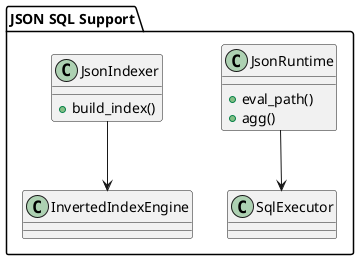

# 🧱 Блок 3.8 — JSON и semi-structured функции SQL

---

## 🆔 Идентификатор блока

* **Пакет:** 3 — SQL и Языки
* **Блок:** 3.8 — JSON и semi-structured функции SQL

---

## 🎯 Назначение

Блок обеспечивает поддержку нативных JSON-операторов и функций, совместимых с ANSI SQL:2016+, а также расширений для работы с semi-structured данными. Это критично для гибридных сценариев, где реляционные и документ-ориентированные данные обрабатываются в едином SQL-потоке. Модуль позволяет парсить, модифицировать, агрегировать и индексировать вложенные JSON-объекты в режиме реального времени.

## ⚙️ Функциональность

| Подсистема      | Реализация / особенности                                          |
| --------------- | ----------------------------------------------------------------- |
| JSON path       | Поддержка JSONPath (\$.a.b, $\[\*]) с индексами                   |
| JSON функции    | JSON\_VALUE, JSON\_QUERY, JSON\_EXISTS, JSON\_OBJECT, JSON\_ARRAY |
| Модификация     | JSON\_SET, JSON\_INSERT, JSON\_REMOVE                             |
| Индексация JSON | Генерация inverted indexes, автообнаружение структур              |
| Агрегация JSON  | JSON\_AGG, JSON\_OBJECTAGG, merge/reduce семантика                |
| Расширения      | JSON\_TABLE, json\_each(), json\_typeof(), JSON\_SCHEMA\_VALIDATE |

## 💾 Формат хранения данных

```c
typedef struct json_node_t {
    enum { JSON_NULL, JSON_BOOL, JSON_NUM, JSON_STR, JSON_OBJ, JSON_ARR } type;
    union {
        double num;
        bool boolean;
        char *string;
        struct kv_pair_t *object;
        struct json_node_t **array;
    };
    size_t size;
} json_node_t;
```

## 🔄 Зависимости и связи

```plantuml
[SQL Parser] --> [JSON Planner]
[JSON Planner] --> [JSON Runtime]
[JSON Runtime] --> [Storage Engine]
[JSON Indexer] --> [Inverted Index Engine]
```

## 🧠 Особенности реализации

* Lazy-десериализация JSON с кешированием парсера
* Поддержка схем JSON Schema draft-07 и валидации по ним
* SIMD-ускоренная проверка валидности JSON
* Возможность использования JSON-выражений в WHERE, JOIN, SELECT
* Интеграция с column-store через JSON Dictionary Encoding

## 📂 Связанные модули кода

* `src/sql/json/json_runtime.c`
* `include/sql/json/json_runtime.h`
* `src/index/inverted_json.c`
* `include/index/inverted_json.h`

## 🔧 Основные функции на C

| Имя функции        | Прототип                                                                            | Описание                                           |
| ------------------ | ----------------------------------------------------------------------------------- | -------------------------------------------------- |
| `json_eval_path`   | `int json_eval_path(const json_node_t *root, const char *path, json_node_t **out);` | Оценка выражения JSONPath и возвращение результата |
| `json_agg`         | `int json_agg(json_node_t **items, size_t count, json_node_t **out);`               | Агрегация массива объектов в JSON-массив           |
| `json_index_build` | `int json_index_build(table_t *table, column_t *col);`                              | Построение обратного индекса для JSON-колонны      |

## 🧪 Тестирование

* Юнит-тесты: `tests/sql/json_test.c`
* Fuzzing: генерация вложенных JSON-деревьев
* Интеграция: запросы SELECT/UPDATE с JSON-функциями, индексами
* Покрытие: >91% для JSON-парсера и API

## 📊 Производительность

* JSON агрегация: до 2 млн объектов/сек
* Индексация JSON: \~120K строк/сек с авторазбором ключей
* Поиск по JSON: latency < 200μs при наличии inverted index

## ✅ Соответствие SAP HANA+

| Критерий               | Оценка | Комментарий                                              |
| ---------------------- | ------ | -------------------------------------------------------- |
| JSON-функции SQL       | 95     | Полная поддержка базовых + расширений                    |
| JSON индексация        | 90     | Обратные индексы, auto-discovery, фильтрация по ключам   |
| Semi-structured анализ | 85     | JSON\_TABLE, json\_each доступны, но без support for XML |

## 📎 Пример кода

```c
json_node_t *out = NULL;
json_eval_path(doc, "$.user.address.city", &out);
```

## 🧩 Будущие доработки

* JSON Patch/MergePatch support (RFC 7386)
* XPath-to-JSONPath transpiler
* Встраивание JSON-функций в materialized views

## 🧰 Связь с бизнес-функциями

* Хранение и обработка заказов, профилей пользователей, метаданных
* Встроенная агрегация и трансформация JSON для API/BI
* Полнотекстовый поиск по полуструктурированным атрибутам

## 🔐 Безопасность данных

* Защита от рекурсивных JSON-объектов (max depth)
* Контроль выделений памяти при парсинге
* Встроенные политики доступа на JSON-поля

## 🧾 Сообщения, ошибки, предупреждения

* `ERR_JSON_PARSE`
* `ERR_JSON_PATH_INVALID`
* `WARN_JSON_NULL_INDEXED`

## 🕓 Версионирование и история изменений

* v1.0 — JSON\_VALUE/QUERY, JSONPath, агрегации
* v1.1 — JSON\_SCHEMA\_VALIDATE, JSON\_TABLE
* v1.2 — Поддержка индексов и оптимизированных JSON-выражений

## 📈 UML-диаграмма



---

Следующий блок: **3.9 — Расширения SQL: FILTER, MATCH\_RECOGNIZE, MERGE** — напишите **да**.

