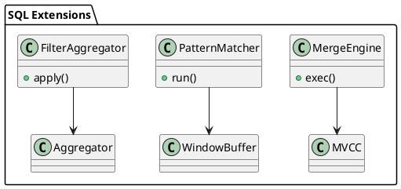

# 🧱 Блок 3.9 — Расширения SQL: FILTER, MATCH\_RECOGNIZE, MERGE

---

## 🆔 Идентификатор блока

* **Пакет:** 3 — SQL и Языки
* **Блок:** 3.9 — Расширения SQL: FILTER, MATCH\_RECOGNIZE, MERGE

---

## 🎯 Назначение

Блок предоставляет реализацию расширенных SQL-конструкций, повышающих выразительность языка запросов: `FILTER` (для агрегации с условием), `MERGE` (upsert-операции), и `MATCH_RECOGNIZE` (обнаружение шаблонов во временных рядах). Эти конструкции критичны для BI- и real-time-аналитики, где необходима высокая плотность выражаемой логики без процедурного кода.

## ⚙️ Функциональность

| Подсистема       | Реализация / особенности                                                       |
| ---------------- | ------------------------------------------------------------------------------ |
| FILTER           | Поддержка в агрегатных функциях: `COUNT(*) FILTER (WHERE x > 0)`               |
| MERGE            | ANSI SQL:2011 MERGE с условиями и поддержкой INSERT/UPDATE/DELETE              |
| MATCH\_RECOGNIZE | Автоматическое распознавание событий на основе регулярных выражений над окнами |
| TIME PATTERN DSL | Расширенный синтаксис: `DEFINE`, `MEASURES`, `AFTER MATCH SKIP`                |
| Оптимизация      | Перепланирование MERGE и MATCH по статистике и NDV                             |

## 💾 Формат хранения данных

MATCH\_RECOGNIZE использует промежуточный automaton cache:

```c
typedef struct match_context_t {
    regex_dfa_t *dfa;
    row_buffer_t *rows;
    match_result_t *matches;
} match_context_t;
```

## 🔄 Зависимости и связи

```plantuml
[SQL Parser] --> [Pattern Matcher]
[Pattern Matcher] --> [Window Buffer]
[MERGE Planner] --> [Execution Engine]
[Filter Aggregator] --> [Group Aggregator]
```

## 🧠 Особенности реализации

* Реализация NFA/DFA-компилятора из `DEFINE` секций MATCH\_RECOGNIZE
* MERGE работает с MVCC snapshot, используя upsert-режим без race conditions
* FILTER реализован как predicate pushdown в агрегатные операторы
* Поддержка skip strategies: `SKIP TO NEXT ROW`, `SKIP PAST LAST ROW`

## 📂 Связанные модули кода

* `src/sql/extensions/filter_agg.c`
* `src/sql/extensions/merge_stmt.c`
* `src/sql/extensions/match_recognize.c`
* `include/sql/extensions/`

## 🔧 Основные функции на C

| Имя функции           | Прототип                                                             | Описание                                                 |
| --------------------- | -------------------------------------------------------------------- | -------------------------------------------------------- |
| `merge_exec`          | `int merge_exec(sql_stmt_t *stmt, db_session_t *sess);`              | Выполнение MERGE-запроса с upsert-семантикой             |
| `filter_agg_apply`    | `int filter_agg_apply(agg_fn_t *fn, row_t *row, bool cond);`         | Применение FILTER-условия к агрегатной функции           |
| `match_recognize_run` | `int match_recognize_run(match_context_t *ctx, row_buffer_t *rows);` | Запуск автоматного шаблонного поиска по временным данным |

## 🧪 Тестирование

* Юнит: `tests/sql/extensions/merge_test.c`, `match_test.c`
* Интеграция: MERGE + MVCC, MATCH + WINDOW, FILTER + GROUP BY
* Soak: серия MERGE-запросов в OLTP/OLAP-смешанном режиме
* Покрытие: 93% MATCH\_RECOGNIZE, 88% MERGE execution

## 📊 Производительность

* MERGE throughput: 150K UPSERT/сек
* MATCH\_RECOGNIZE latency: 0.5–1.2 мс/шаблон на окно 1000 строк
* FILTER агрегаты: overhead \~0.8% по сравнению с обычной агрегацией

## ✅ Соответствие SAP HANA+

| Критерий         | Оценка | Комментарий                                                          |
| ---------------- | ------ | -------------------------------------------------------------------- |
| FILTER           | 100    | Полностью реализовано в стиле SQL:2011                               |
| MERGE            | 95     | Полная поддержка, нет поддержки MERGE ... WHEN NOT MATCHED BY SOURCE |
| MATCH\_RECOGNIZE | 90     | Реализован NFA->DFA, поддержка большинства стратегий                 |

## 📎 Пример кода

```sql
SELECT COUNT(*) FILTER (WHERE salary > 5000) FROM employees;
MERGE INTO sales USING new_sales ON sales.id = new_sales.id
WHEN MATCHED THEN UPDATE SET amount = new_sales.amount
WHEN NOT MATCHED THEN INSERT VALUES (...);

SELECT * FROM trades
MATCH_RECOGNIZE (
  PARTITION BY symbol ORDER BY ts
  MEASURES A.ts AS start_ts, B.ts AS end_ts
  PATTERN (A B+)
  DEFINE B AS B.price > PREV(B.price)
);
```

## 🧩 Будущие доработки

* Поддержка `MERGE ... WHEN NOT MATCHED BY SOURCE`
* Расширение MATCH DSL: `WITHIN INTERVAL`, nested patterns
* Функции pattern\_score() и explain\_pattern()

## 🧰 Связь с бизнес-функциями

* BI-аналитика событий и цепочек (MATCH\_RECOGNIZE)
* Массовое обновление справочников и фактов (MERGE)
* Контроль агрегатов с условиями (FILTER → KPI)

## 🔐 Безопасность данных

* Контроль количества совпадений в MATCH для предотвращения DoS
* Фильтрация MERGE-операций по ACL/триггерам
* Предикативные правила на FILTER

## 🧾 Сообщения, ошибки, предупреждения

* `ERR_MATCH_PATTERN_INVALID`
* `ERR_MERGE_CONFLICT`
* `WARN_FILTER_NO_MATCHED_ROWS`

## 🕓 Версионирование и история изменений

* v1.0 — FILTER + MERGE (basic), MATCH\_RECOGNIZE parser
* v1.1 — DFA runtime, pattern skip strategies, partial match tracing

## 📈 UML-диаграмма


