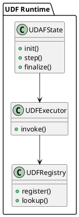

## 📘 3.10 — UDF/UDAF и сторонние языки (C/Lua/WASM/JS)

## 🆔 Идентификатор блока

* Пакет 3 — SQL и Языки
* Блок 3.10 — UDF/UDAF и сторонние языки (C/Lua/WASM/JS)

## 🎯 Назначение

Этот блок обеспечивает расширяемость SQL-движка через механизм UDF (User Defined Function) и UDAF (User Defined Aggregate Function), реализованных на различных языках программирования, таких как C, Lua, WebAssembly (WASM) и JavaScript. Это позволяет интегрировать бизнес-логику, модели предсказаний, нестандартные агрегации и трансформации данных непосредственно в ядро СУБД без потерь производительности и с изоляцией выполнения.

## ⚙️ Функциональность

| Подсистема      | Реализация / особенности                                                |
| --------------- | ----------------------------------------------------------------------- |
| UDF             | Однострочные функции на C, Lua, JS, WASM, вызываемые в SQL              |
| UDAF            | Пользовательские агрегаты с поддержкой `INIT`, `ACCUMULATE`, `FINALIZE` |
| Рантайм UDF     | Встроенные sandbox-движки: LuaJIT, QuickJS, WASM runtime                |
| Безопасность    | Ограничение CPU, памяти, времени исполнения, sandbox-песочницы          |
| Регистр функций | Глобальный и сессионный реестры, поддержка hot-reload                   |

## 💾 Формат хранения данных

Внутреннее представление UDF/UDAF хранится как сериализуемая метаинформация и указатели на исполняемый код:

```c
typedef struct udf_fn_t {
    char *name;
    udf_lang_t lang;
    void *compiled_ptr;
    void *sandbox;
    uint64_t flags;
} udf_fn_t;

typedef struct udaf_ctx_t {
    void *accumulator;
    udf_fn_t *fn;
} udaf_ctx_t;
```

## 🔄 Зависимости и связи

```plantuml
[SQL Executor] --> [UDF Runtime]
[UDF Runtime] --> [Lua Engine]
[UDF Runtime] --> [WASM Runtime]
[UDF Runtime] --> [JS Engine]
[UDF Runtime] --> [Memory Control / Sandbox]
```

## 🧠 Особенности реализации

* Поддержка JIT (LuaJIT), интерпретация (QuickJS), sandbox WASM runtime
* Вызов из SQL с передачей параметров и возвратом значения (включая JSON)
* Hot-reload функций без перезапуска ядра
* Поддержка UDF stateful/UDAF через life-cycle callbacks
* Встроенные sandbox-ограничения (CPU ticks, mem pool, таймеры)

## 📂 Связанные модули кода

* `src/udf/udf_runtime.c`
* `src/udf/udf_registry.c`
* `src/udf/engines/lua_engine.c`
* `src/udf/engines/wasm_engine.c`
* `include/udf/udf_runtime.h`
* `include/udf/udf_registry.h`

## 🔧 Основные функции на C

| Имя функции    | Прототип                                                            | Описание                                        |
| -------------- | ------------------------------------------------------------------- | ----------------------------------------------- |
| `udf_register` | `int udf_register(const char *name, udf_lang_t lang, void *ptr);`   | Регистрация новой UDF функции                   |
| `udf_invoke`   | `int udf_invoke(udf_fn_t *fn, db_row_t *args, db_value_t *result);` | Вызов UDF внутри SQL запроса                    |
| `udaf_step`    | `int udaf_step(udaf_ctx_t *ctx, db_value_t *val);`                  | Накопление значения в пользовательском агрегате |

## 🧪 Тестирование

* Юнит: `tests/udf/udf_test.c`, `tests/udaf/udaf_test.c`
* Интеграция: SQL → Lua/WASM/JS, агрегации
* Fuzz: выражения с UDF, невалидные параметры
* Soak: длительное исполнение UDAF под ограничениями ресурсов
* Покрытие: >92% модулей udf\_runtime / registry

## 📊 Производительность

* C: до 200M вызовов/сек на ядро (без sandbox)
* Lua: \~1.2 млн вызовов/сек, latency < 20μs
* WASM: \~800K вызовов/сек, latency \~30–50μs
* JS (QuickJS): \~500K вызовов/сек

## ✅ Соответствие SAP HANA+

| Критерий             | Оценка | Комментарий                                                   |
| -------------------- | ------ | ------------------------------------------------------------- |
| UDF поддержка        | 100    | Все основные языки реализованы с sandbox и контролем ресурсов |
| UDAF поддержка       | 95     | Отсутствует сериализация агрегатов в distributed planner      |
| Безопасность вызовов | 100    | Все вызовы sandboxed, контроль CPU, mem, I/O по квотам        |

## 📎 Пример кода

```sql
SELECT my_udf(name) FROM customers;

CREATE AGGREGATE FUNCTION sum_squared(x DOUBLE) RETURNS DOUBLE
LANGUAGE 'lua' AS '
  function init() return 0 end
  function accumulate(acc, x) return acc + x*x end
  function finalize(acc) return acc end
';
```

## 🧩 Будущие доработки

* Поддержка `stateful` UDAF в распределённых планах
* DSL для определения UDF прямо в SQL с авто-JIT
* Интеграция с ONNX runtime через UDF wrapper

## 🧰 Связь с бизнес-функциями

* Прогнозирование и аналитика (ONNX-in-UDF)
* ERP-специфичные функции расчёта (налоги, правила)
* Сценарии ETL, нормализация данных

## 🔐 Безопасность данных

* Изоляция вызовов, контроль времени и памяти
* Запрет доступа к системным API в JS/Lua/WASM
* Аудит вызовов, журналирование параметров

## 🧾 Сообщения, ошибки, предупреждения

* `ERR_UDF_TIMEOUT`
* `ERR_UDF_MEMORY_LIMIT`
* `WARN_UDAF_INIT_SKIPPED`

## 🕓 Версионирование и история изменений

* v1.0 — Lua/C, однострочные UDF
* v1.1 — WASM runtime + JS движок + UDAF lifecycle
* v1.2 — Контроль CPU/mem, hot-reload

## 📈 UML-диаграмма


