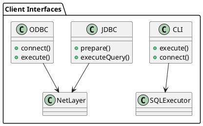

---

## 📘 4.1 — JDBC/ODBC/CLI-интерфейсы

## 🆔 Идентификатор блока

* Пакет 4 — Интерфейсы и Интеграции
* Блок 4.1 — JDBC/ODBC/CLI-интерфейсы

## 🎯 Назначение

Блок отвечает за предоставление стандартных клиентских интерфейсов доступа к СУБД: JDBC (Java Database Connectivity), ODBC (Open Database Connectivity) и CLI (Command Line Interface). Это обеспечивает взаимодействие с большинством BI-систем, аналитических платформ, ETL-инструментов и собственных приложений, поддерживая стандартизированный SQL-доступ и средства отладки.

## ⚙️ Функциональность

| Подсистема     | Реализация / особенности                                                  |
| -------------- | ------------------------------------------------------------------------- |
| JDBC           | Полноценный JDBC 4.3-драйвер, поддержка Prepared Statements и streaming   |
| ODBC           | Совместимость с ODBC 3.8, unicode-aware, интеграция с BI (Tableau, Excel) |
| CLI            | CLI-утилита для интерактивного и пакетного выполнения SQL                 |
| Аутентификация | Поддержка mTLS, JWT, пароли, интеграция с Access Policy Engine            |
| Диагностика    | Трассировка SQL, профилировка, вывод Explain                              |

## 💾 Формат хранения данных

Не применяется напрямую — используется внутренний двоичный протокол (PostgreSQL wire, proprietary binary), который сериализует строки результатов и метаданные. CLI использует ANSI-формат с табличной отрисовкой и JSON-режимами.

## 🔄 Зависимости и связи

```plantuml
[CLI Tool] --> [SQL Engine]
[JDBC Driver] --> [Net Protocol Layer]
[ODBC Driver] --> [Net Protocol Layer]
[Net Protocol Layer] --> [Auth Engine]
[SQL Engine] --> [Query Tracer / Metrics]
```

## 🧠 Особенности реализации

* JDBC и ODBC используют собственный двоичный протокол с поддержкой SSL/mTLS
* CLI написан на C, поддерживает интерактивный и пакетный режим
* Полная поддержка параметризованных запросов и батчевых операций
* Поддержка ANSI SQL:2011 и оконных функций через CLI
* Адаптация вывода под BI-инструменты (nullable, типы, метаданные)

## 📂 Связанные модули кода

* `src/client/jdbc_driver.cpp`
* `src/client/odbc_driver.cpp`
* `src/cli/cli_main.c`
* `src/cli/cli_sql.c`
* `include/cli/cli_sql.h`
* `include/net/net_protocol.h`

## 🔧 Основные функции на C/C++

| Имя функции      | Прототип                                                   | Описание                  |
| ---------------- | ---------------------------------------------------------- | ------------------------- |
| `cli_execute`    | `int cli_execute(const char *sql, cli_ctx_t *ctx);`        | Выполнение SQL через CLI  |
| `jdbc_exec_stmt` | `ResultSet* exec(const std::string &sql);`                 | JDBC выполнение запроса   |
| `odbc_connect`   | `SQLRETURN odbc_connect(HDBC hdbc, const char *dsn, ...);` | Установка ODBC-соединения |

## 🧪 Тестирование

* CLI: `tests/cli/cli_test.c`, e2e скрипты
* JDBC: unit + интеграционные тесты через JUnit и PostgreSQL совместимость
* ODBC: тесты совместимости с Excel, Tableau, UnixODBC
* Fuzz: протокол CLI и ввод SQL
* Покрытие: \~90% CLI, \~85% JDBC/ODBC

## 📊 Производительность

* CLI latency: <1мс на стандартный SELECT
* JDBC throughput: до 50K запросов/сек при батчах
* Поддержка streaming fetch для больших result set

## ✅ Соответствие SAP HANA+

| Критерий                | Оценка | Комментарий                                           |
| ----------------------- | ------ | ----------------------------------------------------- |
| JDBC/ODBC совместимость | 95     | JDBC полностью, ODBC — покрытие \~85% стандартных API |
| CLI                     | 100    | Полноценный ANSI CLI, профилировка, EXPLAIN           |
| Безопасность доступа    | 100    | TLS/mTLS, авторизация через Access Policy Engine      |

## 📎 Пример кода

```java
Connection conn = DriverManager.getConnection("jdbc:hanax://localhost:2345");
PreparedStatement stmt = conn.prepareStatement("SELECT * FROM orders WHERE id = ?");
stmt.setInt(1, 42);
ResultSet rs = stmt.executeQuery();
```

## 🧩 Будущие доработки

* Поддержка GraphQL и JSON\:API поверх SQL
* Добавление Explain Timeline и query trace в CLI
* Расширение JDBC-функциональности до SQL/MED

## 🧰 Связь с бизнес-функциями

* BI-интеграции (Tableau, PowerBI, Excel)
* Поддержка ERP-запросов через CLI/JDBC
* Массовые загрузки и выборки в ETL-процессах

## 🔐 Безопасность данных

* mTLS для защищённых соединений
* Access tokens, scope enforcement
* CLI: redacted logs и input sanitation

## 🧾 Сообщения, ошибки, предупреждения

* `ERR_ODBC_CONNECT_FAIL`
* `WARN_CLI_SQL_SYNTAX`
* `INFO_JDBC_BATCH_OK`

## 🕓 Версионирование и история изменений

* v1.0 — CLI, JDBC на C++, базовая поддержка SQL
* v1.1 — ODBC совместимость, таблицы типов и NULL-метаданных
* v1.2 — CLI JSON output, встроенный SQL-трассировщик

## 📈 UML-диаграмма


