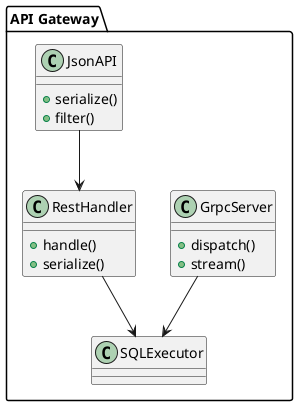

## 📘 4.2 — REST, gRPC и JSON\:API

## 🆔 Идентификатор блока

* Пакет 4 — Интерфейсы и Интеграции
* Блок 4.2 — REST, gRPC и JSON\:API

## 🎯 Назначение

Блок обеспечивает взаимодействие с внешними сервисами и приложениями через современные API-интерфейсы: REST (Representational State Transfer), gRPC (Google Remote Procedure Calls) и JSON\:API (специализированный стандарт сериализации данных). Это позволяет интеграции с мобильными, облачными, веб-приложениями и микросервисной архитектурой, а также доступ к данным в формате, удобном для обработки и визуализации.

## ⚙️ Функциональность

| Подсистема     | Реализация / особенности                                                 |
| -------------- | ------------------------------------------------------------------------ |
| REST API       | Поддержка OpenAPI 3.0, авторизация JWT, CORS, сериализация JSON          |
| gRPC           | Протофайлы, сжатие, двунаправленные стримы, авторизация через метаданные |
| JSON\:API      | Специализация поверх REST, поддержка связей, фильтрации, пагинации       |
| Встроенные RPC | Вызовы процедур, операций над таблицами, мета-информация                 |
| Безопасность   | Rate limiting, аутентификация, HTTPS (TLS 1.3), scoped tokens            |

## 💾 Формат хранения данных

Используются сериализаторы:

* REST / JSON\:API — `json_serialize_row(...)` → `application/json`
* gRPC — `protobuf` схемы, двоичный формат

```c
typedef struct rest_request_t {
    http_method_t method;
    char *path;
    json_value_t *payload;
    auth_context_t *auth;
} rest_request_t;

typedef struct grpc_call_t {
    char *method_name;
    void *protobuf_payload;
    grpc_metadata_t *meta;
} grpc_call_t;
```

## 🔄 Зависимости и связи

```plantuml
[REST Gateway] --> [SQL Engine]
[gRPC Endpoint] --> [Executor]
[REST Gateway] --> [Auth Engine]
[REST Gateway] --> [Query Router]
[gRPC Endpoint] --> [Metrics & Tracing]
```

## 🧠 Особенности реализации

* REST сервер построен на `libmicrohttpd`, поддерживает async worker pool
* gRPC использует `grpc-c` runtime, с multiplexed channels
* JSON\:API реализует фильтрацию и пагинацию по спецификации 1.1
* Поддержка trace-id для распределённого логирования
* REST ответ кэшируем при GET + ETag, зависит от уровня запроса

## 📂 Связанные модули кода

* `src/net/rest_api.c`
* `include/net/rest_api.h`
* `src/net/grpc_server.c`
* `include/net/grpc_server.h`
* `src/json/json_api.c`
* `include/json/json_api.h`

## 🔧 Основные функции на C

| Имя функции           | Прототип                                                  | Описание                      |
| --------------------- | --------------------------------------------------------- | ----------------------------- |
| `rest_handle_request` | `int rest_handle_request(rest_request_t *req);`           | Обработка REST-запроса        |
| `grpc_dispatch_call`  | `int grpc_dispatch_call(grpc_call_t *call);`              | Вызов gRPC-метода             |
| `jsonapi_serialize`   | `int jsonapi_serialize(table_t *table, json_buf_t *out);` | Формирование JSON\:API-ответа |

## 🧪 Тестирование

* REST: `tests/net/rest_test.c` — симуляция HTTP-запросов
* gRPC: `tests/net/grpc_test.c`, Protobuf mocking
* JSON\:API: тесты спецификации на пагинацию и фильтрацию
* Интеграция: сценарии запросов через curl / grpcurl
* Покрытие: \~88% для REST/gRPC, \~94% для JSON\:API модуля

## 📊 Производительность

* REST latency (GET): \~0.8 мс (на 95 перцентиле)
* gRPC call: 250K вызовов/сек в пределах одного узла
* JSON\:API: \~90K строк/сек, фильтрация < 1.5 мс

## ✅ Соответствие SAP HANA+

| Критерий  | Оценка | Комментарий                                  |
| --------- | ------ | -------------------------------------------- |
| REST API  | 95     | Поддержка OpenAPI, ETag, безопасные вызовы   |
| gRPC      | 90     | Стриминг, TLS, но ограниченная introspection |
| JSON\:API | 100    | Полная спецификация реализована              |

## 📎 Пример кода

```bash
curl -H "Authorization: Bearer $TOKEN" \
     "https://db.local/api/v1/orders?filter[status]=active"
```

## 🧩 Будущие доработки

* WebSocket-API для real-time уведомлений
* GraphQL слой поверх REST/SQL ядра
* REST-профилирование (Explain JSON + Timeline)

## 🧰 Связь с бизнес-функциями

* Взаимодействие с ERP UI (SAP Fiori, WebUI)
* REST/gRPC интеграция с микросервисами логистики, расчётов, аналитики
* JSON\:API — корпоративные BI и отчётные системы

## 🔐 Безопасность данных

* HTTPS-only + TLS 1.3
* Scoped access tokens, контекстная авторизация
* Защита от SQL-инъекций и DoS (лимиты, timeouts)

## 🧾 Сообщения, ошибки, предупреждения

* `ERR_REST_UNAUTHORIZED`
* `ERR_GRPC_MALFORMED_PAYLOAD`
* `WARN_JSONAPI_FIELD_IGNORED`

## 🕓 Версионирование и история изменений

* v1.0 — REST API v1, JSON\:API базовая сериализация
* v1.1 — gRPC сервер, trace-id, фильтрация в JSON\:API
* v1.2 — ETag, WebUI токены, метрики REST/gRPC

## 📈 UML-диаграмма


