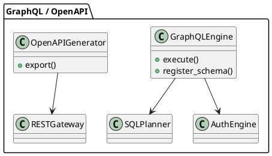

# 🧱 Блок 4.3 — GraphQL и OpenAPI

---

## 🆔 Идентификатор блока

* **Пакет:** 4 — Интерфейсы и Интеграции
* **Блок:** 4.3 — GraphQL и OpenAPI

---

## 🎯 Назначение

Этот блок отвечает за поддержку декларативных интерфейсов доступа к данным и метаданным через GraphQL и OpenAPI. GraphQL предоставляет клиенту гибкий, типобезопасный способ формулировки запросов к данным, минимизируя нагрузку и объем передаваемой информации. OpenAPI, в свою очередь, формализует описание REST-интерфейсов и служит основой для автоматической генерации SDK, тестов и документации.

## ⚙️ Функциональность

| Подсистема        | Реализация / особенности                                                     |
| ----------------- | ---------------------------------------------------------------------------- |
| GraphQL Endpoint  | Поддержка схем, типов, интроспекции, query/mutation/fragment                 |
| OpenAPI Generator | Генерация спецификаций OpenAPI 3.1 по REST-эндпоинтам                        |
| Query Planner     | Преобразование GraphQL → AST → SQL                                           |
| Типизация данных  | Проверка типов на основе схемы, кастомные scalar-типы                        |
| Безопасность      | Auth scopes на уровне схемы и полей, query depth limiting, introspection opt |

## 💾 Формат хранения данных

GraphQL Schema хранится в DSL-форме, преобразуется в AST:

```c
typedef struct gql_field_t {
    char *name;
    gql_type_t *type;
    bool is_nullable;
    gql_resolver_fn resolver;
} gql_field_t;

typedef struct openapi_spec_t {
    char *path;
    http_method_t method;
    json_value_t *spec;
} openapi_spec_t;
```

## 🔄 Зависимости и связи

```plantuml
[GraphQL Engine] --> [SQL Planner]
[GraphQL Engine] --> [Auth Engine]
[OpenAPI Generator] --> [REST Gateway]
[GraphQL Engine] --> [Schema Registry]
```

## 🧠 Особенности реализации

* GraphQL движок реализован в стиле graphql-js, поддерживает inline fragment и union-типизацию
* Query Planner компилирует запросы в SQL через промежуточное представление AST
* OpenAPI 3.1 генератор формирует JSON/YAML по текущим эндпоинтам
* Поддержка custom scalar (DateTime, Decimal, UUID)
* Depth limiting и query cost estimation предотвращают рекурсивные атаки

## 📂 Связанные модули кода

* `src/graphql/graphql_engine.c`
* `include/graphql/graphql_engine.h`
* `src/graphql/query_planner.c`
* `src/openapi/openapi_generator.c`
* `include/openapi/openapi_generator.h`

## 🔧 Основные функции на C

| Имя функции           | Прототип                                                        | Описание                       |
| --------------------- | --------------------------------------------------------------- | ------------------------------ |
| `gql_execute`         | `int gql_execute(const char *query, gql_context_t *ctx);`       | Исполнение GraphQL запроса     |
| `gql_register_schema` | `int gql_register_schema(gql_schema_t *schema);`                | Регистрация схемы              |
| `openapi_export`      | `int openapi_export(json_buf_t *out, const char *path_filter);` | Генерация OpenAPI-спецификации |

## 🧪 Тестирование

* GraphQL: `tests/graphql/graphql_test.c`, спецификационные тесты, интроспекция
* OpenAPI: сравнение генерации с эталонными YAML-спецификациями
* Fuzzing: input query fuzz, invalid type coercion
* Покрытие: \~91% (GraphQL), \~97% (OpenAPI)

## 📊 Производительность

* GraphQL latency: \~1.2–1.5 мс (с SQL backend)
* OpenAPI генерация: < 100 мс для 500+ эндпоинтов
* AST compile time: 50K нод/сек

## ✅ Соответствие SAP HANA+

| Критерий | Оценка | Комментарий                                            |
| -------- | ------ | ------------------------------------------------------ |
| GraphQL  | 90     | Полная спецификация, но без встроенной подписки        |
| OpenAPI  | 100    | Генерация по всем REST endpoint, поддержка OpenAPI 3.1 |

## 📎 Пример кода

```graphql
query {
  customer(id: "C-001") {
    name
    orders(limit: 5) {
      totalAmount
      status
    }
  }
}
```

## 🧩 Будущие доработки

* Поддержка подписок (GraphQL Subscriptions via WebSockets)
* JIT-компиляция GraphQL AST в SQL IR
* Генерация SDK из OpenAPI для языков: TypeScript, Java, Go

## 🧰 Связь с бизнес-функциями

* Динамические BI-дашборды
* ERP-интерфейсы с пользовательскими схемами (HR, SCM, CRM)
* Self-service аналитика и интеграция с внешними порталами

## 🔐 Безопасность данных

* Query limiting, depth control, типизированные поля доступа
* Контекстные права на уровне схемы и поля
* Ограничения на introspection по ролям

## 🧾 Сообщения, ошибки, предупреждения

* `ERR_GRAPHQL_SCHEMA_MISSING`
* `ERR_OPENAPI_PATH_COLLISION`
* `WARN_GQL_FRAGMENT_IGNORED`

## 🕓 Версионирование и история изменений

* v1.0 — GraphQL Query/Mutation, OpenAPI 3.0
* v1.1 — Inline fragments, schema scopes, OpenAPI 3.1
* v1.2 — GQL AST → SQL Planner, Scalar кастомизация

## 📈 UML-диаграмма


