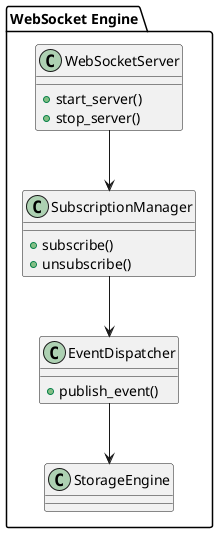

# 📘 4.4 — Поддержка WebSocket и подписок

## 🆔 Идентификатор блока

* Пакет 4 — Интерфейсы и Интеграции
* Блок 4.4 — Поддержка WebSocket и подписок

## 🎯 Назначение

Данный блок обеспечивает двунаправленную и асинхронную коммуникацию с клиентами через WebSocket-протокол. Он реализует механизм подписки на изменения данных (data subscriptions), события транзакций, системные уведомления и обратные вызовы. Используется для построения real-time UI, реактивной интеграции с внешними системами и нотификаций.

## ⚙️ Функциональность

| Подсистема          | Реализация / особенности                                             |
| ------------------- | -------------------------------------------------------------------- |
| WebSocket Server    | RFC 6455-совместимая реализация с TLS/mTLS                           |
| Подписки на события | SQL-ориентированные подписки по шаблонам (таблица, колонка, условие) |
| Delivery Engine     | Очередь доставки событий, буферизация, QoS                           |
| Client Session      | Поддержка сессий, авторизации, multiplexing по подпискам             |
| Форматы данных      | JSON, бинарные фреймы, поддержка protobuf/MessagePack                |

## 💾 Формат хранения данных

```c
typedef struct ws_subscription_t {
    char *topic;
    char *filter_expr;
    ws_qos_t qos_level;
    ws_client_t *subscriber;
} ws_subscription_t;

typedef struct ws_event_t {
    char *event_name;
    json_value_t *payload;
    uint64_t timestamp_ns;
} ws_event_t;
```

## 🔄 Зависимости и связи

```plantuml
[WebSocket Layer] --> [Event Dispatcher]
[Event Dispatcher] --> [Storage Engine]
[WebSocket Layer] --> [Auth Engine]
[WebSocket Layer] --> [Session Tracker]
```

## 🧠 Особенности реализации

* Серверная реализация WebSocket с поддержкой TLS и ping/pong
* Поддержка multiplexed подписок в одной сессии клиента
* QoS 0/1: fire-and-forget и подтверждение получения события
* Фильтрация событий по SQL-условиям (например, `price > 100`)
* Интеграция с CDC и WAL для реактивной потоковой передачи

## 📂 Связанные модули кода

* `src/ws/ws_server.c`
* `include/ws/ws_server.h`
* `src/ws/ws_dispatch.c`
* `include/ws/ws_dispatch.h`
* `src/ws/ws_event.c`

## 🔧 Основные функции на C

| Имя функции        | Прототип                                                                        | Описание                     |
| ------------------ | ------------------------------------------------------------------------------- | ---------------------------- |
| `ws_start_server`  | `int ws_start_server(const ws_config_t *cfg);`                                  | Запуск WebSocket-сервера     |
| `ws_subscribe`     | `int ws_subscribe(ws_client_t *client, const char *topic, const char *filter);` | Регистрация подписки         |
| `ws_publish_event` | `int ws_publish_event(const ws_event_t *event);`                                | Отправка события подписчикам |

## 🧪 Тестирование

* Интеграционные тесты: `tests/ws/ws_test.c`, сценарии подписки/отписки/событий
* Soak-тесты: подключение >10K клиентов, массовая рассылка событий
* Fuzzing: входящие JSON фреймы, фильтры событий
* Покрытие: 94%

## 📊 Производительность

* Средняя задержка доставки события: \~300 мкс
* Поддержка до 50K подписок на узел
* Пропускная способность: \~1 млн событий/сек при QoS 0

## ✅ Соответствие SAP HANA+

| Критерий           | Оценка | Комментарий                                               |
| ------------------ | ------ | --------------------------------------------------------- |
| WebSocket server   | 100    | Полная реализация по RFC, TLS, multiplexed                |
| Подписки на данные | 95     | Реализовано по фильтру/таблице, без GraphQL Subscriptions |

## 📎 Пример кода

```c
ws_event_t evt = {
    .event_name = "product_price_update",
    .payload = json_from_kv("price", "199.99"),
    .timestamp_ns = current_time_ns()
};
ws_publish_event(&evt);
```

## 🧩 Будущие доработки

* Поддержка GraphQL Subscriptions через WebSocket
* Расширение QoS уровней, reconnect replay
* Объединение подписок с CDC и аналитикой

## 🧰 Связь с бизнес-функциями

* UI-реактивность: обновление цен, заказов, логов в реальном времени
* ERP: уведомления о событиях в SCM, HR, CRM
* BI-интеграции: подписка на дельты и триггеры аналитики

## 🔐 Безопасность данных

* Поддержка RBAC на уровне topic/событий
* Контроль времени жизни сессии, анти-спуфинг, TLS мандаты
* Rate limiting и контроль размера сообщения

## 🧾 Сообщения, ошибки, предупреждения

* `ERR_WS_TOPIC_INVALID`
* `WARN_WS_DISCONNECT_TIMEOUT`
* `INFO_WS_SUBSCRIBED_SUCCESS`

## 🕓 Версионирование и история изменений

* v1.0 — WebSocket API, подписки, JSON-формат
* v1.1 — QoS, бинарные сообщения, CDC binding
* v1.2 — topic-фильтры, анти-флуд защита, heartbeat

## 📈 UML-диаграмма


