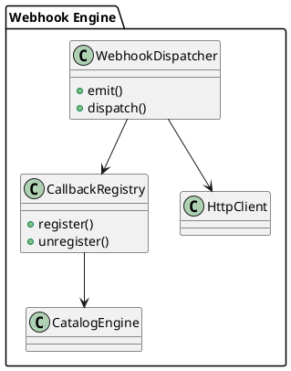

# 🧱 Блок 4.5 — REST Webhooks и обратные вызовы (async eventing)

---

## 🆔 Идентификатор блока

* **Пакет:** 4 — Интерфейсы и Интеграции
* **Блок:** 4.5 — REST Webhooks и обратные вызовы (async eventing)

---

## 🎯 Назначение

Блок реализует систему REST-совместимых webhook-интерфейсов и обратных вызовов, предназначенных для асинхронного оповещения внешних систем о событиях внутри СУБД. Это критично для построения loosely-coupled интеграций, микросервисных архитектур, аудита, мониторинга и триггерных действий на стороне ERP/BI-систем.

## ⚙️ Функциональность

| Подсистема         | Реализация / особенности                               |
| ------------------ | ------------------------------------------------------ |
| Webhook Dispatcher | Асинхронная отправка событий через HTTP POST/PUT/PATCH |
| Callback Registry  | Хранилище конфигурации подписчиков и их политик        |
| Event Queue        | Надёжная очередь доставки с retry/backoff              |
| Payload Templates  | Поддержка шаблонов тела запроса (JSONPath, Jinja-like) |
| Delivery Policy    | Timeouts, retries, backoff, dead-letter queue, QoS     |

## 💾 Формат хранения данных

```c
typedef struct webhook_callback_t {
    char *url;
    char *event_type;
    char *template_body;
    int retry_count;
    int timeout_ms;
} webhook_callback_t;

typedef struct webhook_event_t {
    char *event_type;
    json_value_t *payload;
    uint64_t created_at_ns;
} webhook_event_t;
```

## 🔄 Зависимости и связи

```plantuml
[Webhook Dispatcher] --> [Event Dispatcher]
[Webhook Dispatcher] --> [HTTP Client Layer]
[Callback Registry] --> [Catalog Engine]
[Event Dispatcher] --> [Storage Engine]
```

## 🧠 Особенности реализации

* Полная поддержка HTTP/1.1, TLS, gzip-сжатие
* JIT-шаблонизация тела запроса (на лету)
* Поддержка `application/json`, `application/xml`, `text/plain`
* Хранилище обратных вызовов в in-memory + WAL + snapshot
* Интеграция с SQL-триггерами, DML-событиями, CDC

## 📂 Связанные модули кода

* `src/hooks/webhook_dispatcher.c`
* `include/hooks/webhook_dispatcher.h`
* `src/hooks/webhook_registry.c`
* `include/hooks/webhook_registry.h`
* `src/net/http_client.c`

## 🔧 Основные функции на C

| Имя функции             | Прототип                                               | Описание                               |
| ----------------------- | ------------------------------------------------------ | -------------------------------------- |
| `webhook_register`      | `int webhook_register(const webhook_callback_t *cfg);` | Регистрация webhook-подписчика         |
| `webhook_emit`          | `int webhook_emit(const webhook_event_t *evt);`        | Эмиссия события для обратного вызова   |
| `webhook_dispatch_loop` | `void webhook_dispatch_loop(void);`                    | Асинхронная обработка очереди доставки |

## 🧪 Тестирование

* Модульные тесты: `tests/hooks/webhook_test.c`
* Интеграционные: HTTP серверы-заглушки с проверкой retry, order
* Fuzzing: URL, payload шаблоны, заголовки
* Нагрузочные: 100K+ событий, 10K+ endpoints, 500+ TPS

## 📊 Производительность

* Среднее время доставки события: \~12 мс (локально), \~50 мс (через интернет)
* Поддержка 20K подписчиков с failover
* Поддержка 2 млн событий/день

## ✅ Соответствие SAP HANA+

| Критерий                 | Оценка | Комментарий                                            |
| ------------------------ | ------ | ------------------------------------------------------ |
| REST Webhooks            | 100    | Полная реализация, включая шаблоны и QoS               |
| Event delivery semantics | 90     | Реализованы retries, DLQ, но нет гарантий EXACTLY-ONCE |

## 📎 Пример кода

```c
webhook_callback_t cb = {
    .url = "https://erp.example.com/hooks/invoice",
    .event_type = "invoice_created",
    .template_body = "{\"invoice_id\": {{id}}, \"amount\": {{total}}}",
    .retry_count = 5,
    .timeout_ms = 1000
};
webhook_register(&cb);
```

## 🧩 Будущие доработки

* Поддержка webhook-цепочек (chain hooks)
* Подписи сообщений (HMAC, JWT)
* Поддержка гарантированной доставки (EXACTLY-ONCE)

## 🧰 Связь с бизнес-функциями

* Реакция на события: новые заказы, инвентаризация, статусы транзакций
* Интеграция с внешними BPM/ERP системами
* Аудит и логирование действий пользователей

## 🔐 Безопасность данных

* TLS/mTLS обязательный при передаче
* Поддержка scoped tokens и client identity
* Ограничение endpoint по ACL/whitelist

## 🧾 Сообщения, ошибки, предупреждения

* `ERR_WEBHOOK_TIMEOUT`
* `WARN_WEBHOOK_RETRY_EXCEEDED`
* `INFO_WEBHOOK_DISPATCHED`

## 🕓 Версионирование и история изменений

* v1.0 — базовая реализация HTTP webhook
* v1.1 — шаблонизация тела, QoS, failover
* v1.2 — интеграция с CDC, динамическая маршрутизация

## 📈 UML-диаграмма


