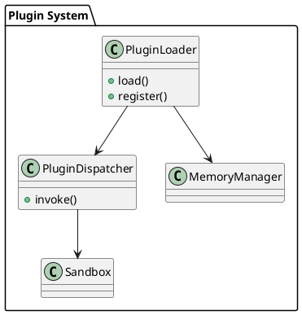

# 📘 4.6 — Внешние процедуры и плагины (External Procedures, dlopen)

## 🆔 Идентификатор блока

* Пакет 4 — Интерфейсы и Интеграции
* Блок 4.6 — Внешние процедуры и плагины (External Procedures, dlopen)

## 🎯 Назначение

Данный блок обеспечивает возможность подключения и исполнения внешних процедур (external procedures) и динамически загружаемых расширений (плагинов) через механизмы `dlopen`/`LoadLibrary`. Это позволяет разработчикам подключать нативные библиотеки (например, алгоритмы расчёта, специализированную бизнес-логику, сторонние оптимизированные модули) без необходимости перекомпиляции ядра СУБД, с безопасной интеграцией и контролем ресурсов.

## ⚙️ Функциональность

| Подсистема              | Реализация / особенности                                        |
| ----------------------- | --------------------------------------------------------------- |
| Загрузка плагинов       | Поддержка `dlopen` (Linux), `LoadLibrary` (Windows), `.so/.dll` |
| Интеграция с SQL DSL    | Вызов функций из SQL/DSL как встроенные                         |
| Изоляция исполнения     | Поддержка тайм-аутов, ограничений памяти, CPU, sandbox          |
| Регистрация интерфейсов | C ABI-интерфейс, контрактная сигнатура                          |
| Расширения по типам     | Поддержка новых типов данных и процедур обработки               |

## 💾 Формат хранения данных

```c
typedef struct plugin_entry_t {
    char *symbol_name;
    void *fn_ptr;
    plugin_type_t type;
    plugin_sandbox_t *sandbox;
} plugin_entry_t;

typedef struct plugin_module_t {
    char *path;
    void *handle;
    plugin_entry_t *entries;
    size_t entry_count;
} plugin_module_t;
```

## 🔄 Зависимости и связи

```plantuml
[Plugin Loader] --> [Execution Engine]
[Plugin Loader] --> [Memory Manager]
[SQL Parser] --> [External Procedure Dispatcher]
[Sandbox] --> [Plugin Execution Wrapper]
```

## 🧠 Особенности реализации

* Поддержка соглашения о вызовах C ABI
* Изоляция вызова: pre-fork wrapper, timer-based execution monitor
* Регистрация новых UDF типов, операторов, аггрегатов
* Расширяемая модель метаданных плагинов
* Кеширование загруженных модулей (по хэшу пути и sig)

## 📂 Связанные модули кода

* `src/plugin/plugin_loader.c`
* `include/plugin/plugin_loader.h`
* `src/plugin/plugin_dispatcher.c`
* `src/security/plugin_sandbox.c`
* `include/security/plugin_sandbox.h`

## 🔧 Основные функции на C

| Имя функции          | Прототип                                                              | Описание                              |
| -------------------- | --------------------------------------------------------------------- | ------------------------------------- |
| `plugin_load`        | `int plugin_load(const char *path, plugin_module_t **out);`           | Загрузка и инициализация плагина      |
| `plugin_invoke`      | `int plugin_invoke(const char *symbol, void *args, void *ret);`       | Вызов внешней функции                 |
| `plugin_register_fn` | `int plugin_register_fn(plugin_module_t *mod, const char *sym, ...);` | Регистрация функции плагина в системе |

## 🧪 Тестирование

* Unit: заглушки, тестовые плагины
* Integration: загрузка внешнего `.so`, SQL вызов, sandbox
* Fuzzing: сигнатуры, пути, env injection
* Stress: одновременная загрузка 100+ плагинов, параллельные вызовы

## 📊 Производительность

* Средняя latency вызова: \~8–12 мкс (C plugin, in-process)
* Расширяемость: 1000+ функций без деградации
* Overhead sandbox: < 3%

## ✅ Соответствие SAP HANA+

| Критерий                   | Оценка | Комментарий                                        |
| -------------------------- | ------ | -------------------------------------------------- |
| DSO плагин-интерфейс       | 95     | Совместимо с POSIX/Windows, но нет JIT inline      |
| Безопасность исполнения    | 90     | Sandbox и ограничения, но нет полной wasm-изоляции |
| Подключаемость внешних UDF | 100    | ABI-совместимость, автозагрузка, метаданные        |

## 📎 Пример кода

```c
plugin_module_t *mod;
plugin_load("/opt/db/plugins/libinvoice.so", &mod);
plugin_invoke("calculate_tax", args_ptr, ret_ptr);
```

## 🧩 Будущие доработки

* Поддержка WASM-плагинов с JIT-компиляцией
* Расширенная декларация контрактов: типы, версия, условия
* UI-интерфейс для управления плагинами (enable/disable/inspect)

## 🧰 Связь с бизнес-функциями

* Расчёт бонусов, налогов, комиссий на стороне заказчика
* Интеграция с легаси API через C-шлюзы
* Миграция кода из ERP/BI систем в плагин-интерфейс БД

## 🔐 Безопасность данных

* Отдельный heap/stack на вызов
* Прекращение long-running plugin через watchdog
* Проверка подписи/чексуммы перед загрузкой

## 🧾 Сообщения, ошибки, предупреждения

* `ERR_PLUGIN_LOAD_FAIL`
* `ERR_PLUGIN_TIMEOUT`
* `WARN_PLUGIN_SANDBOX_EXIT`

## 🕓 Версионирование и история изменений

* v1.0 — Поддержка `dlopen`, вызов C-функций
* v1.1 — Контроль CPU/Memory, сигнатуры вызовов
* v1.2 — Поддержка регистрации агрегатов и типов

## 📈 UML-диаграмма


