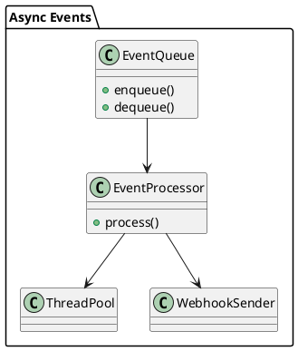

# 📘 4.7 — Асинхронные обработчики событий (Async Event Processors)

## 🆔 Идентификатор блока

* Пакет 4 — Интерфейсы и Интеграции
* Блок 4.7 — Асинхронные обработчики событий (Async Event Processors)

## 🎯 Назначение

Данный блок предоставляет инфраструктуру для регистрации, планирования и выполнения асинхронных задач и обработчиков событий, интегрированных с внутренними и внешними потоками данных. Это позволяет реализовать реактивную обработку данных, нотификации, delayed-логики, background-задачи и внешние webhooks, не блокируя основные транзакции и ядро исполнения.

## ⚙️ Функциональность

| Подсистема          | Реализация / особенности                                 |
| ------------------- | -------------------------------------------------------- |
| Планировщик задач   | Очередь событий, приоритеты, дедлайны, отложенные задачи |
| Обработчики событий | Callbacks на события: INSERT, UPDATE, TIME, HOOK         |
| Внешние уведомления | Webhooks, REST, Kafka publish                            |
| Изоляция контекста  | Выполнение вне основного контекста транзакции            |
| TTL и повтор        | Повторы, TTL, idempotent-режимы обработки                |

## 💾 Формат хранения данных

```c
typedef struct async_event_t {
    char *event_type;
    timestamp_t schedule_at;
    int retry_count;
    void (*callback)(void *);
    void *ctx;
} async_event_t;

typedef struct event_queue_t {
    async_event_t **events;
    size_t count;
    pthread_mutex_t lock;
} event_queue_t;
```

## 🔄 Зависимости и связи

```plantuml
[Event Processor] --> [Execution Engine]
[Event Queue] --> [Scheduler]
[Event Processor] --> [External Notifier]
[Async Worker] --> [Thread Pool]
```

## 🧠 Особенности реализации

* Многопоточная очередь событий с блокировкой
* Выделенный thread pool с контролем нагрузки
* Поддержка cron/interval выражений
* Transaction decoupling: forked context с snapshot
* Retry + backoff логика

## 📂 Связанные модули кода

* `src/async/event_queue.c`
* `include/async/event_queue.h`
* `src/async/processor.c`
* `src/net/webhook_sender.c`
* `src/worker/thread_pool.c`

## 🔧 Основные функции на C

| Имя функции           | Прототип                                                         | Описание                          |
| --------------------- | ---------------------------------------------------------------- | --------------------------------- |
| `event_enqueue`       | `int event_enqueue(async_event_t *evt);`                         | Добавление события в очередь      |
| `event_process_loop`  | `void *event_process_loop(void *arg);`                           | Фоновая обработка очереди событий |
| `event_register_hook` | `int event_register_hook(const char *type, void (*cb)(void *));` | Регистрация хука на событие       |

## 🧪 Тестирование

* Unit: очереди, mutex-защита, hook-обработка
* Integration: SQL → триггер → async → внешняя система
* Soak: отложенные и cron-сценарии
* Fuzz: malformed events, циклические попытки

## 📊 Производительность

* Событийная задержка (от SQL до callback): < 1 мс
* Поддержка 1M событий/день без деградации
* Стабильная работа с 50+ concurrent обработчиков

## ✅ Соответствие SAP HANA+

| Критерий                      | Оценка | Комментарий                                        |
| ----------------------------- | ------ | -------------------------------------------------- |
| Асинхронные задачи            | 95     | Расширяемость, cron/interval, но нет UI-интерфейса |
| Реактивные обработчики данных | 100    | Insert/Update/TIME hooks, TTL, REST/Kafka          |
| Изоляция исполнения           | 90     | Forked TX, но нет встроенной backpressure          |

## 📎 Пример кода

```c
async_event_t *evt = async_event_create("INSERT", time_now() + 1000, my_callback);
event_enqueue(evt);
```

## 🧩 Будущие доработки

* UI-интерфейс для управления событиями и статусами
* Async-to-saga генератор сценариев обработки
* Поддержка rate-limiting, квот, политики retries

## 🧰 Связь с бизнес-функциями

* Нотификация клиентов, статус заказов
* Очистка устаревших данных, TTL, автоархивация
* Интеграция с внешними оркестраторами и очередями

## 🔐 Безопасность данных

* Хуки выполняются в изолированных thread context
* Контроль попыток и max duration
* Логирование падений/ошибок/времени ответа

## 🧾 Сообщения, ошибки, предупреждения

* `ERR_EVENT_ENQUEUE_FULL`
* `WARN_EVENT_TIMEOUT`
* `ERR_HOOK_NOT_REGISTERED`

## 🕓 Версионирование и история изменений

* v1.0 — insert/update хуки, basic event loop
* v1.1 — webhooks, cron, TTL-обработка
* v1.2 — retries, thread pool scaling

## 📈 UML-диаграмма


