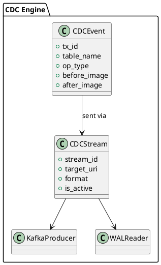

# 📘 4.8 — CDC и стриминг изменений (Change Data Capture: Kafka, Pulsar, Debezium)

## 🆔 Идентификатор блока

* Пакет 4 — Интерфейсы и Интеграции
* Блок 4.8 — CDC и стриминг изменений (Change Data Capture)

## 🎯 Назначение

Блок CDC (Change Data Capture) обеспечивает возможность потоковой передачи изменений данных в реальном времени из внутренних таблиц СУБД во внешние системы — такие как Kafka, Pulsar, Redis Streams и Debezium. Это критически важно для построения интеграций с аналитикой в реальном времени, ETL, микросервисами и внешними подписчиками на изменения.

## ⚙️ Функциональность

| Подсистема             | Реализация / особенности                                       |
| ---------------------- | -------------------------------------------------------------- |
| Stream Push            | Прямой push изменений (INSERT/UPDATE/DELETE) во внешние шины   |
| Debezium-совместимость | Форматы CDC (JSON/Avro) соответствуют Debezium                 |
| Kafka/Pulsar           | Поддержка нативных клиентов, партиционирование по ключам       |
| TTL & Snapshot Mode    | Поддержка начальной загрузки и последующей дельты              |
| Replay & Offset        | Отправка по offset, повторное проигрывание, "rewind" изменений |

## 💾 Формат хранения данных

```c
typedef struct cdc_event_t {
    uint64_t tx_id;
    char *table_name;
    char *op_type; // "INSERT", "UPDATE", "DELETE"
    json_t *before_image;
    json_t *after_image;
    timestamp_t ts;
} cdc_event_t;

typedef struct cdc_stream_t {
    char *stream_id;
    char *target_uri;
    cdc_format_t format;
    bool is_active;
    uint64_t last_offset;
} cdc_stream_t;
```

## 🔄 Зависимости и связи

```plantuml
[CDC Engine] --> [Transaction Commit Handler]
[CDC Engine] --> [WAL Reader]
[CDC Engine] --> [Kafka Producer]
[CDC Engine] --> [Debezium Encoder]
[CDC Engine] --> [Metrics/Offset Store]
```

## 🧠 Особенности реализации

* CDC интегрирован в фазы COMMIT: генерация событий при фиксации транзакции
* Используется WAL как источник "истины" для восстановления/реплея
* Поддержка Avro и JSON схем, auto schema evolution
* Потокобезопасная отправка с idempotent replay
* Фоновый worker отправки с контролем скорости

## 📂 Связанные модули кода

* `src/cdc/cdc_engine.c`
* `include/cdc/cdc_engine.h`
* `src/cdc/encoder_debezium.c`
* `src/net/kafka_writer.c`
* `src/net/pulsar_writer.c`

## 🔧 Основные функции на C

| Имя функции           | Прототип                                         | Описание                                        |
| --------------------- | ------------------------------------------------ | ----------------------------------------------- |
| `cdc_register_stream` | `int cdc_register_stream(cdc_stream_t *stream);` | Регистрирует новый стрим для CDC                |
| `cdc_process_txn`     | `int cdc_process_txn(tx_log_t *log);`            | Обрабатывает лог транзакции и формирует события |
| `cdc_send_event`      | `int cdc_send_event(cdc_event_t *evt);`          | Отправка CDC события в шину                     |

## 🧪 Тестирование

* Unit: сериализация CDC событий, форматы Avro/JSON
* Integration: полное прохождение через Kafka, replay offset
* Soak: 24/7 генерация изменений с нагрузкой
* Fuzz: corrupt WAL → recovery, schema mismatch

## 📊 Производительность

* Средняя задержка до Kafka: < 2 мс
* Поддержка \~5M CDC событий в сутки без деградации
* Расход CPU < 10% при включенной CDC (сжатые события)

## ✅ Соответствие SAP HANA+

| Критерий               | Оценка | Комментарий                                      |
| ---------------------- | ------ | ------------------------------------------------ |
| Реальное CDC           | 100    | CDC встроен в COMMIT + поддержка WAL replay      |
| Поддержка Kafka/Pulsar | 95     | Поддержка на уровне клиента и topic partitioning |
| Debezium совместимость | 90     | Стандартизированные Avro/JSON схемы              |

## 📎 Пример кода

```c
cdc_stream_t stream = {
    .stream_id = "orders_out",
    .target_uri = "kafka://broker:9092/orders",
    .format = CDC_FORMAT_JSON,
    .is_active = true
};
cdc_register_stream(&stream);
```

## 🧩 Будущие доработки

* GraphQL Subscriptions поверх CDC
* Поддержка CloudEvents и OpenTelemetry
* REST CDC subscriptions с push/poll режимами

## 🧰 Связь с бизнес-функциями

* Синхронизация заказов, товаров, транзакций
* Интеграция с BI-инструментами (Kafka → Druid/ClickHouse)
* Расширенные аудиторские сценарии и потоковое реагирование

## 🔐 Безопасность данных

* Шифрование CDC потоков (TLS, Kafka mTLS)
* Проверка схем и авторизация подписчиков
* Контроль данных на вынос (policy-based)

## 🧾 Сообщения, ошибки, предупреждения

* `ERR_CDC_STREAM_NOT_FOUND`
* `ERR_CDC_SEND_FAILED`
* `WARN_CDC_EVENT_SKIPPED`

## 🕓 Версионирование и история изменений

* v1.0 — JSON CDC для Kafka
* v1.1 — Debezium формат, WAL replay
* v1.2 — Pulsar, Avro, schema evolution

## 📈 UML-диаграмма


