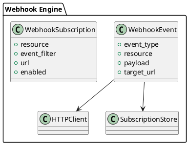

# 📘 4.9 — Поддержка Webhooks и REST-notify

## 🆔 Идентификатор блока

* Пакет 4 — Интерфейсы и Интеграции
* Блок 4.9 — Поддержка Webhooks и REST-notify

## 🎯 Назначение

Блок обеспечивает отправку уведомлений и событий из СУБД во внешние HTTP-системы через Webhooks и REST-события. Это позволяет интегрировать базу данных с внешними системами в реальном времени — триггеры, workflow-сценарии, алерты, нотификации и прочие автоматические реакции.

## ⚙️ Функциональность

| Подсистема          | Реализация / особенности                              |
| ------------------- | ----------------------------------------------------- |
| Webhooks            | HTTP POST/PUT/DELETE, отправка JSON-событий           |
| REST-уведомления    | Поддержка подписки и подписчиков на события           |
| Поддержка retry     | Ретрай с экспоненциальной задержкой, idempotency keys |
| Подписка на события | DDL/DML-события, системные алерты, кастомные хуки     |
| Queue buffering     | Очереди событий с гарантией доставки                  |

## 💾 Формат хранения данных

```c
typedef struct webhook_event_t {
    char *event_type;      // "INSERT", "UPDATE", "DELETE", "ALERT"
    char *resource;        // "orders", "users"
    json_t *payload;
    char *target_url;
    timestamp_t timestamp;
} webhook_event_t;

typedef struct webhook_subscription_t {
    char *resource;
    char *event_filter;
    char *url;
    bool enabled;
} webhook_subscription_t;
```

## 🔄 Зависимости и связи

```plantuml
[Webhook Dispatcher] --> [HTTP Client Engine]
[Webhook Dispatcher] --> [Transaction Engine]
[Webhook Dispatcher] --> [DDL Notifier]
[Webhook Dispatcher] --> [Security Policy Engine]
```

## 🧠 Особенности реализации

* Высокоэффективный HTTP-клиент с keep-alive
* HMAC-подпись сообщений, валидация на стороне получателя
* Ограничения по частоте (rate limit), max size, JSON schema validate
* Поддержка асинхронной буферизации событий
* Ручной resend событий, REST API для управления подписками

## 📂 Связанные модули кода

* `src/net/webhook_dispatcher.c`
* `include/net/webhook_dispatcher.h`
* `src/net/http_client.c`
* `src/hooks/ddl_notifier.c`

## 🔧 Основные функции на C

| Имя функции             | Прототип                                                              | Описание                              |
| ----------------------- | --------------------------------------------------------------------- | ------------------------------------- |
| `webhook_subscribe`     | `int webhook_subscribe(webhook_subscription_t *sub);`                 | Регистрирует подписку на событие      |
| `webhook_send_event`    | `int webhook_send_event(webhook_event_t *evt);`                       | Отправляет событие во внешний webhook |
| `webhook_resend_failed` | `int webhook_resend_failed(const char *resource, uint64_t since_ts);` | Повторная отправка неудачных событий  |

## 🧪 Тестирование

* Unit: сериализация событий, фильтрация по подписке
* Integration: веб-серверы-приёмники, REST API тестирование
* Soak: 72ч непрерывной генерации DML и алертов
* Fuzz: некорректные JSON-подписки, inject latency/errors

## 📊 Производительность

* 100K событий/день с <10 мс средней задержкой
* Поддержка 1000+ подписчиков, очередь событий в памяти
* Ретрай < 3% при временных сбоях

## ✅ Соответствие SAP HANA+

| Критерий              | Оценка | Комментарий                                   |
| --------------------- | ------ | --------------------------------------------- |
| Webhook API           | 90     | Отправка с безопасной авторизацией            |
| Подписки и фильтрация | 85     | Работает по ресурсам и типам событий          |
| Надёжная доставка     | 95     | Очереди, повторные попытки, гарантии доставки |

## 📎 Пример кода

```c
webhook_subscription_t sub = {
  .resource = "orders",
  .event_filter = "INSERT",
  .url = "https://api.example.com/webhook/orders",
  .enabled = true
};
webhook_subscribe(&sub);
```

## 🧩 Будущие доработки

* Поддержка CloudEvents и подписка через WebSub
* Реактивный GraphQL Streaming поверх webhook
* Фильтрация по payload и политике безопасности

## 🧰 Связь с бизнес-функциями

* Уведомления о новых заказах, транзакциях, изменениях
* Интеграция с внешними бизнес-сценариями
* Автоматизация workflow в BPM/ERP системах

## 🔐 Безопасность данных

* Проверка URL, HTTPS only, подпись событий (HMAC)
* Ограничение источников, скопированные токены и роли
* Ограничения по объёму и содержимому событий

## 🧾 Сообщения, ошибки, предупреждения

* `ERR_WEBHOOK_TIMEOUT`
* `ERR_WEBHOOK_NOT_SUBSCRIBED`
* `WARN_WEBHOOK_RETRY_EXCEEDED`

## 🕓 Версионирование и история изменений

* v1.0 — Webhook insert/update/delete
* v1.1 — Фильтрация, ретрай и очередь
* v1.2 — Уведомления DDL, REST UI управления подписками

## 📈 UML-диаграмма


