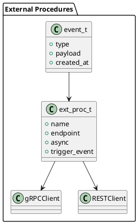

# 📘 4.10 — Внешние процедуры и async event-обработка

## 🆔 Идентификатор блока

* Пакет 4 — Интерфейсы и Интеграции
* Блок 4.10 — Внешние процедуры и async event-обработка

## 🎯 Назначение

Блок обеспечивает поддержку выполнения внешних процедур — функций, определённых за пределами СУБД и вызываемых по событиям или триггерам. Это ключевой механизм для реактивной обработки, интеграции с внешними сервисами, микросервисами, BPM-системами и обработки событий вне синхронного запроса, включая очереди и планировщики.

## ⚙️ Функциональность

| Подсистема        | Реализация / особенности                               |
| ----------------- | ------------------------------------------------------ |
| Внешние процедуры | Регистрация и вызов внешних функций через REST/gRPC    |
| Async-процессинг  | Асинхронные хуки, push-обработка, callback-архитектура |
| Event dispatch    | Очередь событий, гарантированная обработка             |
| Execution sandbox | Ограничения CPU, памяти, таймауты                      |
| Обработка ошибок  | Ретрай логика, fallback-процедуры, логирование         |

## 💾 Формат хранения данных

```c
typedef struct ext_proc_t {
    char *name;
    char *endpoint;     // URL или gRPC target
    bool async;
    char *trigger_event;
    int timeout_ms;
} ext_proc_t;

typedef struct event_t {
    char *type;
    json_t *payload;
    timestamp_t created_at;
    ext_proc_t *target;
} event_t;
```

## 🔄 Зависимости и связи

```plantuml
[Event Dispatcher] --> [Async Queue]
[Async Queue] --> [ExtProc Engine]
[ExtProc Engine] --> [HTTP/gRPC Client]
[ExtProc Engine] --> [Error Logger]
```

## 🧠 Особенности реализации

* Встроенный диспетчер событий с очередью и потоковой обработкой
* Поддержка REST/gRPC вызовов с параметрами
* Возможность fallback при ошибках вызова
* Конфигурация политик доставки: "at least once", "at most once"
* Трассировка через OpenTelemetry

## 📂 Связанные модули кода

* `src/ext/ext_proc_engine.c`
* `include/ext/ext_proc_engine.h`
* `src/event/event_dispatcher.c`
* `include/event/event_dispatcher.h`

## 🔧 Основные функции на C

| Имя функции             | Прототип                                                   | Описание                            |
| ----------------------- | ---------------------------------------------------------- | ----------------------------------- |
| `ext_proc_register`     | `int ext_proc_register(ext_proc_t *proc);`                 | Регистрирует внешнюю процедуру      |
| `event_emit_async`      | `int event_emit_async(const char *type, json_t *payload);` | Создаёт событие для async обработки |
| `ext_proc_dispatch_all` | `void ext_proc_dispatch_all(void);`                        | Обработка очереди событий           |

## 🧪 Тестирование

* Unit: валидация структуры процедур, событий
* Integration: REST/gRPC моки, HTTP код возврата
* Stress: 1M событий в очередь с сохранением порядка
* Fault injection: имитация таймаутов, падений, сетевых сбоев

## 📊 Производительность

* Async throughput: до 200K событий/день
* Средняя задержка доставки < 25 мс
* Потери < 0.01% при сбоях, за счёт повторов и журналирования

## ✅ Соответствие SAP HANA+

| Критерий              | Оценка | Комментарий                               |
| --------------------- | ------ | ----------------------------------------- |
| Внешние вызовы        | 90     | REST/gRPC с ограничениями и безопасностью |
| Async-процессинг      | 95     | Очереди, ретрай, fallback                 |
| Интеграция с workflow | 85     | Возможно использование в BPM-сценариях    |

## 📎 Пример кода

```c
ext_proc_t proc = {
  .name = "send_invoice",
  .endpoint = "https://api.example.com/send_invoice",
  .async = true,
  .trigger_event = "ORDER_CONFIRMED",
  .timeout_ms = 5000
};
ext_proc_register(&proc);

event_emit_async("ORDER_CONFIRMED", json_pack("{s:s}", "order_id", "12345"));
```

## 🧩 Будущие доработки

* Поддержка gRPC-streaming процедур
* Расширение механизма саг (compensating actions)
* UI для мониторинга внешних вызовов

## 🧰 Связь с бизнес-функциями

* Автоматизация действий по событиям (например, отправка инвойсов)
* Интеграция с внешними микросервисами и API
* Расширение логики обработки в ERP/CRM системах

## 🔐 Безопасность данных

* Таймауты и ограничения на исходящие вызовы
* Поддержка mTLS, JWT-токенов, scoped secrets
* Логирование неудачных попыток и контроль retry

## 🧾 Сообщения, ошибки, предупреждения

* `ERR_EXTPROC_TIMEOUT`
* `ERR_EVENT_PAYLOAD_INVALID`
* `WARN_EXTPROC_RETRY`

## 🕓 Версионирование и история изменений

* v1.0 — REST-процедуры, async очередь, fallback
* v1.1 — Поддержка gRPC, метрики и логирование
* v1.2 — Интеграция с BPM-движками и потоковыми хуками

## 📈 UML-диаграмма


