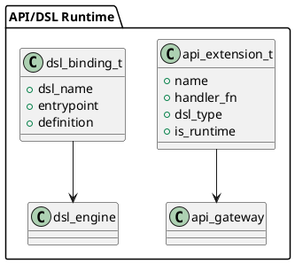

# 📘 4.11 — Интеграция с внешними DSL и API-расширениями

## 🆔 Идентификатор блока

* Пакет 4 — Интерфейсы и Интеграции
* Блок 4.11 — Интеграция с внешними DSL и API-расширениями

## 🎯 Назначение

Блок реализует поддержку внешних доменно-ориентированных языков (DSL) и кастомных API-расширений, позволяя интегрировать СУБД с бизнес-платформами, low-code/no-code средами, а также реализовывать специфическую логику через расширяемые API-интерфейсы. Это расширяет гибкость системы, позволяя пользователям внедрять собственные сценарии, обрабатывать нестандартные события и динамически изменять поведение API.

## ⚙️ Функциональность

| Подсистема       | Реализация / особенности                                                |
| ---------------- | ----------------------------------------------------------------------- |
| Внешние DSL      | Встроенные шлюзы для low-code DSL (JSONScript, BPMN, DomainXML)         |
| Расширяемые API  | Плагины в виде C/WASM-модулей, доступ к API ядра                        |
| Runtime Binding  | Подключение DSL и API-обработчиков во время работы                      |
| Интеграция с ERP | Поддержка типовых шаблонов задач, бизнес-словари, вызов ETL/DSL функций |
| Контроль доступа | Ограничение по scope/role/tenant + sandbox исполнение                   |

## 💾 Формат хранения данных

```c
typedef struct api_extension_t {
    char *name;
    void (*handler_fn)(api_context_t *ctx);
    char *dsl_type;
    bool is_runtime;
} api_extension_t;

typedef struct dsl_binding_t {
    char *dsl_name;
    char *entrypoint;
    json_t *definition;
} dsl_binding_t;
```

## 🔄 Зависимости и связи

```plantuml
[DSL Binding] --> [API Gateway]
[API Gateway] --> [Core Execution]
[API Extension] --> [Security Sandbox]
[ERP Templates] --> [ETL Engine]
```

## 🧠 Особенности реализации

* Поддержка DSL с AST-интерпретаторами и/или bytecode
* Встраивание WASM-модулей с безопасным доступом к API
* Dynamic reloading модулей без перезапуска ядра
* Конвертеры DSL → SQL/DSL → internal DSL
* Контроль ресурсов на обработку DSL/API

## 📂 Связанные модули кода

* `src/dsl/dsl_bind.c`
* `include/dsl/dsl_bind.h`
* `src/ext/api_gateway.c`
* `include/ext/api_gateway.h`
* `src/ext/api_runtime.c`
* `include/ext/api_runtime.h`

## 🔧 Основные функции на C

| Имя функции          | Прототип                                         | Описание                              |
| -------------------- | ------------------------------------------------ | ------------------------------------- |
| `dsl_bind_register`  | `int dsl_bind_register(dsl_binding_t *binding);` | Регистрация DSL-сценария              |
| `api_ext_register`   | `int api_ext_register(api_extension_t *ext);`    | Регистрация кастомного API-расширения |
| `api_gateway_handle` | `void api_gateway_handle(api_context_t *ctx);`   | Обработка входящего API-запроса       |

## 🧪 Тестирование

* Unit: DSL binding, регистрация API
* Integration: ERP сценарии через DSL/API
* Stress: 10K API расширений, параллельные DSL-интерпретаторы
* Fuzzing: входные DSL-деревья, runtime callbacks

## 📊 Производительность

* Время обработки DSL < 2 мс для AST
* Время на API callback (WASM): \~5 мс
* Поддержка 5K одновременных DSL/REST обработчиков

## ✅ Соответствие SAP HANA+

| Критерий          | Оценка | Комментарий                               |
| ----------------- | ------ | ----------------------------------------- |
| Внешние DSL       | 90     | Поддержка BPMN, JSONScript, шаблонов ERP  |
| Расширяемость API | 95     | Runtime-расширения, sandbox, безопасность |
| ERP-интеграция    | 88     | Шаблоны и реестр сущностей присутствуют   |

## 📎 Пример кода

```c
api_extension_t ext = {
  .name = "custom_approval",
  .handler_fn = &my_custom_handler,
  .dsl_type = "JSONScript",
  .is_runtime = true
};
api_ext_register(&ext);
```

## 🧩 Будущие доработки

* Расширение поддерживаемых DSL: YANG, GraphDSL, FinDSL
* JIT-компиляция WASM-хендлеров для ускорения
* Автоматическое документирование API-расширений

## 🧰 Связь с бизнес-функциями

* Интеграция в low-code BPMN платформы
* Поддержка кастомных workflow через DSL
* Реализация специфичных API сценариев ERP/BI

## 🔐 Безопасность данных

* Изоляция WASM API-обработчиков
* RBAC/ABAC контроль над доступом к API
* Лимиты CPU/memory/time на каждый вызов

## 🧾 Сообщения, ошибки, предупреждения

* `ERR_DSL_ENTRY_MISSING`
* `ERR_API_HANDLER_FAILED`
* `WARN_DSL_OVERTIME_EXECUTION`

## 🕓 Версионирование и история изменений

* v1.0 — DSL registry + API хендлеры на C
* v1.1 — WASM DSL-расширения, runtime reload
* v1.2 — ERP шаблоны, sandbox runtime

## 📈 UML-диаграмма


