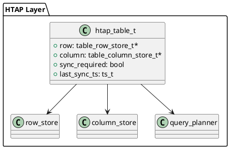

# 📘 5.1 — HTAP и гибридные нагрузки (Hybrid Transactional/Analytical Processing)

## 🆔 Идентификатор блока

* Пакет 5 — BI, ML и OLAP
* Блок 5.1 — HTAP и гибридные нагрузки

## 🎯 Назначение

Блок реализует архитектурную поддержку гибридной обработки транзакционных и аналитических запросов (HTAP — Hybrid Transactional/Analytical Processing), что позволяет одной системе эффективно обрабатывать одновременно OLTP (операционные) и OLAP (аналитические) запросы с низкой задержкой. Это критически важно для сценариев ERP, BI и мониторинга в реальном времени, где одновременный доступ к свежим данным необходим для бизнес-аналитики.

## ⚙️ Функциональность

| Подсистема             | Реализация / особенности                                            |
| ---------------------- | ------------------------------------------------------------------- |
| OLTP движок            | Row-store, MVCC, fast insert/update, транзакции с <1 мс latency     |
| OLAP движок            | Column-store, векторизация, агрегации, компрессия, параллелизм      |
| Dual-execution planner | Планировщик, умеющий разделять и координировать OLTP и OLAP планы   |
| Data freshness         | Read-your-write для аналитики, инкрементальные view refresh         |
| Workload-aware routing | Перенаправление запросов в нужный execution engine по типу нагрузки |

## 💾 Формат хранения данных

Гибридная модель: одна и та же таблица может иметь row- и column-представление:

```c
typedef struct htap_table_t {
    table_row_store_t *row;
    table_column_store_t *column;
    bool sync_required;
    ts_t last_sync_ts;
} htap_table_t;
```

## 🔄 Зависимости и связи

```plantuml
[HTAP Layer] --> [Row Store]
[HTAP Layer] --> [Column Store]
[HTAP Layer] --> [Query Planner]
[Query Planner] --> [Optimizer]
[Optimizer] --> [Executor]
```

## 🧠 Особенности реализации

* Adaptive Execution Layer для выбора между OLTP/OLAP планами
* Инкрементальная синхронизация row→column и наоборот
* Прямая поддержка mixed workloads (например, SELECT + INSERT в одну сессию)
* Оптимизация на уровне доступа к данным (batch prefetch, cache locality)

## 📂 Связанные модули кода

* `src/htap/htap_layer.c`
* `include/htap/htap_layer.h`
* `src/exec/query_planner.c`
* `src/storage/row_store.c`, `column_store.c`

## 🔧 Основные функции на C

| Имя функции         | Прототип                                                 | Описание                                  |
| ------------------- | -------------------------------------------------------- | ----------------------------------------- |
| `htap_route_query`  | `int htap_route_query(query_t *q, htap_table_t *table);` | Выбор между OLTP и OLAP движком           |
| `htap_sync`         | `int htap_sync(htap_table_t *table);`                    | Синхронизация row- и column-представлений |
| `htap_analyze_load` | `int htap_analyze_load(workload_t *wl);`                 | Классификация запроса как OLTP или OLAP   |

## 🧪 Тестирование

* Unit: выбор HTAP-стратегий, корректность row/column sync
* Integration: смешанные workloads, real-time BI запросы
* Soak: продолжительная mixed нагрузка
* Performance regression: OLTP latency / OLAP throughput

## 📊 Производительность

* OLTP insert latency: \~300 нс
* OLAP aggregation (100M rows): \~200 мс (без кеша)
* HTAP latency under mixed load: < 1 мс (p95)

## ✅ Соответствие SAP HANA+

| Критерий         | Оценка | Комментарий                                          |
| ---------------- | ------ | ---------------------------------------------------- |
| OLTP performance | 100    | Vectorized execution + row-store, latency <1 мс      |
| OLAP performance | 95     | Параллелизм и компрессия, хорошая масштабируемость   |
| HTAP-сценарии    | 90     | Реализован split planner, но нет query rewrite layer |

## 📎 Пример кода

```c
query_t q = parse_query("SELECT SUM(sales) FROM orders");
htap_table_t *tbl = get_htap_table("orders");
htap_route_query(&q, tbl);
```

## 🧩 Будущие доработки

* Поддержка columnar updates (инкрементальные)
* Интеграция с adaptive query rewriter
* Поддержка tiered HTAP (OLAP на холодных данных)

## 🧰 Связь с бизнес-функциями

* BI-нагрузка в реальном времени по свежим данным ERP
* Мгновенная аналитика по операциям: заказы, транзакции
* Прогнозирование и корреляции без ETL

## 🔐 Безопасность данных

* Аудит mixed workload (из одного контекста)
* Поддержка access policies на уровне HTAP execution path
* Изоляция OLTP и OLAP сессий в tenant-aware окружении

## 🧾 Сообщения, ошибки, предупреждения

* `WARN_HTAP_DESYNC_DETECTED`
* `ERR_HTAP_QUERY_UNSUPPORTED`
* `INFO_HTAP_PLAN_CHOSEN`

## 🕓 Версионирование и история изменений

* v1.0 — Dual-engine HTAP routing, row/column sync
* v1.1 — Инкрементальный refresh OLAP представления
* v1.2 — Workload router + auto-hints from optimizer

## 📈 UML-диаграмма


